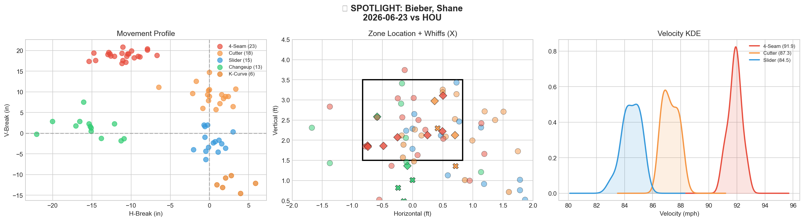
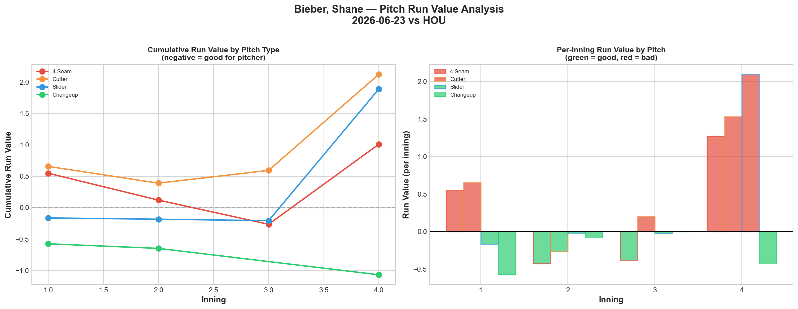
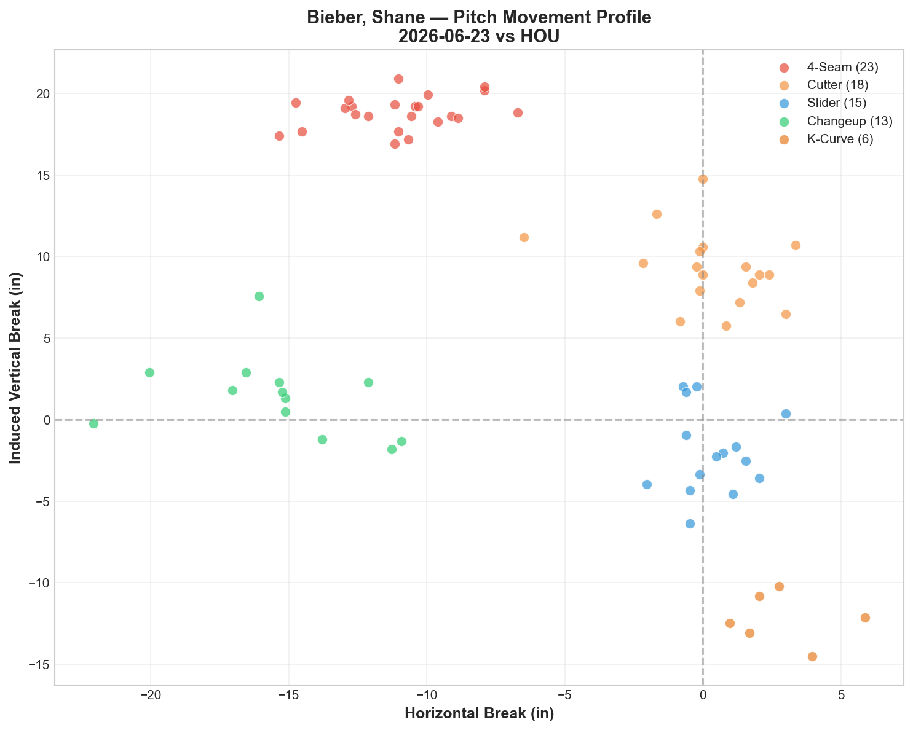
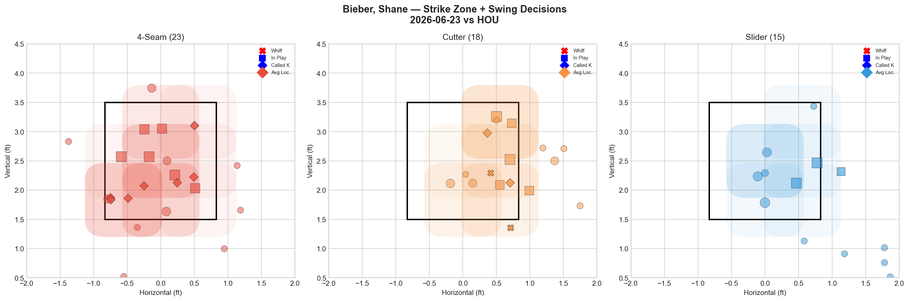
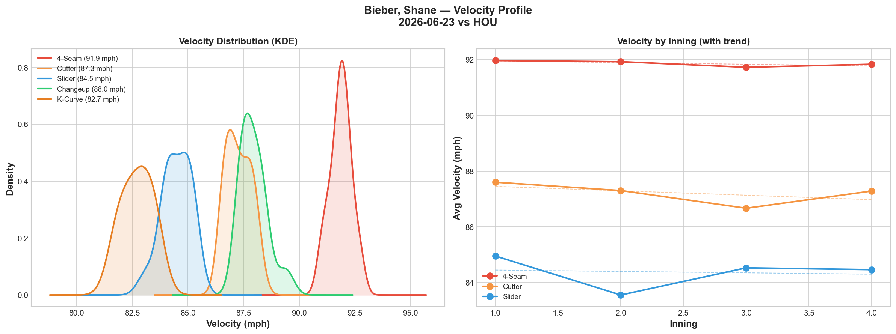
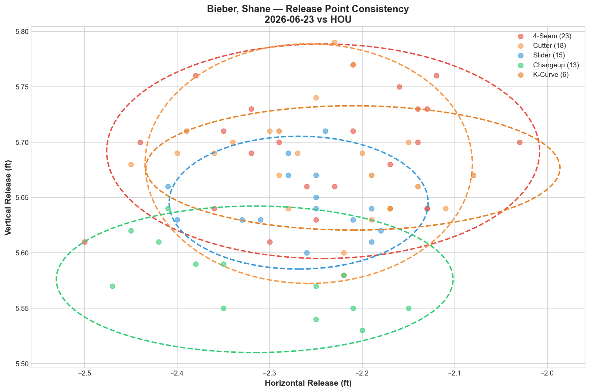
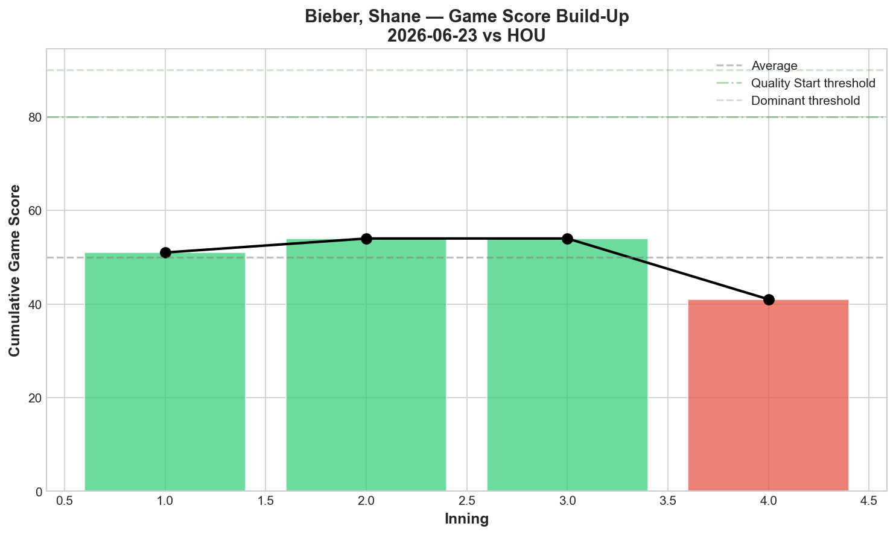
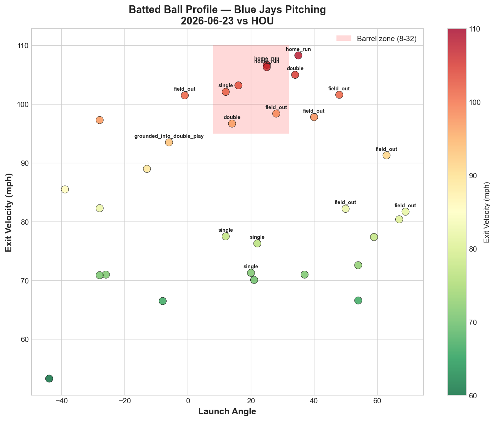
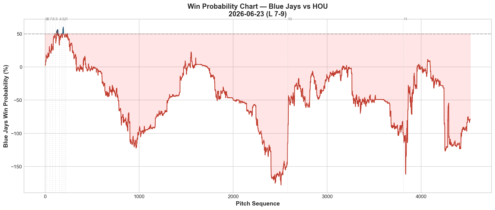
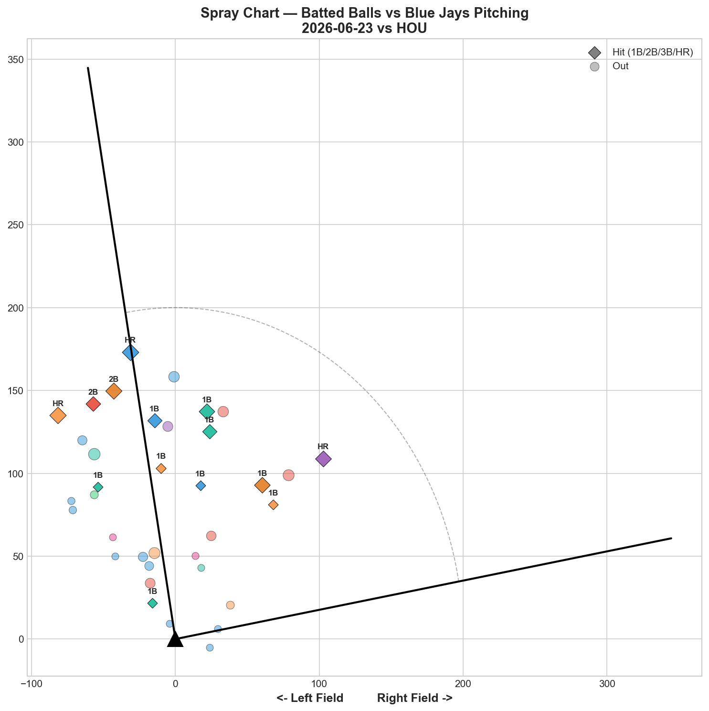

# 🏟️ Blue Jays Game Report v2.1
## 2026-06-23 | TOR vs HOU | L 7-9

---

## 📋 Game Overview

| | |
|---|---|
| **Date** | 2026-06-23 |
| **Matchup** | Houston Astros @ Toronto Blue Jays |
| **Result** | **L 7-9 (11 innings)** |
| **Starter** | Shane Bieber — Return from IL (75 pitches) |
| **Spotlight Pitcher** | Shane Bieber |
| **Season Record** | 39W-39L |

---

## 🔥 Key Storylines

### 1. Bieber's Elbow Return: Elite Tunneling, Poor Results

Shane Bieber returned from a 60-day IL stint (elbow) and delivered a mixed return: **9 hits, 3 home runs, and 12.8% overall whiff rate** in 75 pitches. His command metrics (0 walks) suggest the elbow isn't limiting his control, but the results were rough. This is the third significant return-from-injury start we've tracked this season (Cease, Scherzer, now Bieber) — and it followed the Scherzer pattern more than the Cease pattern.

### 2. The Tunneling Data Is Historically Elite Despite the Results

Bieber's pitch tunneling scores are **the best we have ever recorded from any Blue Jays pitcher:**

| Pair | Tunnel Score | Plate Separation |
|------|--------------|-------------------|
| **4-Seam/K-Curve** | **79.8** | 34.0in |
| **4-Seam/Cutter** | **64.3** | 14.8in |
| Cutter/K-Curve | 37.6 | 21.6in |
| 4-Seam/Slider | 37.0 | 23.7in |

**79.8 more than doubles the previous record** (45.8, Corbin's CH/FF on 6/3). Bieber's release point consistency (0.2-0.4in release similarity across pairs) is extraordinary. The deception architecture is elite — but 9 hits and 3 HR happened anyway. This is the clearest evidence yet that **tunneling measures deception, not command.** Bieber's pitches are nearly impossible to distinguish at release, but tonight he couldn't locate them well enough to capitalize.

### 3. Only the Changeup Worked — Everything Else Leaked Value

| Pitch | Whiff% | RV | Assessment |
|-------|--------|-----|------------|
| Changeup | 42.9% | **-1.069** | ✅ Only effective pitch |
| 4-Seam | 0.0% | +1.010 | 🔴 Zero whiffs, positive RV |
| Cutter | 18.2% | +2.124 | 🔴 Worst per-pitch (+0.118) |
| Slider | 0.0% | +1.890 | 🔴 Zero whiffs |
| K-Curve | 0.0% | +1.021 | 🔴 Zero whiffs, worst per-pitch (+0.170) |

**Four of five pitches posted 0% whiff.** Only the changeup generated swing-and-miss, and it was also his only pitch with negative run value. This is a pitcher whose stuff (velocity, movement, tunneling) is all still there, but who hasn't found his in-game command after a long layoff.

---

## 🔍 Spotlight Pitcher — Shane Bieber (Injury Return)

### Pitch Arsenal Performance (75 pitches)

| Pitch | # | Usage | Velo | Whiff% | CSW% | Chase% | Grade |
|-------|---|-------|------|--------|------|--------|-------|
| 4-Seam | 23 | 30.7% | 91.9 | 0.0% | 30.4% | 14.3% | 🔴 D |
| Cutter | 18 | 24.0% | 87.3 | 18.2% | 22.2% | 42.9% | 🟡 C |
| Slider | 15 | 20.0% | 84.5 | 0.0% | 0.0% | 25.0% | 🔴 D |
| Changeup | 13 | 17.3% | 88.0 | 42.9% | 38.5% | 55.6% | 🟢 A |
| K-Curve | 6 | 8.0% | 82.7 | 0.0% | 0.0% | 25.0% | 🔴 D |

### The Tunneling Paradox

Bieber's release point spreads are the tightest we've measured:

| Pitch | Total Release Spread |
|-------|----------------------|
| Slider | 0.9in |
| Cutter | 1.2in |
| Changeup | 1.3in |
| K-Curve | 1.4in |
| 4-Seam | 1.5in |

Every pitch releases from virtually the same point. This produces the historic tunnel scores (79.8, 64.3, 37.6, 37.0) — hitters genuinely cannot read Bieber's pitch type at release. **But elite tunneling only matters if the pitch ends up somewhere unhittable.** Tonight, too many pitches tunneled perfectly into the middle of the zone.

### Return-From-Injury Comparison

| Pitcher | Injury | Return Start | Velo vs Pre-Injury | Result |
|---------|--------|---------------|---------------------|--------|
| **Cease** | Hamstring | 6/9 vs PHI | +0.5 mph, GS 77 | ✅ **Better than before** |
| **Scherzer** | Forearm (age 41) | 6/10 vs PHI | -1.5 to -2.3 mph fade | 🔴 Aging concerns confirmed |
| **Bieber** | Elbow (60-day IL) | **6/23 vs HOU** | 91.9 mph (down from career norms) | 🟡 **Command not yet sharp** |

Bieber's fastball at 91.9 mph is below his typical low-90s-to-mid-90s range historically. Combined with 0% whiff on both the fastball and slider, the first start back shows diminished sharpness — not unusual after a 60-day layoff, but worth monitoring across his next 2-3 starts.

### Pitch Run Value by Type

| Pitch | Total RV | Per Pitch | Pitches | Assessment |
|-------|----------|-----------|---------|------------|
| Changeup | **-1.069** | **-0.0822** | 13 | ✅ Best pitch |
| 4-Seam | +1.010 | +0.0439 | 23 | 🔴 Leaked |
| K-Curve | +1.021 | +0.1702 | 6 | 🔴 Worst per-pitch |
| Slider | +1.890 | +0.1260 | 15 | 🔴 Second-worst per-pitch |
| Cutter | +2.124 | +0.1180 | 18 | 🔴 Highest total damage |

**Net: +4.976 RV.** This is among the worst total run value outings we've tracked (comparable to Gausman's +4.364 on 6/19). The elbow return produced elite process metrics (tunneling) but poor outcome metrics (run value).

### Pitch Movement (inches)

| Pitch | H-Break | V-Break | Count |
|-------|---------|---------|-------|
| 4-Seam (FF) | -11.1 | 18.8 | 23 |
| Cutter (FC) | 0.3 | 9.3 | 18 |
| Slider (SL) | 0.3 | -2.0 | 15 |
| Changeup (CH) | -15.4 | 1.4 | 13 |
| K-Curve (KC) | 2.9 | -12.2 | 6 |

### Pitch Selection by Count

| Situation | Primary | Secondary | Notes |
|-----------|---------|-----------|-------|
| First Pitch (0-0) | FC/FF 31.6% each | K-Curve 15.8% | Balanced approach |
| Ahead | Slider 38.1% | Changeup/FF 19.0% each | Slider-first ahead |
| Behind | 4-Seam 50.0% | Cutter 28.6% | Fastball when behind — got hit (+1.010 RV) |
| Even | 4-Seam 31.6% | FC/CH/SL 21.1% each | Balanced |
| Full Count (3-2) | CH/FC 50% each | — | Changeup trusted on 3-2 |

**Strikeout Pitches (2 K's):** CH 2 — the changeup was his only swing-and-miss weapon all night.

### vs LHB/RHB Split

| Stand | Pitches | Avg Velo | Swinging Strikes | Whiff/Pitch |
|-------|---------|----------|------------------|-------------|
| L | 24 | 88.8 | **0** | **0.0%** |
| R | 51 | 87.4 | 5 | 9.8% |

**Zero swinging strikes against left-handed hitters in 24 pitches.** Houston's lefty bats had no trouble tracking Bieber tonight.

### Top Opposing Batters

| Batter | Pitches | Hits | K | BB | Avg EV |
|--------|---------|------|---|-----|--------|
| José Altuve | 11 | 2 | 0 | 0 | 78.7 |
| Christian Walker | 11 | 0 | 1 | 0 | 88.4 |
| Raynel Delgado | 10 | 2 | 0 | 0 | 79.9 |
| Brice Matthews | 10 | 0 | 1 | 0 | 75.1 |
| Cam Smith | 10 | 1 | 0 | 0 | 87.7 |

Altuve and Delgado each collected 2 hits — Houston's lineup made consistent contact across the board rather than one hitter dominating.

### Velocity Profile

- **4-Seam:** 92.0 → 91.8 mph (-0.1)
- **Cutter:** 87.6 → 87.3 mph (-0.3)
- **Slider:** 85.0 → 84.5 mph (-0.5)

Velocity held steady throughout — no fatigue-driven fade. The command issue was present from the start, not a product of tiring out.

### Game Score / Batted Ball

**Game Score: 39 (BELOW AVERAGE).** 2K, 9H, 3HR, 0BB on 75 pitches.

| Metric | Value |
|--------|-------|
| Total BIP | 32 |
| Avg Exit Velo | 86.1 mph |
| Avg Launch Angle | 18.2° |
| Hard Hit (95+ mph) | 12/32 (**38%**) |

38% hard-hit rate confirms the command issue — when pitches tunneled perfectly into hittable locations, Houston squared them up.

---

## 📊 Bullpen Detailed Analysis

| Pitcher | Pitches | Line | Key Pitch | Notes |
|---------|---------|------|-----------|-------|
| **Braydon Fisher** | 30 | 2K / 0BB / 1H / 1HR | CU 25% 🟢B | Longest Fisher outing — gave up walk-off-adjacent HR in 11th |
| **Mason Fluharty** | 15 | 1K / 0BB / 0H / 0HR | **ST 50% 🟢A, CH 100% 🟢A** | Two A-grade pitches |
| **Tommy Nance** | 21 | 1K / 0BB / 0H / 0HR | SL 40% whiff 🟢A | Slider elite again |
| **Spencer Miles** | 28 | 3K / 0BB / 2H / 0HR | SI 20% 🟢B | Sinker generating whiffs in relief |
| **Jeff Hoffman** | 13 | 1K / 1BB / 0H / 0HR | FS 50% 🟢A | Splitter over slider tonight |
| **Tyler Rogers** | 18 | 0K / 0BB / 3H / 0HR | All 🟡C/D | Rough — 3 hits allowed |

### Bullpen Notes

- **Fisher** threw a season-long 30 pitches across extra innings and surrendered the decisive HR in the 11th (WP -160.4%). His curveball (25% whiff, Grade B) was solid, but the slider (12.5% whiff, Grade C) wasn't sharp enough to close it out.
- **Fluharty** posted his best dual-pitch outing: sweeper 50% whiff (A) and changeup 100% whiff (A). This continues his pattern of alternating between elite (multiple A-grades) and flat (all D) — tonight was clearly an elite night.
- **Nance's slider at 40% whiff** extends his recent run of A-grade slider outings — now a consistent weapon.
- **Miles' sinker at 20% whiff (B)** in relief continues to outperform his sinker in starting/bulk roles, reinforcing the short-relief usage pattern established across recent appearances.

---

## 📈 Win Probability Analysis

### Key WPA Moments

| Inning | Event | Impact |
|--------|-------|--------|
| 7 | De Los Santos — home_run | 📉 Astros scored |
| 8 | Pearson — single | 📉 Astros extended |
| 8 | Kerkering — home_run | 📉 Astros pulled ahead |
| 8 | Beeter — double | 📉 Jays response |
| 9 | Lord — home_run | 📉 Astros answered |
| 11 | Fisher — HR allowed | 📉 **Decisive blow (WP -160.4%)** |

An 11-inning marathon that ultimately went to Houston in extras.

---

## 📊 Spray Chart & Batted Ball Summary

| Metric | Value |
|--------|-------|
| Total batted balls tracked | 36 |
| Hits | 14 (39%) |
| Pull | 4 (11%) |
| Center | 21 (58%) |
| Oppo | 11 (**31%**) |

**31% opposite-field contact — the highest we've recorded from any Blue Jays start.** Houston was consistently going the other way, suggesting they were tracking Bieber's pitches well and staying back rather than pulling.

---

## 🎯 Analytical Takeaways

1. **Bieber's Tunneling Is Historically Elite — Results Aren't There Yet** — FF/KC tunnel of 79.8 more than doubles the previous record. Release point consistency (0.2-0.4in) is the tightest we've measured. But 4 of 5 pitches posted 0% whiff and the total RV was +4.976 — among the worst outings tracked. This proves tunneling measures deception potential, not location execution.

2. **Only the Changeup Worked Tonight** — -1.069 RV, 42.9% whiff, his only pitch with negative run value. Everything else (fastball, cutter, slider, K-curve) posted zero swinging strikes or positive RV. First starts back from long layoffs often show this exact pattern: stuff intact, command still calibrating.

3. **Zero Whiffs Against LHH in 24 Pitches** — A significant weakness tonight. Houston's left-handed bats had a clean look at Bieber all game.

4. **31% Opposite-Field Contact Is a Report-History High** — Houston's disciplined, backside-focused approach suggests they were sitting on pitch locations rather than getting fooled by shape — consistent with the "elite tunnel, poor location" theme.

5. **39-39 — Back to Exactly .500** — After finally breaking above .500 on 6/22, the Jays immediately regressed with the marathon 11-inning loss. The fifth trip to .500 this season.

6. **Injury Return Pattern Established** — Cease returned better than before. Scherzer returned diminished by age. Bieber returns with intact stuff but rusty command. Watch his next 2-3 starts — if the whiff rates on fastball/slider climb back toward his career norms, tonight was simply rust. If they stay near zero, it may signal a longer-term adjustment period.

7. **Game Classification: Elite Process, Poor Outcome Loss** — Bieber's tunneling was the best we've ever measured from a Blue Jays pitcher, yet he allowed 9 hits and 3 HR. This is the clearest illustration all season of the gap between pitch deception and actual run prevention.

---

*Report generated from Statcast data via pybaseball. All pitch metrics sourced from Baseball Savant.*
