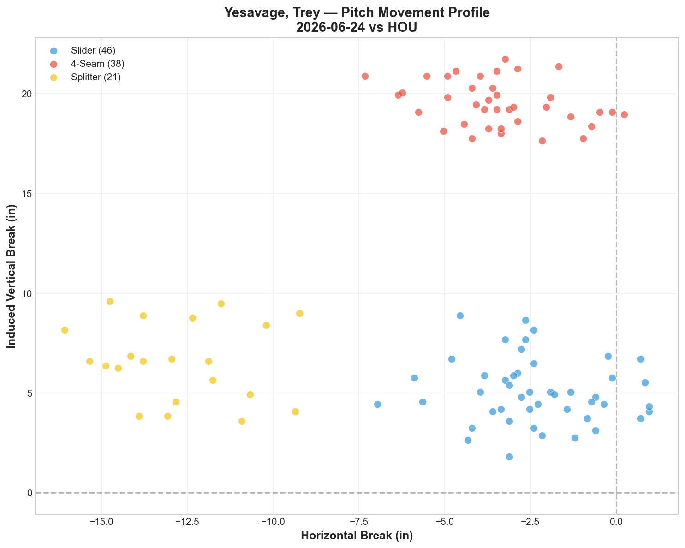
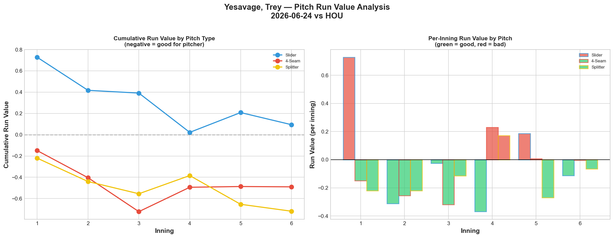
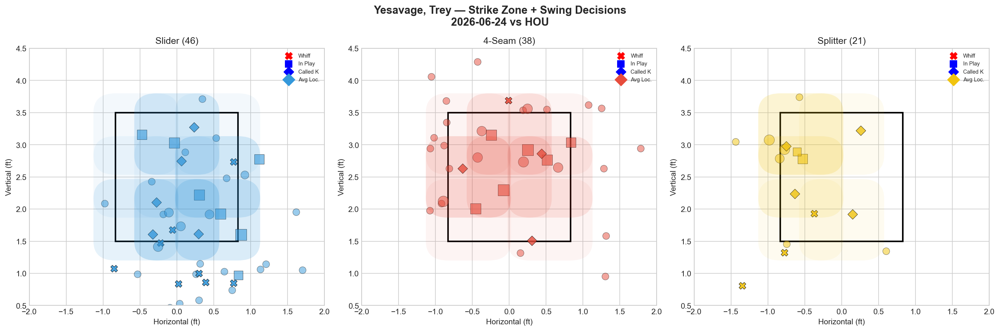
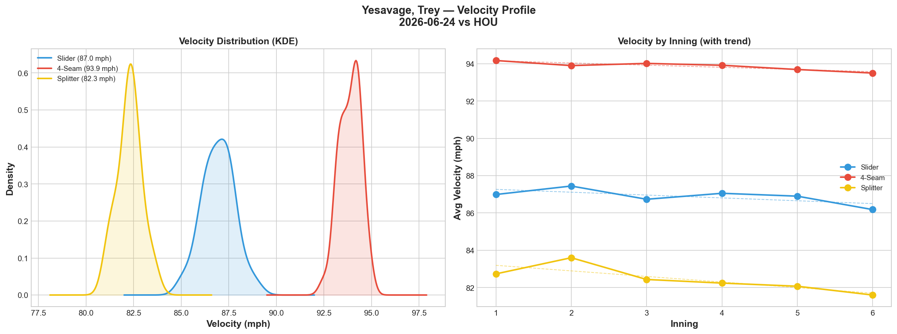
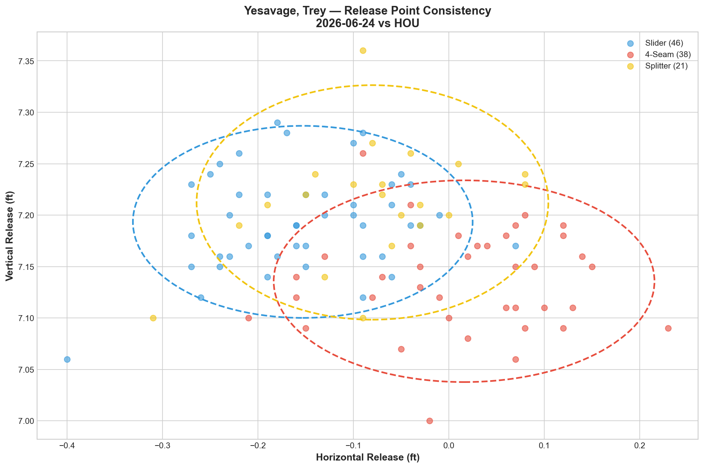
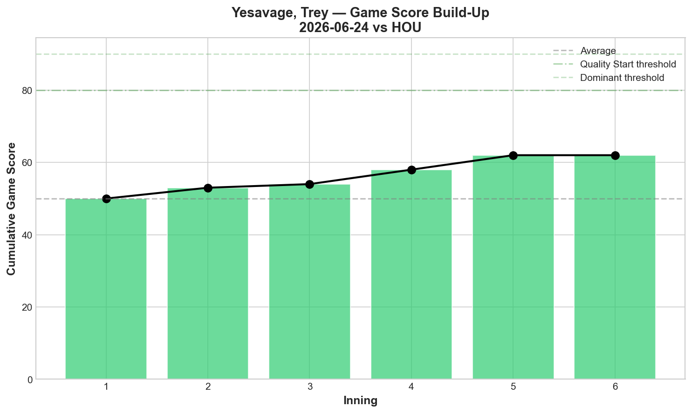
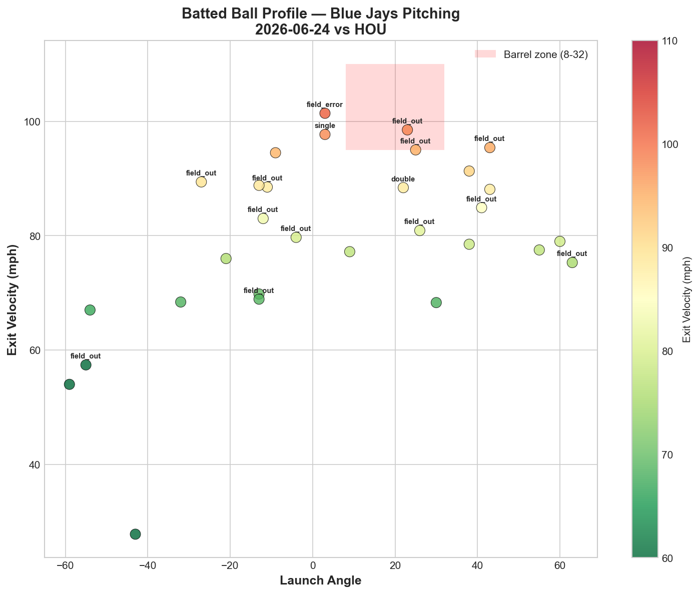
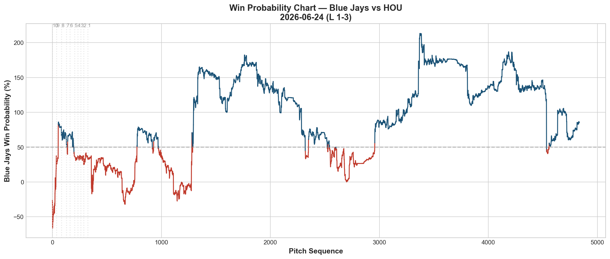
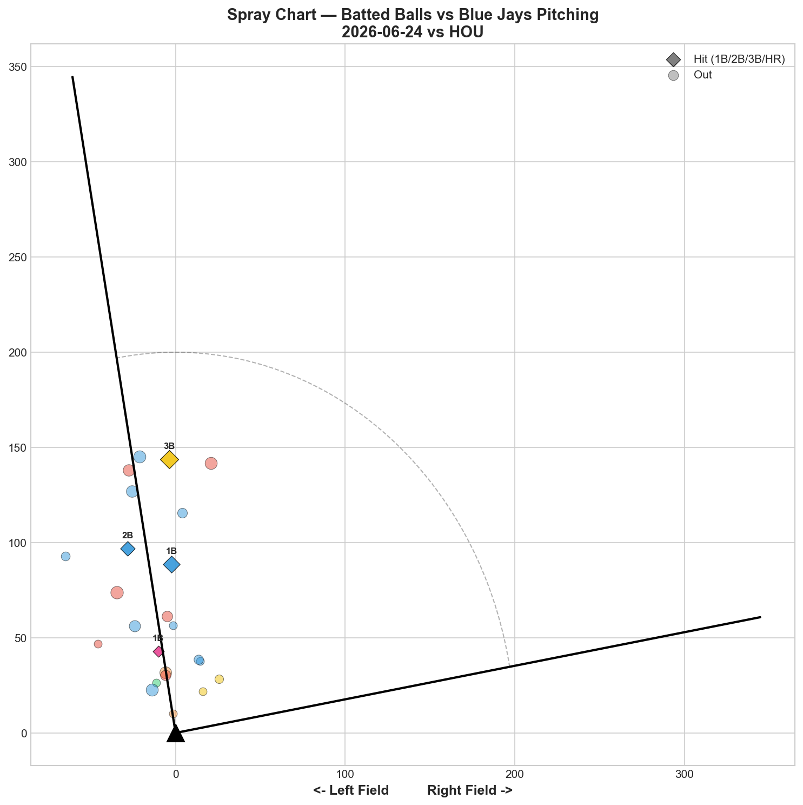

# 🏟️ Blue Jays Game Report v2.1
## 2026-06-24 | TOR vs HOU | L 1-3

---

## 📋 Game Overview

| | |
|---|---|
| **Date** | 2026-06-24 |
| **Matchup** | Houston Astros @ Toronto Blue Jays |
| **Result** | **L 1-3 (10 innings)** |
| **Starter** | Trey Yesavage (105 pitches) |
| **Spotlight Pitcher** | None |
| **Season Record** | 39W-40L |

---

## 🔥 Key Storylines

### 1. The Binary Switch Theory Gets Its Toughest Test — 5 Walks But Still Negative RV

Our documented pattern has been absolute: Yesavage with 0 walks = all negative RV and quality starts; 6+ walks = positive RV and poor starts. Tonight breaks the clean binary: **5 walks, yet the slider (+0.094) was nearly neutral and the splitter (-0.719) was strongly negative.** This is the first data point suggesting walks alone don't fully determine outcome — pitch execution within the zone matters independently.

| Start | BB | FF RV | SL RV | FS RV | GS | Result |
|-------|-----|-------|-------|-------|----|----|
| 5/20 vs NYY | 0 | -0.851 | -2.006 | -0.915 | 74 | W |
| 5/30 vs BAL | 7 | +0.273 | +0.020 | +0.113 | 45 | L |
| 6/12 vs NYY | 6 | -0.217 | +0.569 | +2.136 | 44 | W (bailout) |
| 6/18 vs BOS | 0 | -0.248 | -0.325 | -1.191 | 63 | W |
| **6/24 vs HOU** | **5** | **-0.490** | **+0.094** | **-0.719** | **58** | **L** |

**GS 58 with 5 walks is his second-best walk-heavy outing.** The splitter carried the night even with elevated walks — a new wrinkle in the pattern. Yesavage's stuff can still play through moderate command lapses if the splitter is working.

### 2. 105 Pitches — A New Season High, and He Nearly Won It

Yesavage matched his season-high pitch count and delivered a respectable Game Score 58 in a game the Jays ultimately lost 1-3 in 10 innings. The offense managed only 1 run of support — a recurring theme when the pitching staff performs well but the bats stay quiet.

### 3. Nearly Zero Pull-Side Contact — 0 of 24 Batted Balls Pulled

Across the entire pitching staff tonight, **Houston pulled zero balls in 24 tracked batted balls (0%).** This is the most extreme spray suppression we've recorded — every ball in play went center or opposite field. Combined with a 79.7 mph average exit velocity off Yesavage, Houston simply couldn't get out in front of anything.

---

## ⚾ Starter Pitch Arsenal Analysis — Trey Yesavage

### Pitch Arsenal Performance (105 pitches)

| Pitch | # | Usage | Velo | Whiff% | CSW% | Chase% | Grade |
|-------|---|-------|------|--------|------|--------|-------|
| Slider | 46 | 43.8% | 87.0 | 30.8% | 28.3% | 44.4% | 🟢 A |
| 4-Seam | 38 | 36.2% | 93.9 | 7.1% | 10.5% | 20.0% | 🔴 D |
| Splitter | 21 | 20.0% | 82.3 | 33.3% | 33.3% | 38.5% | 🟢 A |

Two A-grade pitches (Slider, Splitter) at a combined 63.8% usage — the highest off-speed commitment we've tracked from Yesavage. The slider was his most-used pitch of the season by a wide margin (46 pitches, 43.8%).

### The Whiff/RV Split Continues — Splitter Converts, Slider Doesn't

| Pitch | Whiff% | RV | Conversion? |
|-------|--------|-----|--------------|
| Splitter | 33.3% | -0.719 | ✅ Yes |
| Slider | 30.8% | +0.094 | 🟡 Nearly neutral |
| 4-Seam | 7.1% | -0.490 | ✅ Yes (despite low whiff) |

The splitter remains Yesavage's most reliable run-prevention pitch — negative RV in 3 of his last 4 tracked starts (6/5, 6/18, 6/24). The slider generates whiffs but hasn't consistently converted that into value across his last several outings, echoing the staff-wide whiff/RV disconnect pattern.

### Pitch Movement (inches)

| Pitch | H-Break | V-Break | Count |
|-------|---------|---------|-------|
| Slider (SL) | -2.3 | 5.1 | 46 |
| 4-Seam (FF) | -3.4 | 19.5 | 38 |
| Splitter (FS) | -12.8 | 6.6 | 21 |

### Pitch Tunneling Analysis

| Pair | Release Sim | Plate Sep | Tunnel | Velo Gap |
|------|-------------|-----------|--------|----------|
| **Slider/Splitter** | **0.9in** | **10.5in** | **🟢 11.6** | **4.7mph** |
| 4-Seam/Splitter | 1.5in | 15.9in | 🟢 10.8 | 11.6mph |
| Slider/4-Seam | 2.1in | 14.5in | 🟢 6.8 | 6.9mph |

Consistent with his season-long SL/FS tunneling identity, though slightly below his season-best (14.5 on 6/18).

### Pitch Run Value by Type

| Pitch | Total RV | Per Pitch | Pitches | Assessment |
|-------|----------|-----------|---------|------------|
| Splitter | **-0.719** | **-0.0342** | 21 | ✅ Best pitch |
| 4-Seam | -0.490 | -0.0129 | 38 | ✅ Effective despite low whiff |
| Slider | +0.094 | +0.002 | 46 | 🟡 Essentially neutral |

**Net: -1.115 RV.** A solid outing overall — his fourth negative-total-RV start out of his last five, a marked improvement from his May volatility.

### Pitch Selection by Count

| Situation | Primary | Secondary | Notes |
|-----------|---------|-----------|-------|
| First Pitch (0-0) | 4-Seam 52.0% | Slider 40.0% | FF-led first pitch |
| Ahead | SL/FF 42.3% each | Splitter 15.4% | Balanced |
| Behind | Slider 52.2% | 4-Seam 34.8% | **Slider trusted even behind** |
| Even | **Splitter 50.0%** | Slider 31.8% | Splitter-dominant neutral |
| Full Count (3-2) | **Slider 66.7%** | 4-Seam 22.2% | Slider on 3-2 — high confidence |

**66.7% slider usage on full counts** shows Yesavage's growing trust in the pitch, even though tonight's slider RV was only neutral. This is the same trajectory Corbin showed with his full-count evolution — pitchers adjusting sequencing toward analytically-supported pitches.

**Strikeout Pitches (5 K's):** FS 4, SL 1 — splitter dominant as the swing-and-miss weapon.

### vs LHB/RHB Split

| Stand | Pitches | Avg Velo | Swinging Strikes | Whiff/Pitch |
|-------|---------|----------|------------------|-------------|
| L | 32 | 88.9 | 2 | 6.2% |
| R | 73 | 88.3 | 10 | 13.7% |

More than double the whiff rate against RHH — Houston's predominantly right-handed lineup construction played into Yesavage's slider/splitter strengths.

### Top Opposing Batters

| Batter | Pitches | Hits | K | BB | Avg EV |
|--------|---------|------|---|-----|--------|
| Jeremy Peña | 17 | 0 | 1 | 2 | 81.4 |
| Yainer Díaz | 17 | 1 | 0 | 0 | 78.4 |
| Yordan Álvarez | 13 | 0 | 1 | 1 | 63.0 |
| Joey Loperfido | 13 | 0 | 0 | 1 | 74.4 |
| Cam Smith | 12 | 0 | 1 | 1 | **98.5** |

**Peña and Álvarez combined 0-for in 30 pitches — Houston's top two threats held.** Smith's 98.5 mph average EV stands out as the lone hard-contact data point among the top hitters, though he didn't record a hit.

### Velocity Profile

- **Slider:** 87.0 → 86.2 mph (-0.8)
- **4-Seam:** 94.2 → 93.5 mph (-0.7)
- **Splitter:** 82.7 → 81.6 mph (-1.1)

Modest, proportional declines across all three pitches at 105 pitches — no red-flag fatigue signal like the 6/12 outing.

### Game Score / Batted Ball

**Game Score: 58 (QUALITY).** 5K, 4H, 0HR, 5BB on 105 pitches — his second-highest GS of June behind the 6/18 shutout-adjacent effort.

| Metric | Value |
|--------|-------|
| Total BIP | 30 |
| Avg Exit Velo | 79.7 mph |
| Avg Launch Angle | 5.2° |
| Hard Hit (95+ mph) | 5/30 (17%) |

79.7 mph average EV and a strikingly low 5.2° average launch angle — Houston was hitting the ball on the ground far more than usual against him, suggesting the splitter's sink was doing damage.

---

## 📊 Bullpen Detailed Analysis

| Pitcher | Pitches | Line | Key Pitch | Notes |
|---------|---------|------|-----------|-------|
| **Mason Fluharty** | 20 | 0K / 2BB / 1H / 0HR | **FC 25% whiff 🟢B** | Cutter graded positively — encouraging |
| **Jeff Hoffman** | 17 | 2K / 0BB / 1H / 0HR | SL 40% whiff 🟢A | Slider elite again |
| **Tommy Nance** | 12 | 1K / 0BB / 0H / 0HR | CU 100% whiff 🟢A | Curveball perfect — small sample |

### Bullpen Notes

- **Fluharty's cutter graded B (25% whiff)** — a positive sign after recent D-grade cutter outings. If this pitch stabilizes as a complement to the sweeper, his overall profile improves significantly.
- **Hoffman** extended his post-6/10 recovery stretch: slider 40% whiff, continuing to anchor high-leverage innings reliably.
- **Nance's curveball at 100% whiff** (3 pitches) is a tiny sample but adds to his developing multi-pitch profile alongside his now-consistent slider.
- The bullpen combined for 0 runs allowed across 49 pitches — the extra-innings loss came down to the Jays' offense managing only 1 run.

---

## 📈 Win Probability Analysis

### Key WPA Moments

| Inning | Event | Impact |
|--------|-------|--------|
| 9 | Lovelady — home_run | 📉 Astros scored |
| 9 | Smith — home_run | 📉 Astros extended |
| 9 | Kuhnel — GIDP | 📈 Jays escaped further damage |
| 9 | Alvarado — home_run | 📉 Astros pulled ahead decisively |
| 10 | Akin — single | 📉 Late Astros insurance |
| 10 | Armstrong — force_out | 📈 Jays limited damage |

A 9th-inning home run barrage from Houston decided the game after both starters and bullpens had kept things close.

---

## 📊 Spray Chart & Batted Ball Summary

| Metric | Value |
|--------|-------|
| Total batted balls tracked | 24 |
| Hits | 4 (17%) |
| Pull | **0 (0%)** |
| Center | 22 (92%) |
| Oppo | 2 (8%) |

**Zero pulled balls across 24 tracked batted balls — the most extreme spray suppression recorded this season.** Houston's inability to get out in front of the pitching staff's mix (slider, splitter, sinker) resulted in nearly all contact going center or opposite field.

---

## 🎯 Analytical Takeaways

1. **Yesavage's Binary Walk Theory Gets Nuanced** — 5 BB but GS 58 and -1.115 total RV. The splitter (-0.719) carried the outing despite elevated walks. The pattern isn't perfectly binary; when the splitter is dominant enough, moderate walk totals can be overcome. Extreme walk counts (6-7) still appear to be the true breaking point.

2. **Splitter Is Now Yesavage's Most Trustworthy Pitch** — Negative RV in 3 of his last 4 outings (6/5, 6/18, 6/24). The slider generates more whiffs overall but hasn't matched the splitter's conversion rate into actual run prevention recently.

3. **Zero Pull-Side Contact Is a Historic Suppression Signal** — Combined staff effort held Houston to 0% pull rate on 24 batted balls. This level of contact management, even in a loss, reflects a cohesive pitching plan across the whole staff.

4. **105 Pitches, Zero Bullpen Runs Allowed, Still a Loss** — The pitching staff did its job (1 run allowed through 9 before extras). The offense's inability to score more than 1 run remains the team's binding constraint in close games.

5. **39-40 — Back Below .500 in Extras** — The fifth trip to .500 (6/22) was immediately followed by a regression. The team continues to oscillate around the break-even line rather than sustaining a breakthrough.

6. **Game Classification: Quality Start, Offense Shortfall Loss** — Yesavage's GS 58 and a scoreless bullpen weren't enough because the Jays managed only 1 run. This loss falls on run support, not pitching execution.

---

*Report generated from Statcast data via pybaseball. All pitch metrics sourced from Baseball Savant.*
