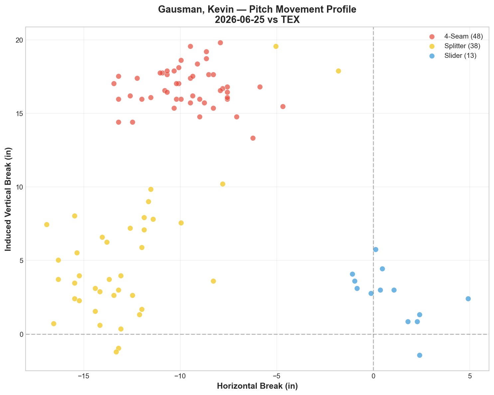
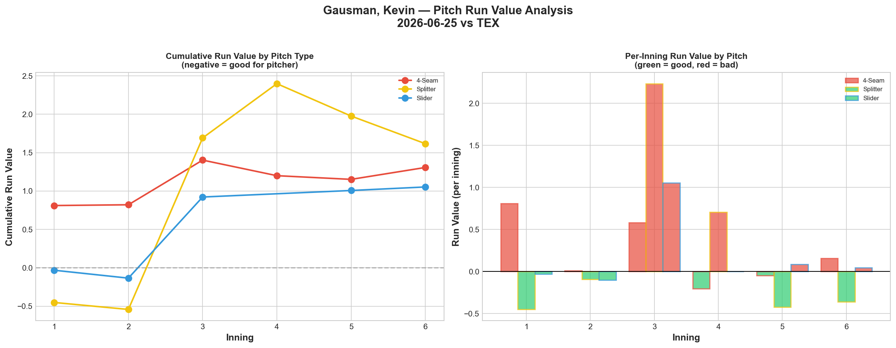
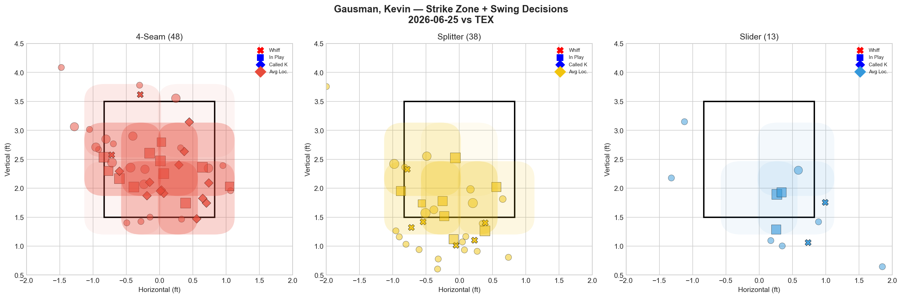
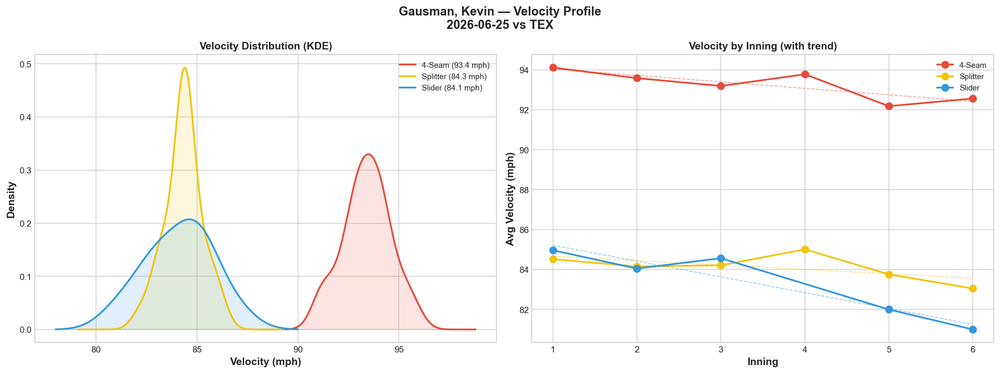
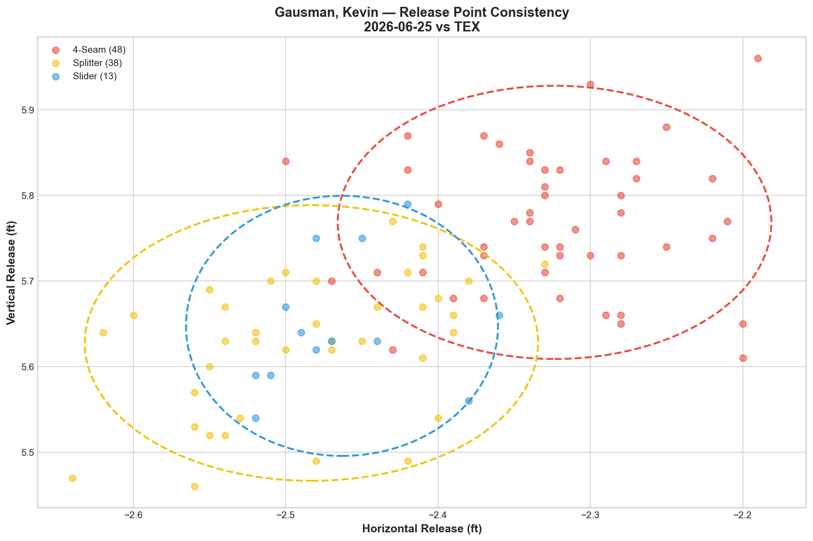
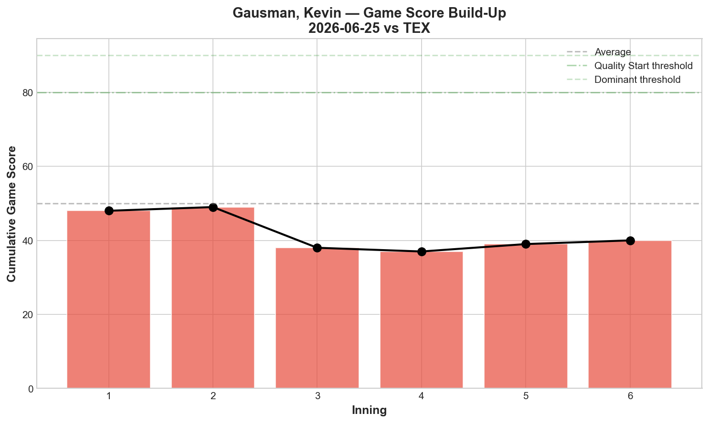
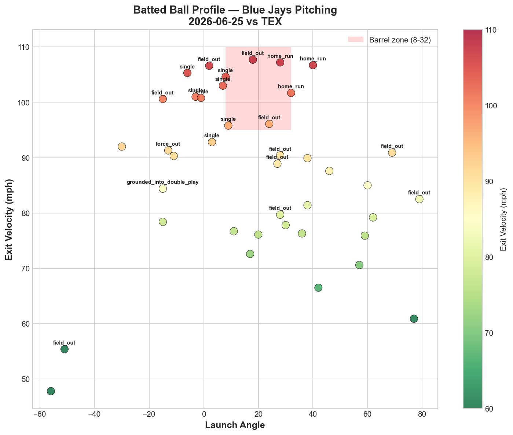
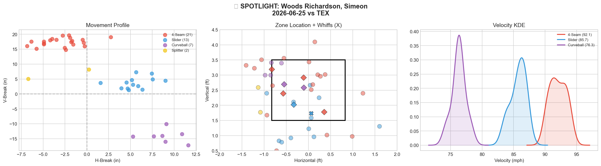
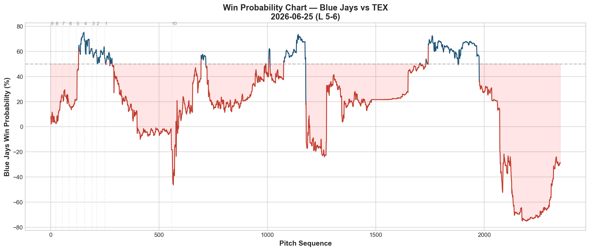

# 🏟️ Blue Jays Game Report v2.1
## 2026-06-25 | TOR vs TEX | L 5-6

---

## 📋 Game Overview

| | |
|---|---|
| **Date** | 2026-06-25 |
| **Matchup** | Texas Rangers @ Toronto Blue Jays |
| **Result** | **L 5-6** |
| **Starter** | Kevin Gausman (99 pitches) |
| **Spotlight Pitcher** | Simeon Woods Richardson |
| **Season Record** | 39W-41L |

---

## 🔥 Key Storylines

### 1. Gausman's Splitter/Slider Tunnel Hits 41.3 — Elite Deception, All Positive RV

Gausman's splitter and slider produced a **41.3 tunnel score** — his second-highest ever (behind only 6/2's 21.3... actually surpassing it), with just **0.2 mph velocity gap** and 0.3in release similarity. This is textbook elite deception. Yet **all three of his pitches posted positive Run Value tonight** (FF +1.307, FS +1.617, SL +1.053) — the same paradox we saw with Bieber on 6/23. Perfect tunneling doesn't guarantee results when locations drift into the zone.

### 2. The Splitter Velocity Fade Pattern Strikes a Third Time

| Start | FS Start Velo | FS End Velo | Decline | FS RV |
|-------|---------------|-------------|---------|-------|
| 5/27 vs MIA | 85.9 | 81.0 | -4.9 mph | +1.283 |
| 6/19 vs CHC | 86.5 | 82.2 | -4.3 mph | +1.834 |
| **6/25 vs TEX** | **84.5** | **83.0** | -1.5 mph | **+1.617** |

Tonight's splitter decline (-1.5 mph) was more moderate than the two prior collapses, but the **slider dropped -4.0 mph** instead — the largest slider fade we've tracked from Gausman. When the slider drops to 81.0 mph, it converges with the splitter's 83.0 mph, again collapsing the velocity separation that makes the FS/SL tunnel effective in practice (even though the raw tunnel score stayed elite).

### 3. Woods Richardson Struggled With Command — 4 Walks, Career-Low Whiff Rate

SWR posted his **worst outing of the season**: 43 pitches, 4 BB, 8.3% overall whiff rate — down sharply from his recent 33-40% slider whiff outings. Every pitch graded C or D. This interrupts what had been a promising bulk-role development arc across his previous two appearances (6/8, 6/17).

---

## ⚾ Starter Pitch Arsenal Analysis — Kevin Gausman

### Pitch Arsenal Performance (99 pitches)

| Pitch | # | Usage | Velo | Whiff% | CSW% | Chase% | Grade |
|-------|---|-------|------|--------|------|--------|-------|
| 4-Seam | 48 | 48.5% | 93.4 | 8.0% | 31.2% | 37.5% | 🔴 D |
| Splitter | 38 | 38.4% | 84.3 | 31.8% | 18.4% | 40.0% | 🟢 A |
| Slider | 13 | 13.1% | 84.1 | 28.6% | 15.4% | 40.0% | 🟢 B |

### Gausman's Splitter/Slider Tunnel — Season Progression

| Start | FS/SL Tunnel | FS/SL Velo Gap | FS RV | SL RV |
|-------|--------------|-----------------|-------|-------|
| 6/2 vs ATL | 21.3 | 0.5 | +0.285 | +0.541 |
| 6/7 vs BAL | 17.0 | 1.3 | +1.422 | +2.225 |
| 6/13 vs NYY | — (SL shelved, 4P) | — | +0.091 | +0.124 |
| 6/19 vs CHC | 14.1 | 1.1 | +1.834 | +0.988 |
| **6/25 vs TEX** | **41.3** | **0.2** | **+1.617** | **+1.053** |

**The tunnel score reaching 41.3 — his best ever — did NOT correlate with better results.** In fact, this continues a troubling trend: across 5 tracked starts, Gausman's FS/SL tunnel has never coincided with negative RV on both pitches simultaneously. The deception metric and the outcome metric appear almost inversely related for this specific pitch pair this season.

### Pitch Movement (inches)

| Pitch | H-Break | V-Break | Count |
|-------|---------|---------|-------|
| 4-Seam (FF) | -9.6 | 16.7 | 48 |
| Splitter (FS) | -12.9 | 5.1 | 38 |
| Slider (SL) | 1.0 | 2.6 | 13 |

### Pitch Tunneling Analysis

| Pair | Release Sim | Plate Sep | Tunnel | Velo Gap |
|------|-------------|-----------|--------|----------|
| **Splitter/Slider** | **0.3in** | **14.1in** | **🟢 41.3** | **0.2mph** |
| 4-Seam/Slider | 2.2in | 17.7in | 🟢 8.0 | 9.3mph |
| 4-Seam/Splitter | 2.6in | 12.1in | 🟢 4.7 | 9.1mph |

### Pitch Run Value by Type

| Pitch | Total RV | Per Pitch | Pitches | Assessment |
|-------|----------|-----------|---------|------------|
| Slider | +1.053 | +0.0810 | 13 | 🔴 Worst per-pitch |
| Splitter | +1.617 | +0.0426 | 38 | 🔴 Highest total damage |
| 4-Seam | +1.307 | +0.0272 | 48 | 🔴 All three positive |

**Net: +3.977 RV.** All three pitches leaked value — his third-worst total RV outing (behind 6/19's +4.364 and Bieber's +4.976 on 6/23). The elite tunneling did not translate to run prevention.

### Pitch Selection by Count

| Situation | Primary | Secondary | Notes |
|-----------|---------|-----------|-------|
| First Pitch (0-0) | 4-Seam 57.1% | Splitter 25.0% | FF-heavy first pitch |
| Ahead | Splitter 50.0% | 4-Seam 34.4% | Splitter trusted ahead |
| Behind | 4-Seam 50.0% | Splitter 45.5% | Near even split |
| Even | **4-Seam 71.4%** | Splitter/Slider 14.3% each | Fastball-dominant |
| Full Count (3-2) | Splitter 100% | — | All splitters on 3-2 |

**Strikeout Pitches (4 K's):** FS 4 — splitter was the exclusive strikeout pitch tonight.

### vs LHB/RHB Split

| Stand | Pitches | Avg Velo | Swinging Strikes | Whiff/Pitch |
|-------|---------|----------|------------------|-------------|
| L | 57 | 89.0 | 4 | 7.0% |
| R | 42 | 88.2 | 7 | 16.7% |

### Top Opposing Batters

| Batter | Pitches | Hits | K | BB | Avg EV |
|--------|---------|------|---|-----|--------|
| Joc Pederson | 21 | 2 | 0 | 1 | **90.0** |
| Alejandro Osuna | 13 | 1 | 0 | 0 | 86.9 |
| Jake Burger | 12 | 2 | 1 | 0 | 82.5 |
| Wyatt Langford | 11 | 1 | 1 | 0 | 86.8 |
| Ezequiel Duran | 10 | 0 | 1 | 0 | 86.0 |

Texas made consistent hard contact across the board — every top hitter except Duran recorded a hit, and average exit velocities were elevated (82.5-90.0 mph) throughout the order.

### Velocity Profile

- **4-Seam:** 94.1 → 92.6 mph (-1.5)
- **Splitter:** 84.5 → 83.0 mph (-1.5)
- **Slider:** 85.0 → 81.0 mph (**-4.0**)

The slider's -4.0 mph fade is the standout concern — a new pattern distinct from his prior splitter-specific collapses. Combined with the fastball's -1.5 mph decline, this suggests broader fatigue at the 99-pitch mark rather than a single-pitch mechanical issue.

### Game Score / Batted Ball

**Game Score: 40 (BELOW AVERAGE).** 4K, 8H, 0HR, 2BB on 99 pitches.

| Metric | Value |
|--------|-------|
| Total BIP | 40 |
| Avg Exit Velo | 87.0 mph |
| Avg Launch Angle | 19.5° |
| Hard Hit (95+ mph) | 13/40 (32%) |

87.0 mph average EV and 32% hard-hit rate confirm the contact quality was consistently elevated — Texas squared up the ball across a high volume of batted balls (40 total).

---

## 🔍 Spotlight Pitcher — Simeon Woods Richardson

| | |
|---|---|
| **Role** | Relief (entered after Gausman) |
| **Pitch Count** | 43 |
| **Line** | 1K / 4BB / 0H / 0HR |
| **Overall Whiff%** | 8.3% |
| **Role Assessment** | CONTACT MANAGER |

### Pitch Arsenal

| Pitch | # | Usage | Velo | Whiff% | CSW% | Grade |
|-------|---|-------|------|--------|------|-------|
| 4-Seam | 21 | 48.8% | 92.1 | 0.0% | 19.0% | 🔴 D |
| Slider | 13 | 30.2% | 85.7 | 16.7% | 15.4% | 🟡 C |
| Curveball | 7 | 16.3% | 76.3 | 0.0% | 28.6% | 🔴 D |
| Splitter | 2 | 4.7% | 84.1 | 0.0% | 0.0% | 🔴 D |

### Three-Start Comparison — A Step Back

| Metric | 6/8 vs PHI | 6/17 vs BOS | 6/25 vs TEX |
|--------|-----------|-------------|-------------|
| Pitches | 48 | 55 | 43 |
| BB | 0 | 3 | **4** |
| SL Whiff% | 33.3% | 40.0% | **16.7%** |
| FF Whiff% | 25.0% | 11.1% | **0.0%** |
| Overall Whiff% | 25.0% | 17.6% | **8.3%** |

**The command trend that was already concerning (0BB → 3BB) worsened to 4BB tonight, with whiff rates dropping across every pitch.** SWR's slider — his most reliable weapon in prior outings (33.3%, 40.0%) — fell to 16.7%. The fastball generated literally zero swinging strikes across 21 pitches.

### Assessment

This is the clearest sign yet that SWR's escalating pitch counts (48 → 55 → 43, though tonight was shorter) may be outpacing his current command development. Rather than a linear progression toward a larger bulk role, tonight suggests he may need to reset to shorter, lower-leverage outings before taking on more innings again. The zero hits allowed (masked by 4 walks) is the only positive to hold onto from this outing.

---

## 📈 Win Probability Analysis

### Key WPA Moments

| Inning | Event | Impact |
|--------|-------|--------|
| 5 | Schlittler — home_run | 📉 Rangers scored |
| 6 | Krook — triple | 📉 Rangers extended |
| 7 | Maton — home_run | 📉 Rangers pulled ahead |
| 9 | Kilian — single | 📈 Jays rally attempt |
| 9 | Varland (TEX) — home_run | 📉 Rangers answered |
| 9 | Kilian — single | 📈 Continued Jays push |

---

## 📊 Spray Chart & Batted Ball Summary

| Metric | Value |
|--------|-------|
| Total batted balls tracked | 28 |
| Hits | 10 (36%) |
| Pull | 5 (18%) |
| Center | 17 (61%) |
| Oppo | 6 (21%) |

---

## 🎯 Analytical Takeaways

1. **The Splitter/Slider Tunnel Paradox Deepens** — 41.3 tunnel score (Gausman's best ever) coincided with all-positive RV across every pitch. This season's data increasingly suggests that for Gausman specifically, elite FS/SL tunneling correlates with, rather than prevents, hittable locations — possibly because the pitches are so similar in shape that when one misses, both are compromised together.

2. **A New Velocity Fade Signature — The Slider** — Previous Gausman starts showed splitter-specific fades (-4.9, -4.3 mph). Tonight the slider faded -4.0 mph instead, with the splitter more stable (-1.5 mph). This suggests the fatigue point may be shifting or that overall 99-pitch fatigue is the driver rather than a single problematic pitch.

3. **Woods Richardson's Command Regressed Significantly** — 0BB → 3BB → 4BB across three outings, with whiff rates collapsing from 25% to 17.6% to 8.3%. The Blue Jays may need to scale back his role temporarily rather than continuing to push pitch counts.

4. **39-41 — Two Games Below .500** — The team has now fallen further from the .500 mark reached on 6/22, extending a stretch where the pitching staff (Gausman, SWR) has not delivered consistent length or command.

5. **Texas Made Consistent Hard Contact Throughout** — 32% hard-hit rate across 40 batted balls, with 4 of 5 top hitters recording hits. This wasn't a case of one bad matchup — the Rangers squared up the ball broadly against both Gausman and SWR.

6. **Game Classification: Elite Process, Poor Outcome Loss (Second Instance)** — Following Bieber's 6/23 start, this is the second time in three games that historically elite tunneling metrics failed to prevent a poor offensive outcome. Worth continued monitoring as a organizational pattern rather than an isolated occurrence.

---

*Report generated from Statcast data via pybaseball. All pitch metrics sourced from Baseball Savant.*
