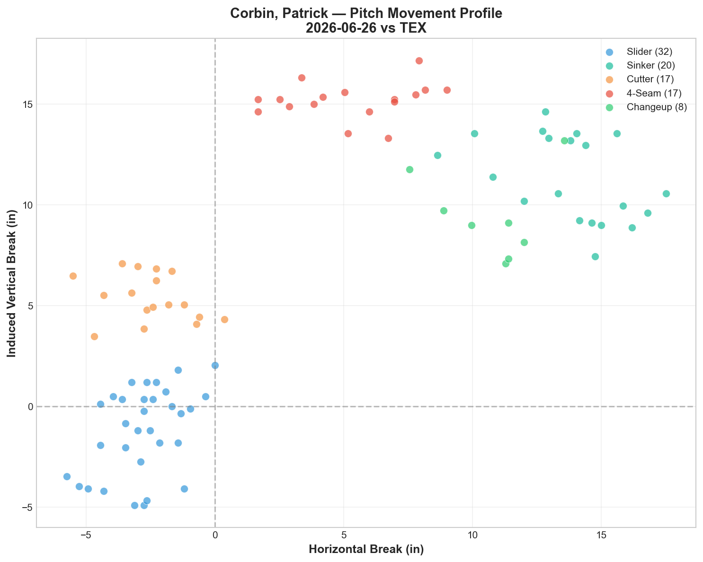
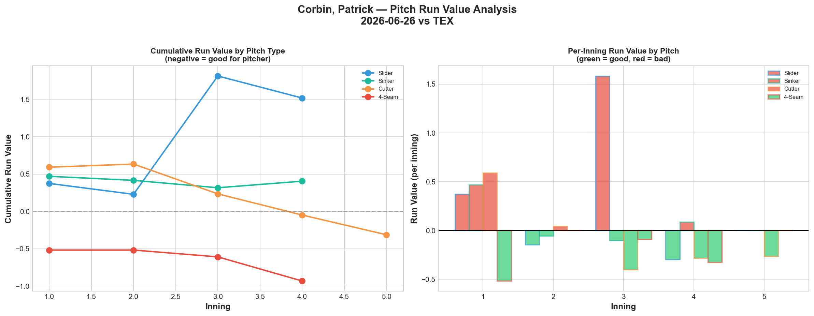
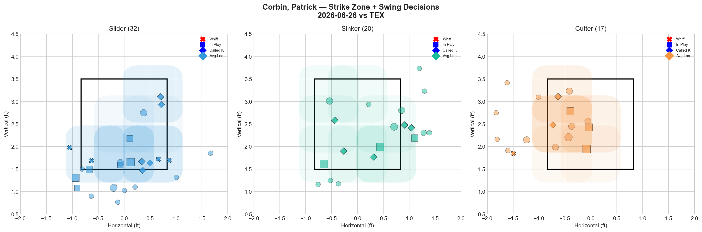
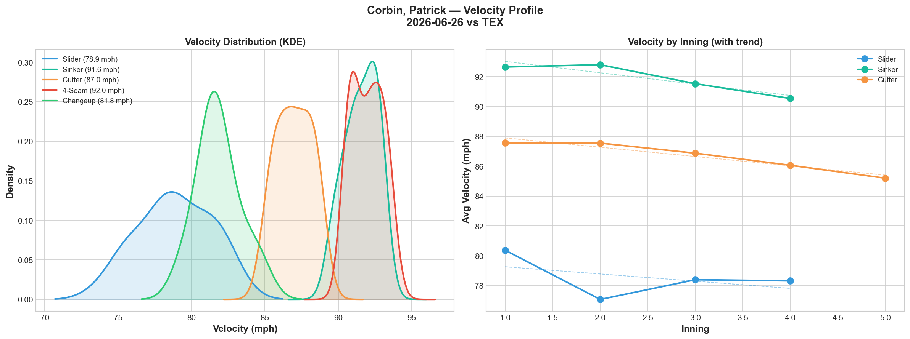
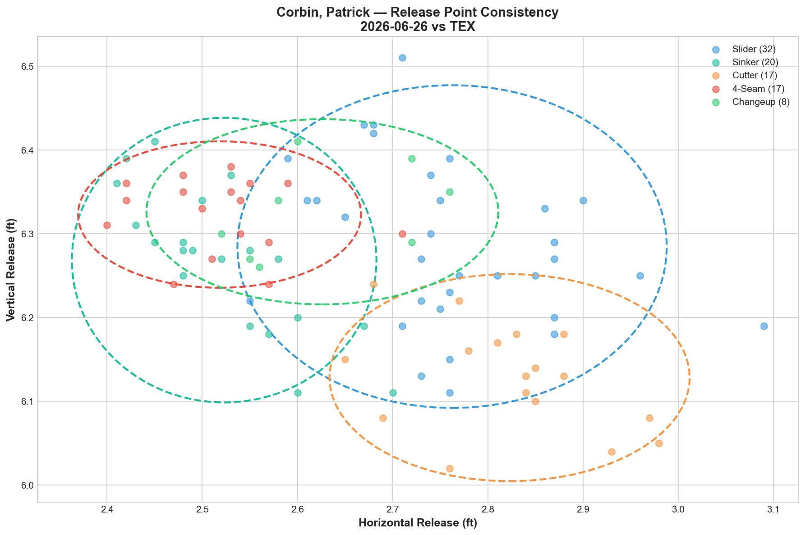
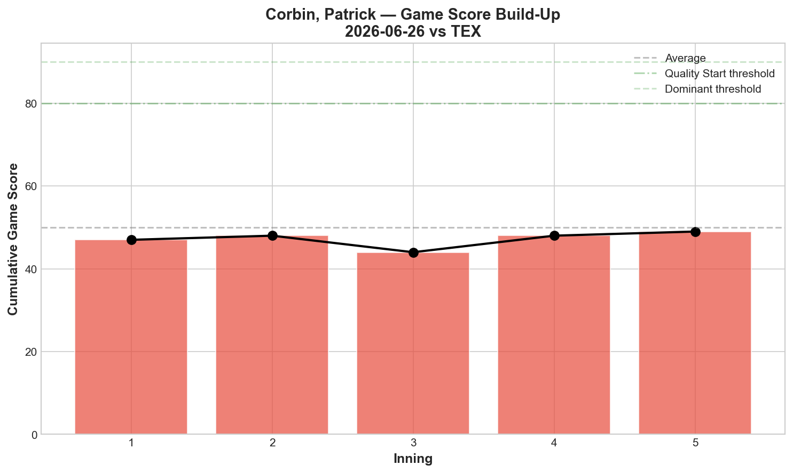
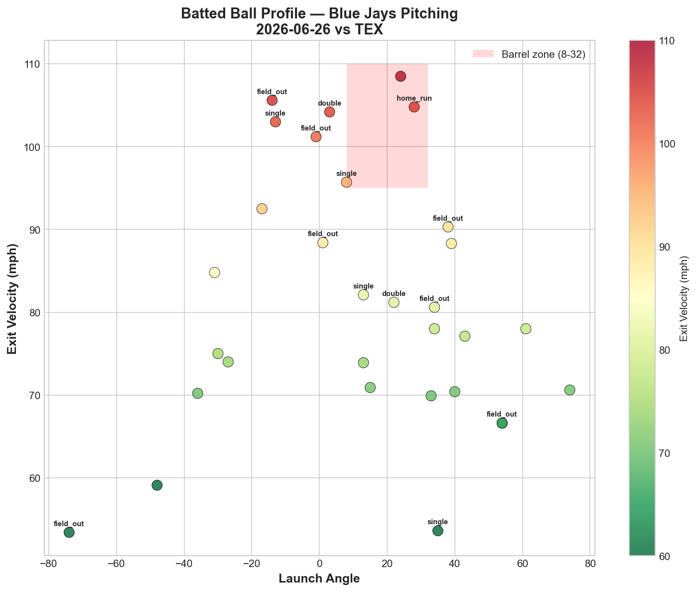
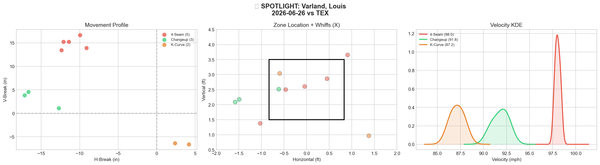
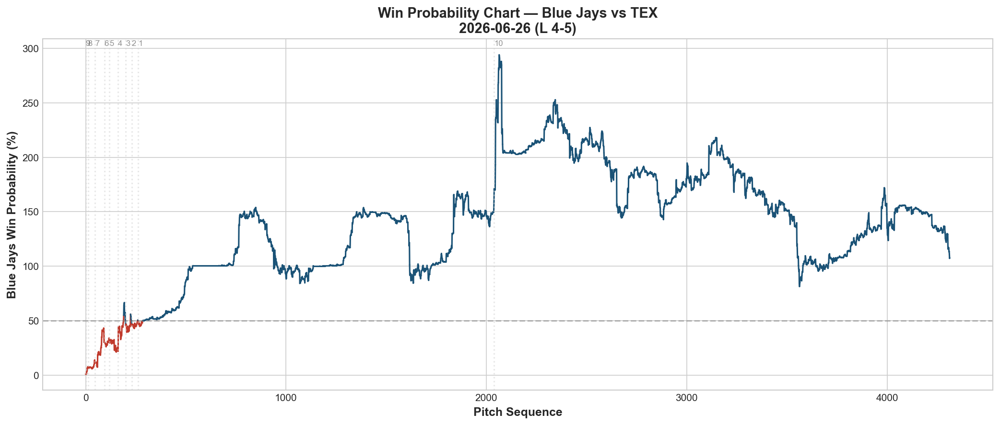

# 🏟️ Blue Jays Game Report v2.1
## 2026-06-26 | TOR vs TEX | L 4-5

---

## 📋 Game Overview

| | |
|---|---|
| **Date** | 2026-06-26 |
| **Matchup** | Texas Rangers @ Toronto Blue Jays |
| **Result** | **L 4-5 (10 innings)** |
| **Starter** | Patrick Corbin (94 pitches) |
| **Spotlight Pitcher** | Louis Varland |
| **Season Record** | 39W-42L |

---

## 🔥 Key Storylines

### 1. The Fastball Was Corbin's Best Pitch Tonight — A Complete Reversal

For a pitcher whose data has consistently pointed to the changeup as the answer, tonight flipped the script: **4-Seam posted -0.931 RV (best pitch), while the changeup posted +1.360 RV (worst per-pitch at +0.170).** Both the slider (+1.518) and changeup leaked heavily. Only the cutter (-0.312) and fastball provided value. This is the first tracked Corbin start where the fastball outperformed the changeup — worth watching whether it's a blip or a genuine shift.

### 2. Three Pitches Faded 2+ mph — A Broader Fatigue Signal

| Pitch | Start Velo | End Velo | Decline |
|-------|-----------|----------|---------|
| Slider | 80.4 | 78.3 | -2.0 mph |
| Sinker | 92.6 | 90.5 | -2.1 mph |
| Cutter | 87.6 | 85.2 | -2.4 mph |

Unlike prior single-pitch velocity collapses (Gausman's splitter, Yesavage's slider), tonight **three separate Corbin pitches all faded 2.0-2.4 mph simultaneously.** This looks like broad-based fatigue rather than a pitch-specific mechanical issue — consistent with his second consecutive start exceeding 90+ pitches (101 on 6/20, 94 tonight).

### 3. Varland's Spotlight Outing Was His Worst of the Season

Louis Varland posted **0.0% whiff rate across 10 pitches** — all three pitch types (4-Seam, Changeup, K-Curve) graded D. This breaks a string of recent strong appearances (6/17's historic 3-A-grade outing, 6/22's clean 12-pitch effort) and reinforces his established "binary switch" pattern: elite or flat, with no consistent middle ground.

---

## ⚾ Starter Pitch Arsenal Analysis — Patrick Corbin

### Pitch Arsenal Performance (94 pitches)

| Pitch | # | Usage | Velo | Whiff% | CSW% | Chase% | Grade |
|-------|---|-------|------|--------|------|--------|-------|
| Slider | 32 | 34.0% | 78.9 | 30.8% | 28.1% | 30.0% | 🟢 A |
| Sinker | 20 | 21.3% | 91.6 | 0.0% | 25.0% | 25.0% | 🔴 D |
| Cutter | 17 | 18.1% | 87.0 | 10.0% | 17.6% | 28.6% | 🟡 C |
| 4-Seam | 17 | 18.1% | 92.0 | 0.0% | 23.5% | 44.4% | 🔴 D |
| Changeup | 8 | 8.5% | 81.8 | 0.0% | 0.0% | 0.0% | 🔴 D |

Changeup usage dropped to just 8.5% tonight — his lowest of the 7-start tracked stretch — a notable departure from 6/20's season-high 34.7% usage.

### The Whiff/RV Disconnect, Corbin Edition

| Pitch | Whiff% | Grade | RV | Note |
|-------|--------|-------|-----|------|
| Slider | 30.8% | A | +1.518 | 🔴 High whiff, worst total damage |
| Changeup | 0.0% | D | +1.360 | 🔴 Zero whiffs, still leaked heavily |
| 4-Seam | 0.0% | D | -0.931 | ✅ Zero whiffs, best pitch by RV |

**The 4-seam posted the best run value with 0% whiff** — pure called-strikes-and-weak-contact effectiveness, no swing-and-miss required. Meanwhile the slider generated real whiffs (30.8%) but still bled the most total value. This is the mirror image of the typical staff-wide pattern and underscores how variable Corbin's night-to-night pitch effectiveness has been across the sample.

### 7-Start Changeup Streak Snapped

| Start | CH Usage | CH RV |
|-------|----------|-------|
| 5/23 – 6/20 (6 straight) | 16-35% | Negative every time |
| **6/26 vs TEX** | **8.5%** | **+1.360** |

The changeup's negative-RV streak (6 consecutive starts, -3.243 cumulative through 6/20) ended tonight with both reduced usage and a positive result. Whether this reflects an off night for the pitch itself or simply insufficient sample size (8 pitches) at low usage remains to be seen in future starts.

### Pitch Movement (inches)

| Pitch | H-Break | V-Break | Count |
|-------|---------|---------|-------|
| Slider (SL) | -2.8 | -1.2 | 32 |
| Sinker (SI) | 13.8 | 11.3 | 20 |
| Cutter (FC) | -2.5 | 5.4 | 17 |
| 4-Seam (FF) | 5.3 | 15.2 | 17 |
| Changeup (CH) | 10.8 | 9.4 | 8 |

### Pitch Tunneling Analysis

| Pair | Release Sim | Plate Sep | Tunnel | Velo Gap |
|------|-------------|-----------|--------|----------|
| **Sinker/4-Seam** | **0.7in** | **9.3in** | **🟢 14.3** | **0.4mph** |
| Slider/Changeup | 1.7in | 17.2in | 🟢 10.1 | 3.0mph |
| Slider/Sinker | 2.9in | 20.8in | 🟢 7.2 | 12.7mph |
| Slider/4-Seam | 3.0in | 18.3in | 🟢 6.2 | 13.1mph |

Sinker/4-Seam tunnel scored highest (14.3) — but with both pitches also grading D by whiff rate, this deception didn't translate into swing-and-miss production tonight.

### Pitch Run Value by Type

| Pitch | Total RV | Per Pitch | Pitches | Assessment |
|-------|----------|-----------|---------|------------|
| 4-Seam | **-0.931** | **-0.0548** | 17 | ✅ Best pitch |
| Cutter | -0.312 | -0.0184 | 17 | ✅ Effective |
| Sinker | +0.405 | +0.0203 | 20 | 🔴 Leaked |
| Changeup | +1.360 | +0.1700 | 8 | 🔴 Worst per-pitch |
| Slider | +1.518 | +0.0474 | 32 | 🔴 Highest total damage |

**Net: +2.040 RV.** A below-average night overall, with the fastball's efficiency (-0.0548 per pitch) the lone standout.

### Pitch Selection by Count

| Situation | Primary | Secondary | Notes |
|-----------|---------|-----------|-------|
| First Pitch (0-0) | Slider 33.3% | Sinker 28.6% | Slider-led |
| Ahead | Slider 33.3% | 4-Seam 27.8% | Slider trusted ahead |
| Behind | Slider 38.1% | 4-Seam/Sinker 19.0% each | Slider even when behind |
| Even | Slider 33.3% | Sinker 25.0% | Slider-dominant |
| Full Count (3-2) | Slider 30.0% | FF/FC/SI 20% each | Diverse — no dominant pitch |

**Strikeout Pitches (5 K's):** FF 2, SL 2, FC 1.

### Top Opposing Batters

| Batter | Pitches | Hits | K | BB | Avg EV |
|--------|---------|------|---|-----|--------|
| Jake Burger | 16 | 0 | 1 | 1 | 72.2 |
| Josh Jung | 16 | 0 | 2 | 0 | 70.1 |
| Brandon Nimmo | 14 | 1 | 1 | 0 | 81.7 |
| Kyle Higashioka | 11 | 0 | 1 | 0 | **94.6** |
| Justin Foscue | 11 | 2 | 0 | 0 | 88.4 |

Burger and Jung — Texas' power bats — combined 0-for in 32 pitches with 3 strikeouts. Foscue's 2 hits at 88.4 mph EV were the primary damage against Corbin directly.

### Game Score / Batted Ball

**Game Score: 49 (AVERAGE).** 5K, 4H, 0HR, 2BB on 94 pitches — his second straight start exceeding 90 pitches.

| Metric | Value |
|--------|-------|
| Total BIP | 31 |
| Avg Exit Velo | 81.2 mph |
| Avg Launch Angle | 12.1° |
| Hard Hit (95+ mph) | 7/31 (23%) |

---

## 🔍 Spotlight Pitcher — Louis Varland

| | |
|---|---|
| **Pitch Count** | 10 |
| **Line** | 1K / 0BB / 1H / 0HR |
| **Overall Whiff%** | 0.0% |
| **Role Assessment** | CONTACT MANAGER |

### Pitch Arsenal

| Pitch | # | Usage | Velo | Whiff% | CSW% | Grade |
|-------|---|-------|------|--------|------|-------|
| 4-Seam | 5 | 50.0% | 98.0 | 0.0% | 0.0% | 🔴 D |
| Changeup | 3 | 30.0% | 91.8 | 0.0% | 0.0% | 🔴 D |
| K-Curve | 2 | 20.0% | 87.2 | 0.0% | 0.0% | 🔴 D |

### Assessment — The Binary Switch, Off Position

All three pitch types graded D with zero whiffs across 10 pitches. This continues the well-documented pattern:

| Recent App | Best Pitch(es) | Whiff% | Version |
|------------|-----------------|--------|---------|
| 6/17 vs BOS | FF+SL+CH all A | High | 🟢 Elite |
| 6/22 vs HOU | KC 100% | High | 🟢 Good |
| **6/26 vs TEX** | **None** | **0.0%** | **🔴 Flat** |

Even at 98.0 mph — his fastball velocity remains elite — the lack of any swing-and-miss tonight (0.0% across the board) shows that velocity alone isn't sufficient when the secondary pitches (changeup, K-Curve) also go flat simultaneously. A small sample (10 pitches) limits how much to read into a single outing, but it fits his established pattern of high variance appearance-to-appearance.

---

## 📊 Bullpen Detailed Analysis

| Pitcher | Pitches | Line | Key Pitch | Notes |
|---------|---------|------|-----------|-------|
| **Adam Macko** | 31 | 1K / 2BB / 0H / 0HR | **FF 33.3% 🟢A, CH 50% 🟢A** | Dual A-grade again — 0 hits |
| **Spencer Miles** | 35 | 3K / 0BB / 1H / 0HR | **FF 33.3% 🟢A, SL 33.3% 🟢A** | Two A-grades in relief role |
| **Louis Varland** | 10 | 1K / 0BB / 1H / 0HR | All 🔴D | See spotlight |

### Bullpen Notes

- **Macko** delivered his now-familiar dual A-grade pattern (4-seam + changeup), extending an exceptional run of 0-hit outings across recent appearances. His slider was the only weak link tonight (0% whiff), but the fastball/changeup combination continues carrying him.
- **Miles** posted his best relief-role outing in some time: fastball (33.3% whiff) and slider (33.3% whiff) both graded A, alongside 3K in 35 pitches. This continues to validate the short-relief usage pattern that has consistently outperformed his bulk/starting appearances.

---

## 📈 Win Probability Analysis

### Key WPA Moments

| Inning | Event | Impact |
|--------|-------|--------|
| 6 | Roberts — home_run | 📉 Rangers scored |
| 7 | Brazobán — single | 📉 Rangers extended |
| 8 | Montgomery — home_run | 📉 Rangers pulled ahead |
| 9 | Senzatela — single | 📈 Jays rally attempt |
| 9 | Banda — home_run | 📉 Rangers answered |
| 10 | Morris — fielders_choice_out | 📈 Jays limited damage |

A back-and-forth extra-innings battle that ultimately fell to Texas.

---

## 📊 Spray Chart & Batted Ball Summary

| Metric | Value |
|--------|-------|
| Total batted balls tracked | 25 |
| Hits | 9 (36%) |
| Pull | 6 (24%) |
| Center | 15 (60%) |
| Oppo | 4 (16%) |

---

## 🎯 Analytical Takeaways

1. **Corbin's Fastball Outperformed the Changeup for the First Time in the Tracked Sample** — At reduced usage (8.5%), the changeup posted its first positive RV in 7 starts. Whether this reflects a genuine dip in effectiveness or simply too small a sample to draw conclusions is worth monitoring in his next outing.

2. **Three Pitches Fading 2+ mph Simultaneously Signals Broader Fatigue** — Unlike prior isolated single-pitch velocity collapses seen elsewhere on the staff, tonight's decline (slider -2.0, sinker -2.1, cutter -2.4) spanned his entire arsenal, coinciding with his second consecutive 90+ pitch outing.

3. **Varland's Binary Pattern Held — Tonight Was the "Off" Version** — 0.0% whiff across all three pitches despite elite fastball velocity (98.0 mph). His outings continue to alternate between dominant and flat with limited middle ground.

4. **Macko and Miles Continue Reliable Bullpen Production** — Both posted dual A-grade pitch outings, reinforcing their status as the most consistent complementary relief arms behind the established late-inning trio.

5. **39-42 — Three Games Below .500** — The team continues to drift further from the 6/22 high-water mark, now on a stretch where the rotation has struggled to find consistency across multiple starters simultaneously.

6. **Game Classification: Extra-Innings Arsenal Reversal Loss** — A night where Corbin's typical strength (changeup) and typical weakness (fastball) essentially swapped roles, and the bullpen's clean work (Macko, Miles combined 0 earned damage) wasn't enough to overcome the extra-innings deficit.

---

*Report generated from Statcast data via pybaseball. All pitch metrics sourced from Baseball Savant.*
