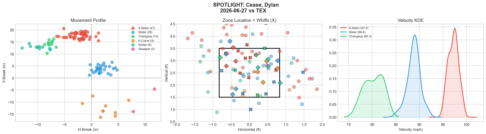
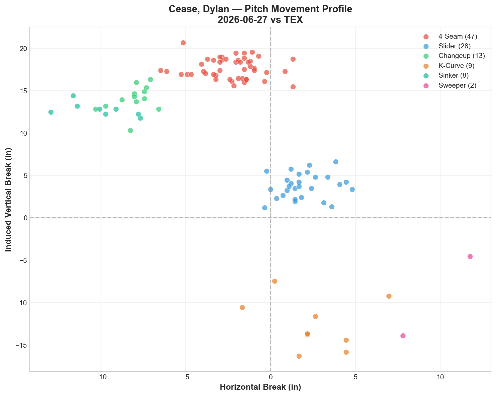
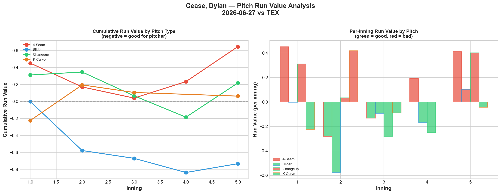
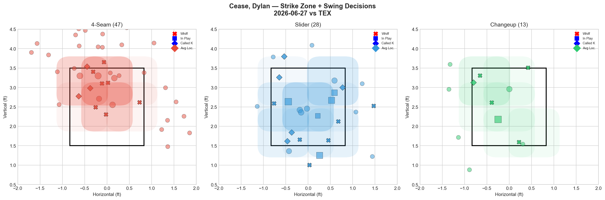
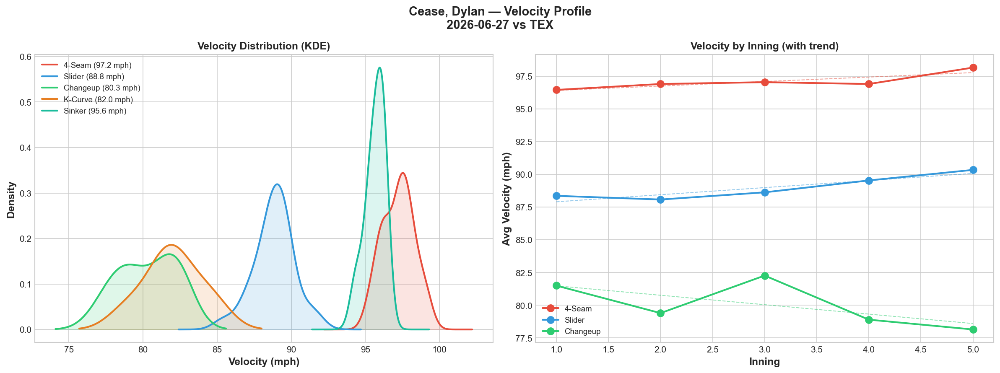
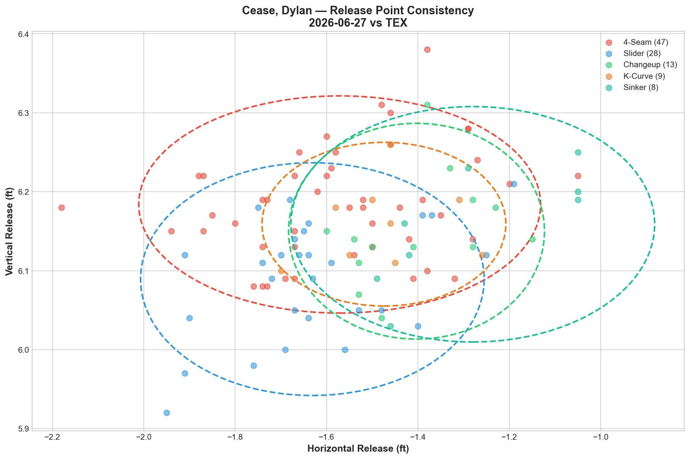
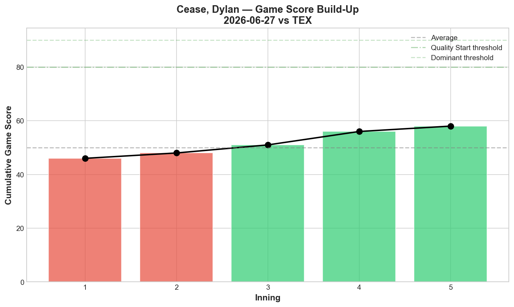
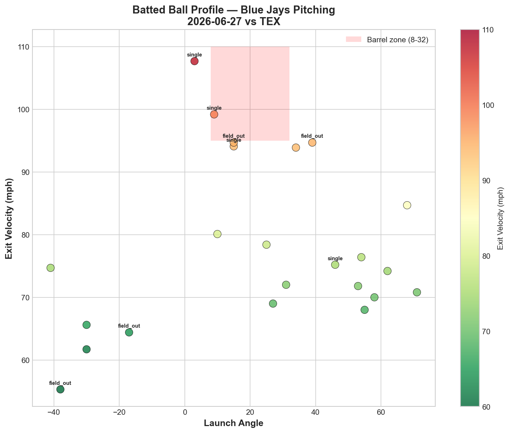
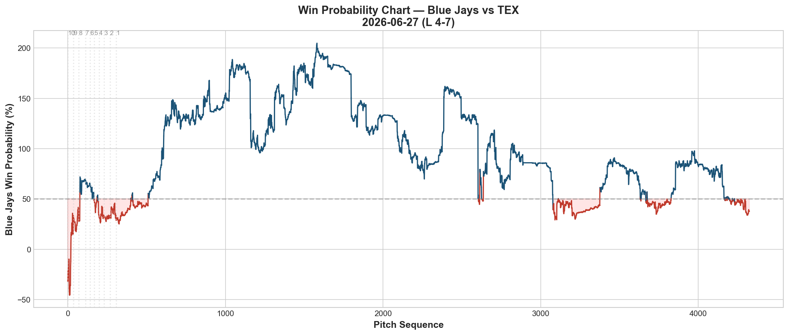
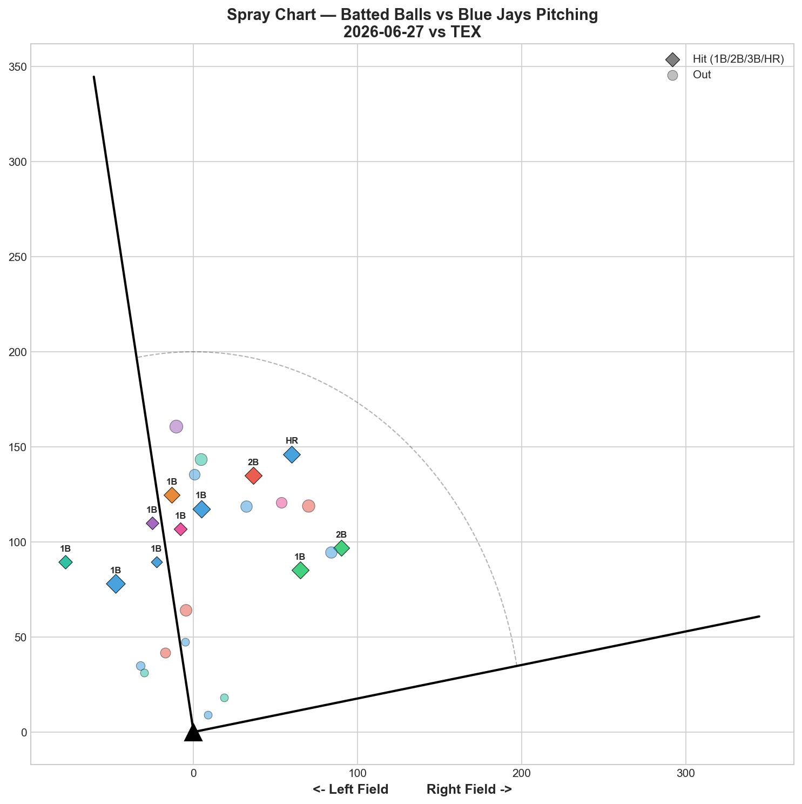

# 🏟️ Blue Jays Game Report v2.1
## 2026-06-27 | TOR vs TEX | L 4-7

---

## 📋 Game Overview

| | |
|---|---|
| **Date** | 2026-06-27 |
| **Matchup** | Texas Rangers @ Toronto Blue Jays |
| **Result** | **L 4-7 (10 innings)** |
| **Starter** | Dylan Cease (107 pitches) |
| **Spotlight Pitcher** | Dylan Cease |
| **Season Record** | 39W-43L |

---

## 🔥 Key Storylines

### 1. Three A-Grade Pitches, 10 Strikeouts, 38.6% Overall Whiff — Yet the Team Still Lost

Cease delivered his best swing-and-miss profile of the season: **4-Seam, Slider, and Changeup all graded A**, combining for a **38.6% overall whiff rate and 10 strikeouts** across 107 pitches. Despite this dominant stuff, the Jays fell 4-7 in 10 innings — a stark reminder that individual pitcher excellence doesn't guarantee a win when 5 walks open the door and the offense goes quiet.

### 2. Velocity Actually Increased Through the Outing — Again

| Pitch | Start Velo | End Velo | Change |
|-------|-----------|----------|--------|
| 4-Seam | 96.4 | 98.2 | **+1.7 mph** |
| Slider | 88.4 | 90.3 | **+2.0 mph** |
| Changeup | 81.5 | 78.2 | -3.3 mph |

For the third consecutive tracked Cease start, his fastball **gained** velocity as the outing progressed (also seen 6/16, 6/22). This continues to confirm his post-injury conditioning is fully restored — if anything, he may be *building* into his pitches rather than fading from them.

### 3. The Whiff/RV Disconnect Returns With a Vengeance

| Pitch | Whiff% | Grade | RV | Conversion? |
|-------|--------|-------|-----|--------------|
| Slider | 37.5% | A | **-0.733** | ✅ Yes — best pitch |
| Changeup | 66.7% | A | +0.218 | 🔴 Elite whiff, still leaked |
| 4-Seam | 43.8% | A | +0.646 | 🔴 Highest whiff, worst RV |
| Sinker | 0.0% | D | -0.392 | ✅ Zero whiffs, still effective |

**The 4-seam posted the highest whiff rate of any Cease pitch tracked this season (43.8%) but also the worst run value (+0.646).** This is one of the clearest single-game illustrations yet of the whiff/RV paradox that has appeared repeatedly across the staff — chase-zone whiffs don't always convert into runs prevented when in-zone locations get squared up.

---

## 🔍 Spotlight Pitcher — Dylan Cease

### Pitch Arsenal Performance (107 pitches)

| Pitch | # | Usage | Velo | Whiff% | CSW% | Chase% | Grade |
|-------|---|-------|------|--------|------|--------|-------|
| 4-Seam | 47 | 43.9% | 97.2 | 43.8% | 21.3% | 10.0% | 🟢 A |
| Slider | 28 | 26.2% | 88.8 | 37.5% | 39.3% | 33.3% | 🟢 A |
| Changeup | 13 | 12.1% | 80.3 | **66.7%** | 38.5% | 16.7% | 🟢 A |
| K-Curve | 9 | 8.4% | 82.0 | 0.0% | 44.4% | 0.0% | 🔴 D |
| Sinker | 8 | 7.5% | 95.7 | 0.0% | 62.5% | 33.3% | 🔴 D |
| Sweeper | 2 | 1.9% | 83.3 | 0.0% | 0.0% | 0.0% | 🔴 D |

**Three A-grade pitches at a combined 82.2% usage** — his most swing-and-miss-heavy outing of the season by grade count, matching his 6/22 outing's arsenal depth.

### Cease's Season-Long Velocity Pattern

| Start | FF Start | FF End | Change |
|-------|----------|--------|--------|
| 6/9 vs PHI | 97.8 | 97.6 | -0.2 |
| 6/16 vs BOS | 98.2 | 97.4 | -0.8 |
| 6/22 vs HOU | 97.0 | 98.0 | **+1.0** |
| **6/27 vs TEX** | **96.4** | **98.2** | **+1.7** |

Across his last two starts, Cease's fastball has *gained* velocity through the outing rather than fading — a pattern distinct from every other starter tracked this season. His conditioning and stamina appear to be at peak form post-injury.

### Pitch Movement (inches)

| Pitch | H-Break | V-Break | Count |
|-------|---------|---------|-------|
| 4-Seam (FF) | -2.4 | 17.7 | 47 |
| Slider (SL) | 1.9 | 3.8 | 28 |
| Changeup (CH) | -8.1 | 14.0 | 13 |
| K-Curve (KC) | 2.6 | -12.5 | 9 |
| Sinker (SI) | -10.0 | 12.8 | 8 |
| Sweeper (ST) | 9.8 | -9.2 | 2 |

### Pitch Tunneling Analysis

| Pair | Release Sim | Plate Sep | Tunnel | Velo Gap |
|------|-------------|-----------|--------|----------|
| **Changeup/K-Curve** | **0.9in** | **28.6in** | **🟢 33.2** | **1.7mph** |
| 4-Seam/K-Curve | 1.2in | 30.6in | 🟢 25.5 | 15.2mph |
| K-Curve/Sinker | 2.3in | 28.3in | 🟢 12.1 | 13.7mph |
| 4-Seam/Slider | 1.3in | 14.5in | 🟢 10.8 | 8.4mph |

The K-Curve continues its role as Cease's geometric anchor, appearing in the top 3 tunnel pairs despite grading D on its own whiff metrics. One notable red flag: **Changeup/Sinker scored only 1.6 (RED)** — the two pitches don't tunnel well together, suggesting Cease should avoid sequencing them back-to-back.

### Pitch Run Value by Type

| Pitch | Total RV | Per Pitch | Pitches | Assessment |
|-------|----------|-----------|---------|------------|
| Sinker | -0.392 | -0.0490 | 8 | ✅ Best per-pitch |
| Slider | **-0.733** | -0.0262 | 28 | ✅ Best total value |
| Sweeper | -0.030 | -0.0150 | 2 | ✅ (tiny sample) |
| K-Curve | +0.063 | +0.0070 | 9 | 🟡 Marginal |
| Changeup | +0.218 | +0.0168 | 13 | 🔴 Elite whiff, still leaked |
| 4-Seam | +0.646 | +0.0137 | 47 | 🔴 Highest total damage |

**Net: -0.228 RV.** A solid overall night — slightly negative total run value despite the whiff/RV disconnect on two of his three A-grade pitches.

### Pitch Selection by Count

| Situation | Primary | Secondary | Notes |
|-----------|---------|-----------|-------|
| First Pitch (0-0) | Slider 26.1% | 4-Seam 21.7% | Balanced 5-pitch mix |
| Ahead | **4-Seam 51.6%** | Slider 22.6% | Fastball trusted ahead |
| Behind | 4-Seam 52.6% | Slider 31.6% | Fastball when behind |
| Even | 4-Seam 45.5% | Slider 22.7% | Fastball-led |
| Full Count (3-2) | 4-Seam 50.0% | Slider 33.3% | Power approach |

**Strikeout Pitches (10 K's):** FF 4, SL 3, CH 2, KC 1 — four different pitch types produced strikeouts, underscoring his arsenal depth.

### vs LHB/RHB Split

| Stand | Pitches | Avg Velo | Swinging Strikes | Whiff/Pitch |
|-------|---------|----------|------------------|-------------|
| L | 77 | 91.0 | 13 | 16.9% |
| R | 30 | 92.1 | 4 | 13.3% |

### Top Opposing Batters

| Batter | Pitches | Hits | K | BB | Avg EV |
|--------|---------|------|---|-----|--------|
| Brandon Nimmo | 19 | 1 | 1 | 1 | 80.8 |
| Corey Seager | 18 | 0 | 2 | 1 | 71.3 |
| Joc Pederson | 16 | 0 | **3** | 0 | 76.8 |
| Jake Burger | 12 | 2 | 0 | 0 | 82.4 |
| Josh Jung | 11 | 0 | 1 | 1 | 58.5 |

Seager and Pederson combined 0-for in 34 pitches with 5 strikeouts — Texas' top two threats were thoroughly neutralized. Burger's 2 hits (82.4 mph EV) were the primary offensive damage against Cease directly.

### Game Score / Batted Ball

**Game Score: 62 (QUALITY).** 10K, 4H, 0HR, 5BB on 107 pitches — his second season-high pitch count in three starts.

| Metric | Value |
|--------|-------|
| Total BIP | 23 |
| Avg Exit Velo | 78.1 mph |
| Avg Launch Angle | 22.6° |
| Hard Hit (95+ mph) | 2/23 (**9%**) |

**9% hard-hit rate** — the second-lowest we've tracked from any Blue Jays starter this season (behind Cease's own 0% on 6/22). Combined with 78.1 mph average EV, Texas simply couldn't square him up when they made contact.

---

## 📊 Bullpen Detailed Analysis

| Pitcher | Pitches | Line | Key Pitch | Notes |
|---------|---------|------|-----------|-------|
| **Tommy Nance** | 11 | 2K / 0BB / 2H / 0HR | **SL 50% 🟢A, CU 50% 🟢A** | Two A-grade pitches |
| **Jeff Hoffman** | 20 | 1K / 0BB / 1H / 0HR | SL 20% 🟢B, FS 50% 🟢A | Splitter graded A |
| **Braydon Fisher** | 12 | 0K / 0BB / 1H / **1HR** | SL 25% 🟢B | Gave up decisive HR |
| **Tyler Rogers** | 22 | 0K / 0BB / 1H / 0HR | SL 14.3% 🟡C | Standard sinker-heavy outing |
| **Mason Fluharty** | 14 | 0K / 1BB / 2H / 0HR | All 🔴D | Rough outing — 0% whiff |

### Bullpen Notes

- **Fisher's** HR allowance was the pivotal moment of the extra-innings loss — his slider (25% whiff, Grade B) was decent, but one mistake proved costly.
- **Nance** continues stacking solid appearances: slider and curveball both A-grade tonight, extending his recent run of reliable multi-pitch outings.
- **Hoffman's** splitter (50% whiff, A) is a notable secondary weapon complementing his usual slider-led approach.
- **Fluharty** struggled across all three pitch types — his alternating "elite or flat" pattern showed the flat side tonight.

---

## 📈 Win Probability Analysis

### Key WPA Moments

| Inning | Event | Impact |
|--------|-------|--------|
| 3 | Teng — home_run | 📉 Rangers scored |
| 6 | Rangel — triple | 📉 Rangers extended |
| 8 | Vest — double | 📉 Rangers pushed further |
| 9 | Soto (TOR) — GIDP | 📈 Jays limited damage |
| 9 | Soto (TEX) — home_run | 📉 Rangers answered late |
| 10 | Lawrence — field_out | 📈 Jays held on briefly |

A back-and-forth extra-innings affair ultimately decided by Texas' bullpen execution over Toronto's late-inning relief.

---

## 📊 Spray Chart & Batted Ball Summary

| Metric | Value |
|--------|-------|
| Total batted balls tracked | 25 |
| Hits | 11 (**44%**) |
| Pull | 6 (24%) |
| Center | 17 (68%) |
| Oppo | 2 (8%) |

Despite Cease's dominant strikeout total, the team-wide 44% hit rate reflects the bullpen's late-game struggles (Fisher's HR, Fluharty's 2H) rather than Cease's own contact management (2/23 hard-hit).

---

## 🎯 Analytical Takeaways

1. **Cease's Three A-Grade Pitches Represent His Deepest Arsenal Night of the Season** — 4-Seam, Slider, and Changeup all graded A with a combined 38.6% overall whiff rate and 10 strikeouts. Even his D-grade K-Curve contributed via elite tunneling (33.2, 25.5 scores) rather than direct whiffs.

2. **Fastball Gaining Velocity Through the Outing Is Now a Repeated Pattern** — +1.0 mph on 6/22, +1.7 mph tonight. Across his last two starts, Cease has finished stronger than he started — a highly unusual profile that speaks to his post-injury conditioning.

3. **The Whiff/RV Disconnect Hit Its Clearest Expression Yet** — 4-seam at 43.8% whiff (his career-high for the pitch) paired with the worst run value (+0.646) of his three A-grade offerings. Elite swing-and-miss numbers don't guarantee run prevention when in-zone locations get squared up.

4. **9% Hard-Hit Rate Confirms Elite Contact Suppression** — Second-lowest of the season, trailing only his own 0% mark from 6/22. Cease has now posted two of the three lowest hard-hit rates tracked this season in his last two starts.

5. **A Dominant Individual Performance Couldn't Overcome Team-Wide Issues** — 5 walks from Cease plus a bullpen HR (Fisher) and a quiet Jays offense combined to erase what was statistically one of his best outings of the year.

6. **39-43 — Four Games Below .500** — The team continues to slide further from the 6/22 breakthrough, now on its longest stretch below .500 since the season's early struggles.

7. **Game Classification: Ace Excellence, Team Shortfall Loss** — This is the third instance this stretch (following Gausman 6/13, Yesavage 6/24) where a starter's strong-to-elite outing wasn't enough to secure the win, highlighting a recurring pattern of the offense and bullpen not consistently supporting quality starts.

---

*Report generated from Statcast data via pybaseball. All pitch metrics sourced from Baseball Savant.*
