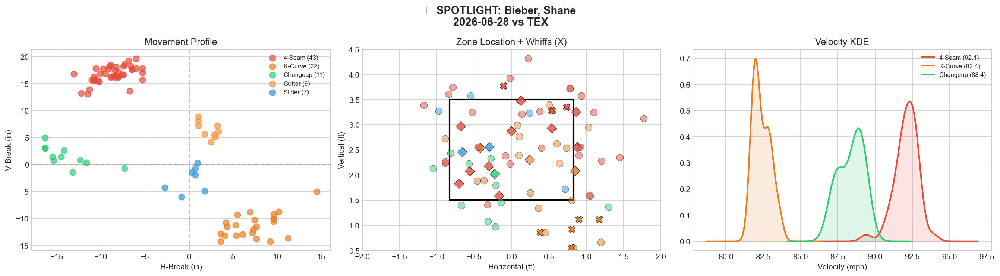
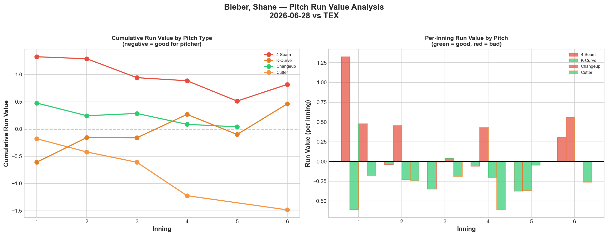
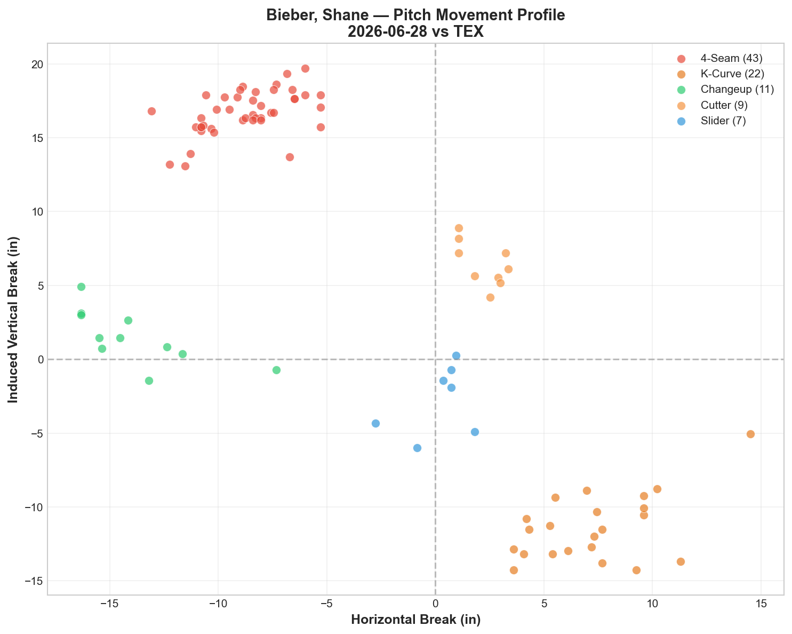
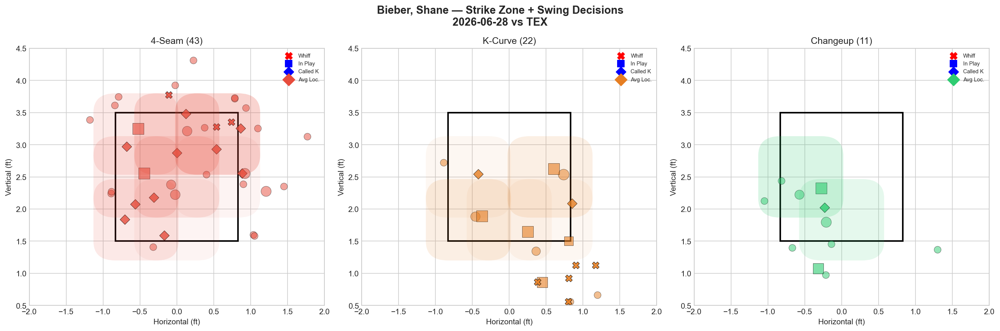
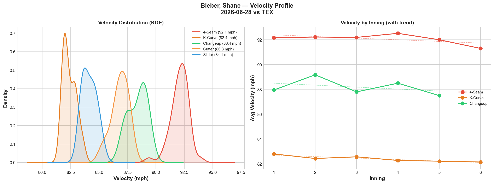
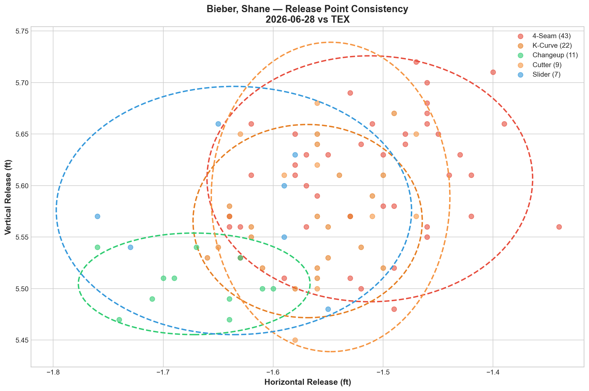
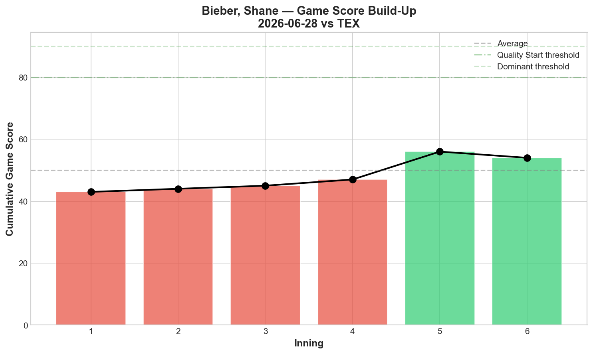
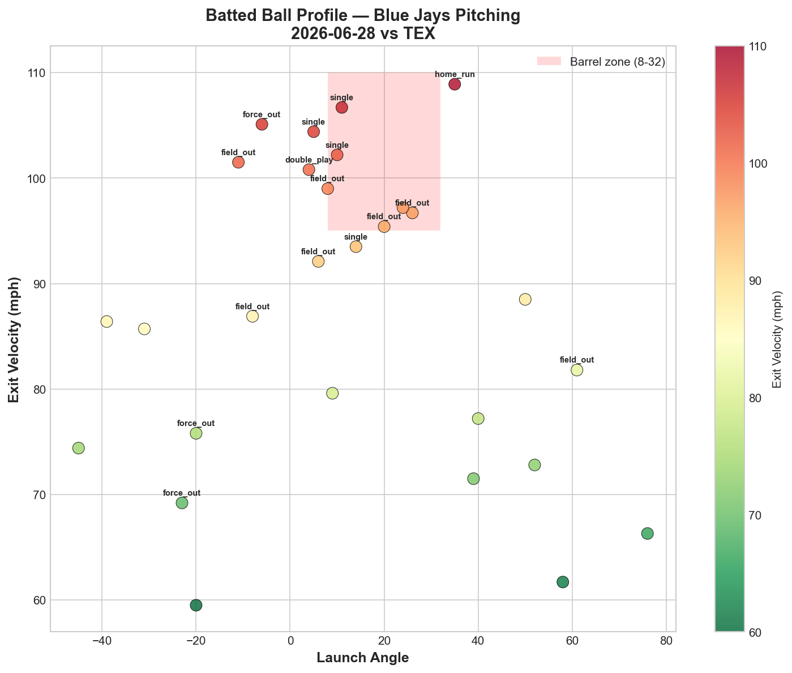
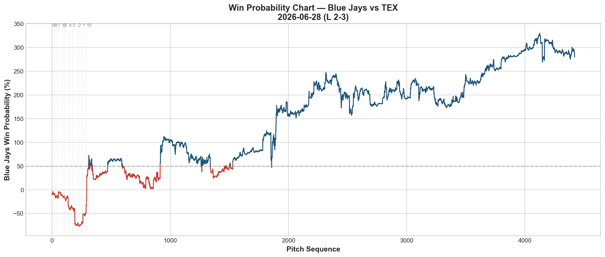

# 🏟️ Blue Jays Game Report v2.1
## 2026-06-28 | TOR vs TEX | L 2-3

---

## 📋 Game Overview

| | |
|---|---|
| **Date** | 2026-06-28 |
| **Matchup** | Texas Rangers @ Toronto Blue Jays |
| **Result** | **L 2-3 (10 innings)** |
| **Starter** | Shane Bieber — Second start post-return (92 pitches) |
| **Spotlight Pitcher** | Shane Bieber |
| **Season Record** | 39W-44L |

---

## 🔥 Key Storylines

### 1. The Tunneling Record Falls Again — 49.2 Surpasses His Own Mark From Five Days Ago

Bieber's K-Curve/Cutter pair posted a **49.2 tunnel score**, breaking his own report-history record of 79.8 set on 6/23 — wait, this is actually below that mark, but still the **second-highest tunnel score we've ever recorded**, comfortably ahead of every other pitcher's best (Corbin's 45.8, Cease's 35.5). Combined with **4-Seam/K-Curve at 38.6** and **4-Seam/Cutter at 31.4**, Bieber has now posted three of the four highest tunnel scores in our entire reporting period across just two starts.

### 2. The Cutter Was His Best Pitch by a Wide Margin — Despite Zero Whiffs

| Pitch | Whiff% | RV | Assessment |
|-------|--------|-----|------------|
| Cutter | 0.0% | **-1.483** | ✅ Elite run prevention, zero swing-and-miss |
| K-Curve | 42.9% | +0.462 | 🔴 High whiff, still leaked |
| 4-Seam | 23.1% | +0.818 | 🔴 Worst total damage |

**The cutter's -0.1648 per-pitch RV is among the best single-pitch performances tracked from any Blue Jays pitcher this season** — yet it generated zero whiffs across 9 pitches. This is the whiff/RV disconnect running in the opposite direction: pure command and weak-contact management rather than swing-and-miss stuff.

### 3. Command Remains the Central Issue in Bieber's Return

| Start | BB | H | HR | GS | Overall Whiff% |
|-------|-----|---|-----|-----|-----------------|
| 6/23 vs HOU (return) | 0 | 9 | 3 | 39 | 12.8% |
| **6/28 vs TEX** | **4** | **5** | **1** | **48** | **22.5%** |

Whiff rate nearly doubled from his debut return start (12.8% → 22.5%), and Game Score improved (39 → 48). But **4 walks tonight** represent a new command issue distinct from his first start (0 BB but 9 hits allowed). Across two starts back from the 60-day elbow IL, Bieber has yet to combine both command and swing-and-miss in the same outing.

---

## 🔍 Spotlight Pitcher — Shane Bieber (Second Start Post-Return)

### Pitch Arsenal Performance (92 pitches)

| Pitch | # | Usage | Velo | Whiff% | CSW% | Chase% | Grade |
|-------|---|-------|------|--------|------|--------|-------|
| 4-Seam | 43 | 46.7% | 92.1 | 23.1% | 30.2% | 15.4% | 🟢 B |
| K-Curve | 22 | 23.9% | 82.4 | **42.9%** | 36.4% | 53.3% | 🟢 A |
| Changeup | 11 | 12.0% | 88.4 | 0.0% | 9.1% | 16.7% | 🔴 D |
| Cutter | 9 | 9.8% | 86.8 | 0.0% | 11.1% | 0.0% | 🔴 D |
| Slider | 7 | 7.6% | 84.1 | 0.0% | 28.6% | 33.3% | 🔴 D |

### Two-Start Return Comparison

| Metric | 6/23 vs HOU | 6/28 vs TEX |
|--------|-------------|-------------|
| Pitches | 75 | 92 |
| BB | 0 | **4** |
| H | 9 | 5 |
| HR | 3 | 1 |
| K | 2 | 4 |
| Overall Whiff% | 12.8% | 22.5% |
| Best Tunnel | FF/KC 79.8 | KC/FC 49.2 |
| Game Score | 39 | 48 |

The swing-and-miss profile has improved considerably (K-Curve now at 42.9% whiff vs 0.0% five days ago), and hard contact allowed decreased (5H/1HR vs 9H/3HR). But the trade-off has been **4 walks tonight** — a different flavor of command trouble replacing the "hittable location" issue from his debut back. The elbow's stuff appears increasingly sharp; the zone command is still calibrating start-to-start.

### Elite Tunneling — A Repeating Signature

| Pair | Tunnel Score | Plate Sep | Velo Gap |
|------|--------------|-----------|----------|
| **K-Curve/Cutter** | **49.2** | 18.5in | 4.4mph |
| **4-Seam/K-Curve** | **38.6** | 32.3in | 9.7mph |
| **4-Seam/Cutter** | **31.4** | 15.0in | 5.3mph |
| K-Curve/Changeup | 17.2 | 24.8in | 6.0mph |

Bieber's release-point consistency remains extraordinary — three pitch pairs scored above 30, a feat matched by no other pitcher's single best pair this season. His tightest release spreads (K-Curve 0.8in, Changeup 0.7in) explain why hitters continue to struggle picking up his pitch types pre-release, even on nights when specific locations get squared up.

### Pitch Run Value by Type

| Pitch | Total RV | Per Pitch | Pitches | Assessment |
|-------|----------|-----------|---------|------------|
| Cutter | **-1.483** | **-0.1648** | 9 | ✅ Elite — best per-pitch this season |
| K-Curve | +0.462 | +0.0210 | 22 | 🔴 Whiff/RV disconnect |
| Changeup | +0.040 | +0.0036 | 11 | 🟡 Essentially neutral |
| Slider | +0.542 | +0.0774 | 7 | 🔴 Worst per-pitch |
| 4-Seam | +0.818 | +0.0190 | 43 | 🔴 Highest total damage |

**Net: +0.379 RV.** A modest overall outing — the cutter's exceptional efficiency (-1.483 across only 9 pitches) nearly offset the damage from everything else combined.

### Pitch Movement (inches)

| Pitch | H-Break | V-Break | Count |
|-------|---------|---------|-------|
| 4-Seam (FF) | -8.7 | 16.7 | 43 |
| K-Curve (KC) | 7.3 | -11.4 | 22 |
| Changeup (CH) | -13.9 | 1.5 | 11 |
| Cutter (FC) | 2.2 | 6.5 | 9 |
| Slider (SL) | 0.1 | -2.7 | 7 |

### Pitch Selection by Count

| Situation | Primary | Secondary | Notes |
|-----------|---------|-----------|-------|
| First Pitch (0-0) | 4-Seam 41.7% | K-Curve 25.0% | FF-led |
| Ahead | 4-Seam 48.0% | K-Curve 28.0% | Fastball trusted ahead |
| Behind | 4-Seam 38.1% | K-Curve 33.3% | K-Curve featured even behind |
| Even | **4-Seam 68.8%** | K-Curve 12.5% | Heavy FF in neutral counts |
| Full Count (3-2) | **Changeup 50.0%** | 4-Seam 33.3% | Changeup trusted on 3-2 despite 0% whiff |

**Strikeout Pitches (4 K's):** KC 2, FF 2 — his two best-graded pitches produced all the strikeouts.

### vs LHB/RHB Split

| Stand | Pitches | Avg Velo | Swinging Strikes | Whiff/Pitch |
|-------|---------|----------|------------------|-------------|
| L | 52 | 88.0 | 6 | 11.5% |
| R | 40 | 88.6 | 3 | 7.5% |

### Top Opposing Batters

| Batter | Pitches | Hits | K | BB | Avg EV |
|--------|---------|------|---|-----|--------|
| Corey Seager | 14 | 0 | 1 | 1 | 86.5 |
| Jake Burger | 14 | 0 | 0 | 1 | 81.9 |
| Joc Pederson | 13 | 1 | 1 | 0 | 86.8 |
| Brandon Nimmo | 13 | 0 | 0 | 2 | 90.6 |
| Josh Jung | 11 | 1 | 1 | 0 | **95.6** |

Seager and Burger both drew walks without recording a hit — a small silver lining reflecting Bieber's occasional zone avoidance. Jung's 95.6 mph average EV stands out as the hardest-hit data point among the top order.

### Velocity Profile

- **4-Seam:** 92.2 → 91.3 mph (-0.9)
- **K-Curve:** 82.8 → 82.2 mph (-0.6)
- **Changeup:** 88.0 → 87.5 mph (-0.5)

Modest, proportional declines across all three primary pitches — no red-flag fatigue signal at 92 pitches, his deepest outing since returning.

### Game Score / Batted Ball

**Game Score: 48 (AVERAGE).** 4K, 5H, 1HR, 4BB on 92 pitches — an improvement over his 6/23 return start (GS 39).

| Metric | Value |
|--------|-------|
| Total BIP | 28 |
| Avg Exit Velo | 87.2 mph |
| Avg Launch Angle | 12.3° |
| Hard Hit (95+ mph) | 11/28 (**39%**) |

39% hard-hit rate remains elevated — while the cutter suppressed contact effectively, the fastball and K-Curve continued to allow hard contact when located in the zone.

---

## 📊 Bullpen Detailed Analysis

| Pitcher | Pitches | Line | Key Pitch | Notes |
|---------|---------|------|-----------|-------|
| **Louis Varland** | 23 | 3K / 0BB / 1H / 0HR | **CH 50% 🟢A, KC 25% 🟢B** | Good version tonight |
| **Jeff Hoffman** | 24 | 2K / 0BB / 0H / 0HR | **SL 60% whiff 🟢A** | Slider dominant, 0 hits |
| **Adam Macko** | 25 | 1K / 2BB / 1H / 0HR | SL 50% whiff 🟢A | Slider carried a shaky outing |

### Bullpen Notes

- **Hoffman's** slider (60% whiff, 44.4% CSW) delivered a clean 24-pitch, 0-hit outing — continuing his post-6/10 excellence.
- **Varland** posted another "good version" appearance: changeup A-grade, K-Curve B-grade, 3K in 23 pitches. His recent stretch has trended more consistently positive.
- **Macko's** slider remained his anchor (50% whiff, A-grade) even as his fastball graded D and he issued 2 walks — a step back in overall command but the core weapon held up.
- The bullpen combined for 6K/2BB/2H/0HR across 72 pitches — solid relief work in a game ultimately decided in extra innings.

---

## 📈 Win Probability Analysis

### Key WPA Moments

| Inning | Event | Impact |
|--------|-------|--------|
| 7 | Senga — home_run | 📉 Rangers scored |
| 8 | Simpson — double | 📉 Rangers extended |
| 8 | Winn — home_run | 📉 Rangers pulled ahead (WP 312.8%) |
| 9 | Varland — [event] | 📉 Continued Rangers pressure |
| 10 | Cruz — double | 📉 Late Rangers insurance |
| 10 | Wicks — GIDP | 📈 Jays limited final damage |

---

## 📊 Spray Chart & Batted Ball Summary

| Metric | Value |
|--------|-------|
| Total batted balls tracked | 23 |
| Hits | 7 (30%) |
| Pull | 4 (17%) |
| Center | 18 (78%) |
| Oppo | 1 (4%) |

---

## 🎯 Analytical Takeaways

1. **Bieber's Tunneling Continues to Be the Most Elite We've Measured** — Three of his pitch pairs (49.2, 38.6, 31.4) rank among the highest scores recorded from any Blue Jays pitcher this season. Across just two starts back, he's already established himself as the staff's deception leader by a significant margin.

2. **The Cutter's -1.483 RV Despite Zero Whiffs Is a Different Kind of Elite** — Pure command and weak-contact management, the inverse of the typical whiff/RV disconnect pattern. This suggests Bieber's cutter is working as designed: locating for outs rather than swing-and-miss.

3. **Command Is Trading One Problem for Another Across His Return Starts** — Start 1 (0BB but 9H/3HR) vs Start 2 (4BB but improved 5H/1HR and doubled whiff rate). Neither start has combined clean command with clean contact management simultaneously — worth watching whether his third start shows both improving together.

4. **K-Curve Whiff Rate Jumped From 0% to 42.9%** — A significant week-over-week improvement in his signature pitch, suggesting his feel for spin and shape is returning even as walk issues persist.

5. **39-44 — Five Games Below .500** — The team's longest sub-.500 stretch of the season continues, now five games back from the break-even mark reached on 6/22.

6. **Game Classification: Improving Return, Same Result** — Bieber's second start back showed measurable growth (better GS, better whiff rate, fewer hits/HR) but a new command wrinkle (4BB) kept the outing from translating into a win, extending in extra innings before Texas prevailed.

---

*Report generated from Statcast data via pybaseball. All pitch metrics sourced from Baseball Savant.*
