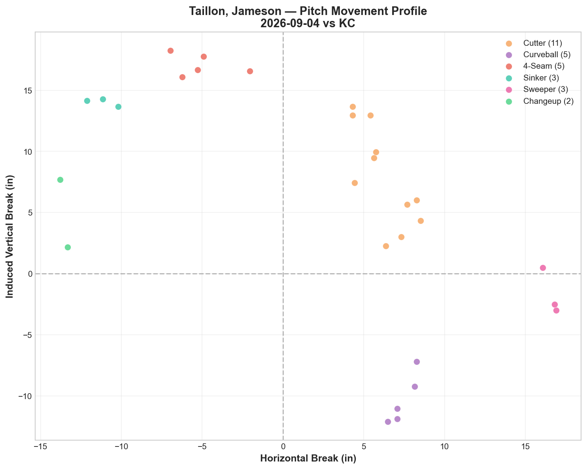
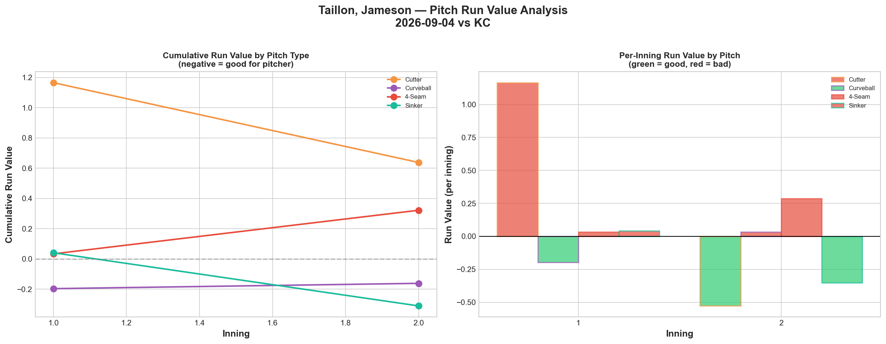
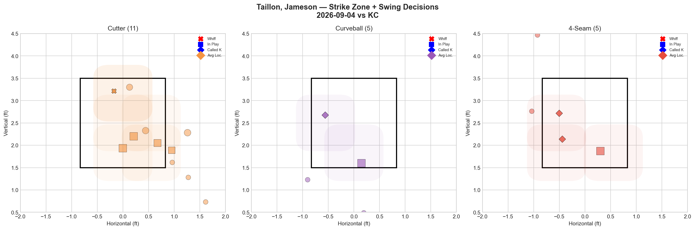
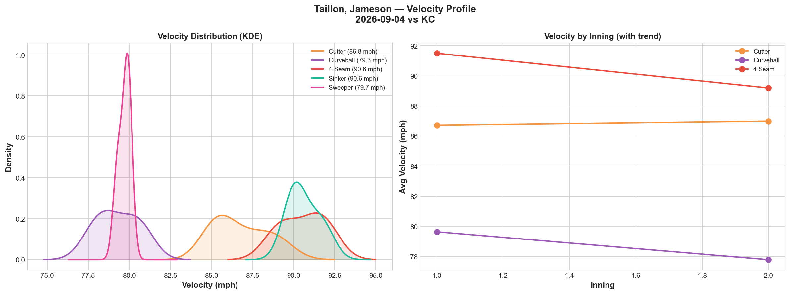
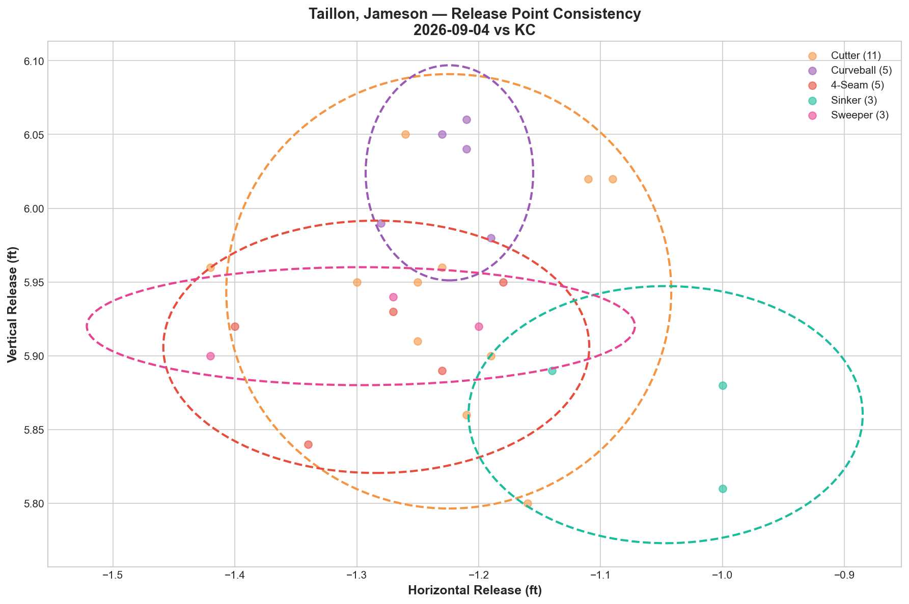
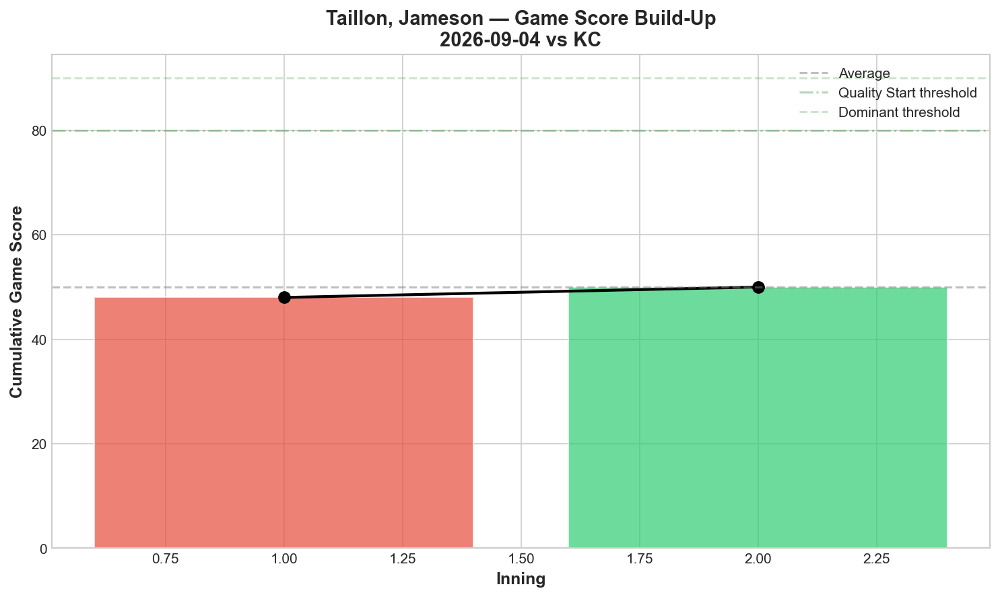
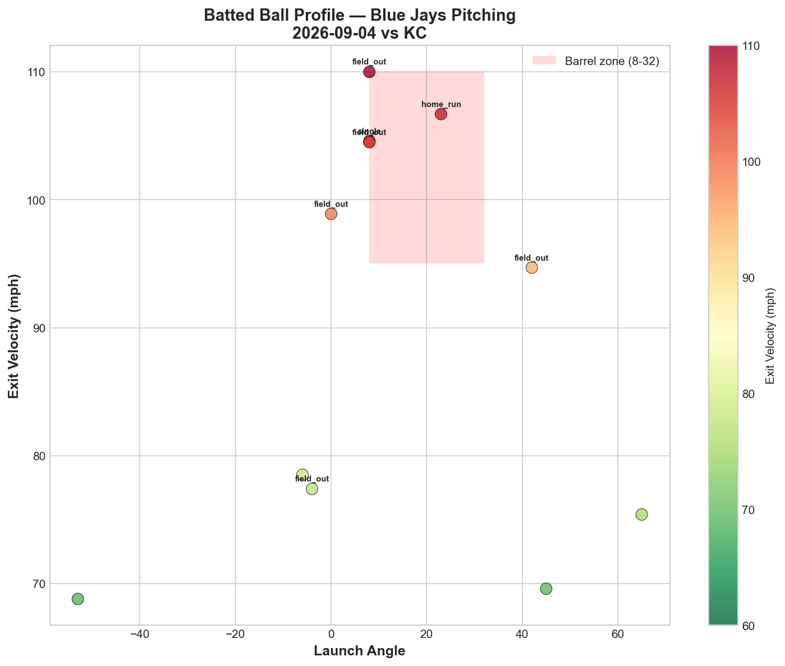
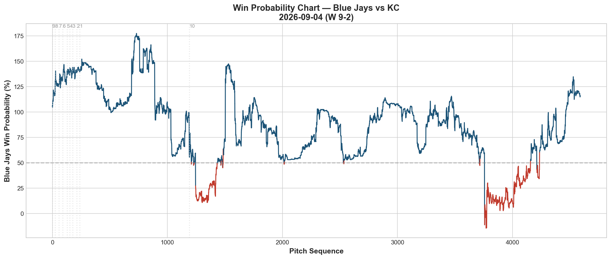
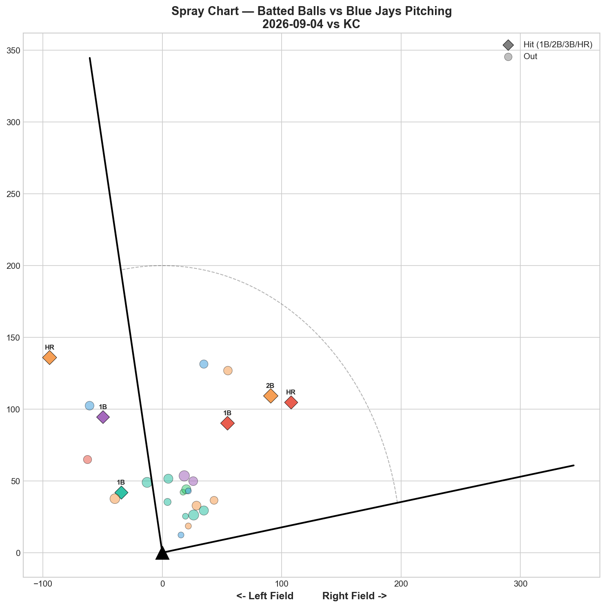

# 🏟️ Blue Jays Game Report v2.1
## 2026-09-04 | TOR @ KC | W 9-2

---

## 📋 Game Overview

| | |
|---|---|
| **Date** | 2026-09-04 |
| **Matchup** | Toronto Blue Jays @ Kansas City Royals |
| **Result** | **W 9-2 (10 innings)** |
| **Starter** | Jameson Taillon (29 pitches — very short outing) |
| **Spotlight Pitcher** | None |
| **Season Record** | **70W-70L (.500)** |

---

## 🔥 Key Storylines

### 1. Back to .500 — Fourth Bullpen Day Win This Stretch, Now With FIVE Relievers

Taillon lasted only 29 pitches — his shortest outing since debuting on 8/5 — before giving way to a four-pitcher bullpen effort (Lorenzen, Little, Fisher, Mantiply). The Jays reach **exactly 70-70** on the season, a milestone after nearly two months of tracked data showing the pitching staff consistently outperforming the win-loss record. Whether Taillon's short outing reflects matchup management, precaution, or ineffectiveness isn't fully clear from the box score — worth watching his next start.

### 2. 45% Hard-Hit Rate Off Taillon in a Small Sample

Despite the win, Taillon's own line was rough: 11 batted balls, 89.9 mph average exit velocity, **5 of 11 (45%) hit at 95+ mph.** The cutter — his most-used pitch at 37.9% — posted the worst run value on his arsenal (+0.638) despite a modest 12.5% whiff rate. Kansas City squared him up consistently in his brief stint.

### 3. 4-Seam/Sweeper Tunnel Hits 126.5 — Elite Geometry in a Losing Effort (By Taillon's Own Line)

Taillon's fastball/sweeper pairing posted a **126.5 tunnel score** — comfortably his best tracked pairing and among the highest scores recorded from any Blue Jays pitcher this season. Notably, this occurred on a night where his overall command wasn't sharp (0 walks but a quick hook and diminished pitch count), reinforcing the season-long pattern that elite tunneling doesn't guarantee results on a given night.

---

## ⚾ Starter Pitch Arsenal Analysis — Jameson Taillon

### Pitch Arsenal Performance (29 pitches)

| Pitch | # | Usage | Velo | Whiff% | CSW% | Chase% | Grade |
|-------|---|-------|------|--------|------|--------|-------|
| Cutter | 11 | 37.9% | 86.8 | 12.5% | 9.1% | 40.0% | 🟡 C |
| Curveball | 5 | 17.2% | 79.3 | 0.0% | 20.0% | 0.0% | 🔴 D |
| 4-Seam | 5 | 17.2% | 90.6 | 0.0% | 40.0% | 0.0% | 🔴 D |
| Sinker | 3 | 10.3% | 90.6 | 0.0% | 33.3% | 0.0% | 🔴 D |
| Sweeper | 3 | 10.3% | 79.7 | 0.0% | 33.3% | 0.0% | 🔴 D |
| Changeup | 2 | 6.9% | 86.2 | 0.0% | 50.0% | 100.0% | 🔴 D |

A very short sample across six pitch types — no clear standout pitch tonight, with only the changeup (2 pitches) producing his lone strikeout.

### Pitch Movement (inches)

| Pitch | H-Break | V-Break | Count |
|-------|---------|---------|-------|
| Cutter (FC) | 6.2 | 8.0 | 11 |
| Curveball (CU) | 7.4 | -10.3 | 5 |
| 4-Seam (FF) | -5.1 | 17.1 | 5 |
| Sinker (SI) | -11.2 | 14.0 | 3 |
| Sweeper (ST) | 16.6 | -1.7 | 3 |

### Pitch Tunneling Analysis

| Pair | Release Sim | Plate Sep | Tunnel | Velo Gap |
|------|-------------|-----------|--------|----------|
| **4-Seam/Sweeper** | **0.2in** | **28.7in** | **🟢 126.5** | **10.9mph** |
| Cutter/Curveball | 1.0in | 18.3in | 🟢 19.0 | 7.5mph |
| Curveball/4-Seam | 1.6in | 30.1in | 🟢 18.9 | 11.3mph |
| Cutter/4-Seam | 0.8in | 14.5in | 🟢 17.2 | 3.8mph |
| Cutter/Sweeper | 0.9in | 14.2in | 🟢 15.6 | 7.1mph |

**4-Seam/Sweeper at 126.5 is Taillon's best tunnel score tracked to date**, with a striking 0.2in release similarity. This is a small-sample outing, but the geometric consistency across his release point (all pitches showing "Tight" release spreads) suggests his mechanics remained sound even in an abbreviated appearance.

### Pitch Run Value by Type

| Pitch | Total RV | Per Pitch | Pitches | Assessment |
|-------|----------|-----------|---------|------------|
| Sinker | -0.310 | -0.1033 | 3 | ✅ Best per-pitch (tiny sample) |
| Changeup | -0.187 | -0.0935 | 2 | ✅ (tiny sample) |
| Curveball | -0.161 | -0.0322 | 5 | ✅ Effective |
| Sweeper | +0.033 | +0.0110 | 3 | 🟡 Marginal |
| 4-Seam | +0.322 | +0.0644 | 5 | 🔴 Leaked |
| Cutter | +0.638 | +0.0580 | 11 | 🔴 Highest total damage |

**Net: +0.335 RV.** With such a small pitch count, these figures should be read cautiously — but the cutter's struggles at his highest-usage pitch are worth tracking into his next outing.

### Pitch Selection by Count

| Situation | Primary | Secondary | Notes |
|-----------|---------|-----------|-------|
| First Pitch (0-0) | 4-Seam 50.0% | Curveball/Sinker 25% each | FF-led |
| Ahead | Cutter/Changeup 33.3% each | Sweeper/Curveball 16.7% each | Balanced |
| Behind | **Cutter 55.6%** | Sinker/Sweeper/FF/CU 11.1% each | Cutter-heavy when behind |
| Even | **Cutter 66.7%** | Sweeper/Curveball 16.7% each | Cutter-dominant neutral |

**Strikeout Pitches (1 K):** Changeup — his only swing-and-miss of the outing.

### vs LHB/RHB Split

| Stand | Pitches | Avg Velo | Swinging Strikes | Whiff/Pitch |
|-------|---------|----------|------------------|-------------|
| L | 16 | 85.7 | 1 | 6.2% |
| R | 13 | 85.9 | 0 | 0.0% |

Zero swinging strikes against right-handed hitters in 13 pitches — a notable early weakness in this brief look.

### Top Opposing Batters

| Batter | Pitches | Hits | K | BB | Avg EV |
|--------|---------|------|---|-----|--------|
| Jac Caglianone | 6 | 0 | 0 | 0 | 85.8 |
| Bobby Witt Jr. | 5 | 1 | 0 | 0 | 91.1 |
| Carter Jensen | 5 | 0 | 1 | 0 | 69.6 |
| Salvador Perez | 4 | 0 | 0 | 0 | **104.5** |
| Nick Loftin | 4 | 0 | 0 | 0 | 98.9 |

Perez's 104.5 mph average EV and Loftin's 98.9 mph EV — both without recording hits — underscore the hard, if not always damaging, contact Kansas City made in this brief sample.

### Velocity Profile

- **Cutter:** 86.7 → 87.0 mph (+0.3)
- **Curveball:** 79.6 → 77.8 mph (-1.9)
- **4-Seam:** 91.5 → 89.2 mph (**-2.3**)

The fastball's -2.3 mph decline across just 5 pitches is notable, though the extremely small sample makes it hard to draw firm conclusions. Worth checking his next outing for a repeat pattern.

### Game Score / Batted Ball

**Game Score: 50 (AVERAGE).** 1K, 1H, 0HR, 0BB on just 29 pitches.

| Metric | Value |
|--------|-------|
| Total BIP | 11 |
| Avg Exit Velo | 89.9 mph |
| Avg Launch Angle | 12.4° |
| Hard Hit (95+ mph) | **5/11 (45%)** |

A 45% hard-hit rate is elevated for any pitcher, though the sample is only 11 batted balls. Combined with the short pitch count, this looks like a managed or precautionary outing rather than a normal start.

---

## 📊 Bullpen Detailed Analysis

| Pitcher | Pitches | Line | Key Pitch | Notes |
|---------|---------|------|-----------|-------|
| **Michael Lorenzen** | 33 | 2K / 0BB / 3H / 1HR | **Sweeper 100% whiff 🟢A** | Longest relief stint, gave up HR |
| **Brendon Little** | 31 | 1K / 1BB / 0H / 0HR | FF 25% (B) + KC 25% (B) | Solid, extended bridge outing |
| **Braydon Fisher** | 14 | 0K / 1BB / 0H / 0HR | All D-grade | Quiet, clean if unspectacular |
| **Joe Mantiply** | 23 | 1K / 0BB / 1H / 0HR | **Changeup 100% whiff 🟢A** | Small sample, effective changeup |

### Bullpen Notes

- With Taillon exiting after just 29 pitches, the bullpen carried the bulk of the workload (101 combined pitches across four relievers) — an emergency-length outing for the relief corps.
- **Lorenzen's sweeper (100% whiff, A)** was the standout individual pitch of the night, though he also allowed the game's lone home run.
- **Little's 31-pitch bridge outing** (FF and K-Curve both B-grade) was the backbone of the extra-innings win, absorbing the largest share of innings behind Taillon.
- **Mantiply's changeup at 100% whiff** (2 pitches, small sample) is an early positive signal worth tracking as he continues integrating into the bullpen mix.

---

## 📈 Win Probability Analysis

### Key WPA Moments

| Inning | Event | Impact |
|--------|-------|--------|
| 5 | Moll — triple | 📉 Royals threatened |
| 9 | Romano — home_run | 📉 Royals scored |
| 9 | Sommers — home_run | 📈 Jays answered |
| 10 | Blackburn — home_run | 📉 Late tension |
| 10 | Jansen — single | 📈 Jays pushed ahead |
| 10 | Miller — single | 📈 Jays extended the lead |

A back-and-forth 10th inning ultimately broke in Toronto's favor, sealing the 9-2 final.

---

## 📊 Spray Chart & Batted Ball Summary

| Metric | Value |
|--------|-------|
| Total batted balls tracked | 26 |
| Hits | 6 (23%) |
| Pull | 5 (19%) |
| Center | 17 (65%) |
| Oppo | 4 (15%) |

---

## 🎯 Analytical Takeaways

1. **Taillon's Abbreviated Outing Is Worth Monitoring** — Only 29 pitches, elevated hard-hit rate (45%), and no clear standout pitch. Whether this reflects a precautionary hook, a rough matchup night, or an early warning sign should become clearer in his next start.

2. **4-Seam/Sweeper Tunnel at 126.5 Is His Best Tracked Score** — Even in a short outing, Taillon's release-point consistency held up (all five pitch types graded "Tight" on release spread), a positive signal about his underlying mechanics regardless of tonight's results.

3. **A Five-Pitcher Bullpen Game by Necessity** — Lorenzen, Little, Fisher, and Mantiply combined for 101 pitches to cover the bulk of the game — the bullpen's depth (now featuring eight new post-deadline arms across the season) was essential to securing the win.

4. **70-70 — The Jays Reach Exactly .500** — A milestone after nearly two months of the pitching staff's underlying performance outpacing the win-loss record. The offense's 9 runs tonight, combined with the bullpen's extra-innings execution, delivered a rare comfortable-margin win.

5. **Game Classification: Bullpen Rescue Win** — With the starter unable to go deep, the relief corps' collective 101-pitch effort — anchored by Little's 31-pitch bridge and complemented by strong individual pitches from Lorenzen and Mantiply — turned a short start into a season-milestone win.

---

*Report generated from Statcast data via pybaseball. All pitch metrics sourced from Baseball Savant.*
