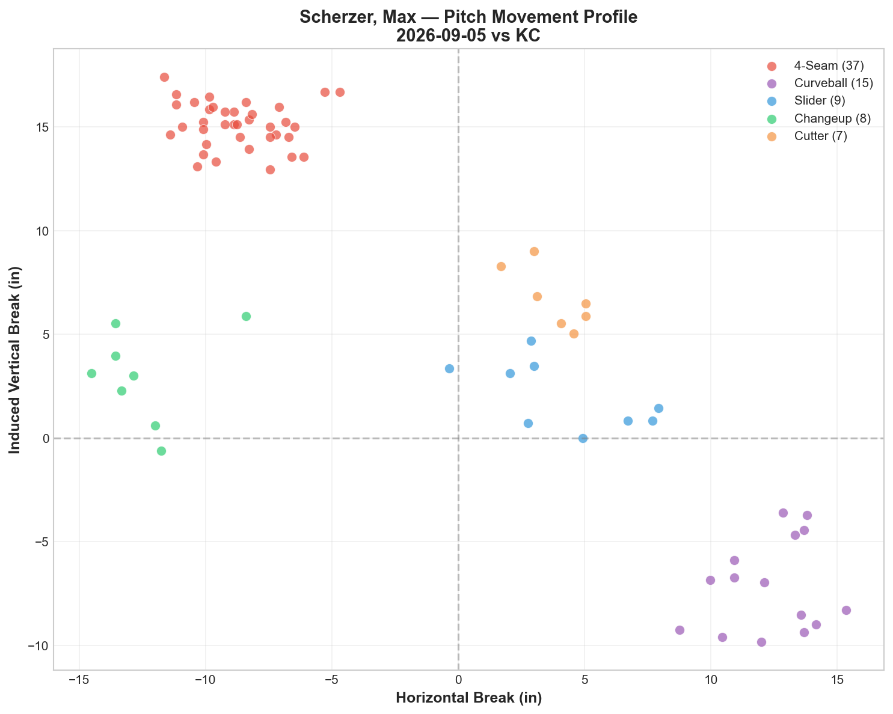
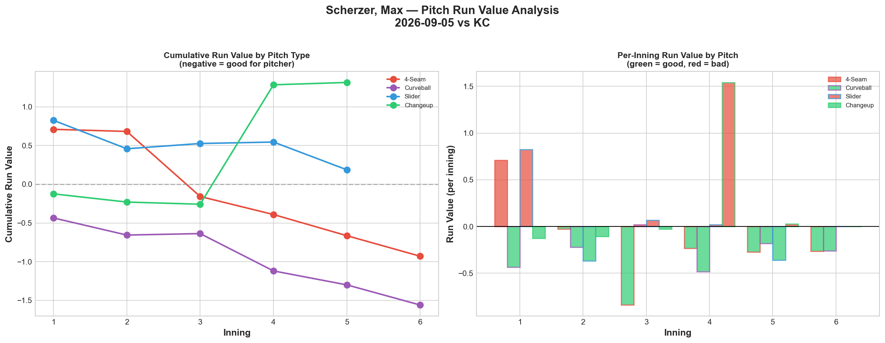
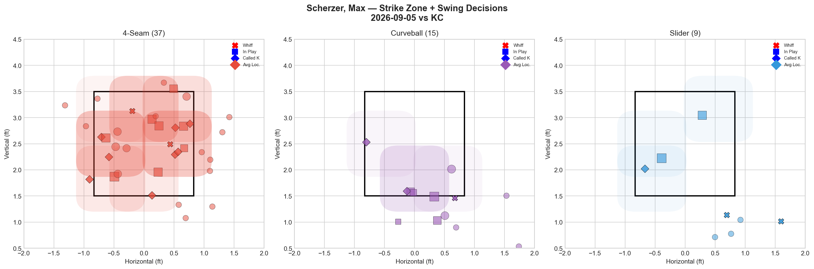
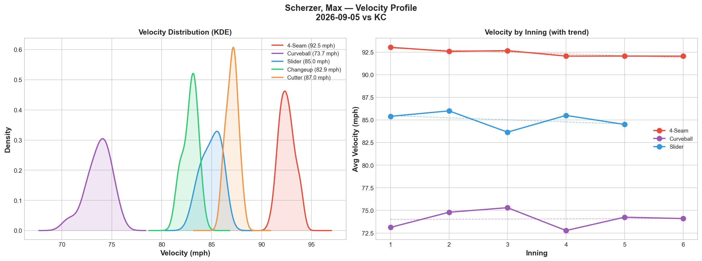
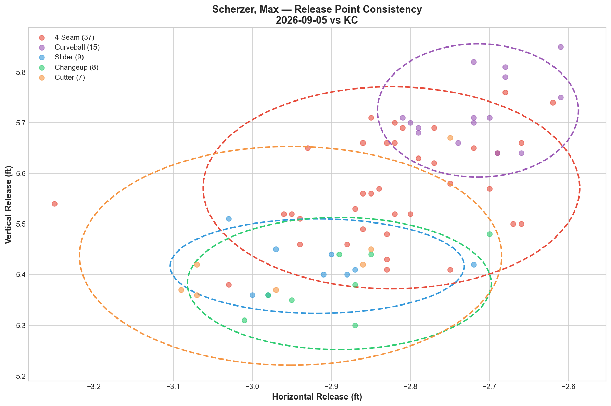
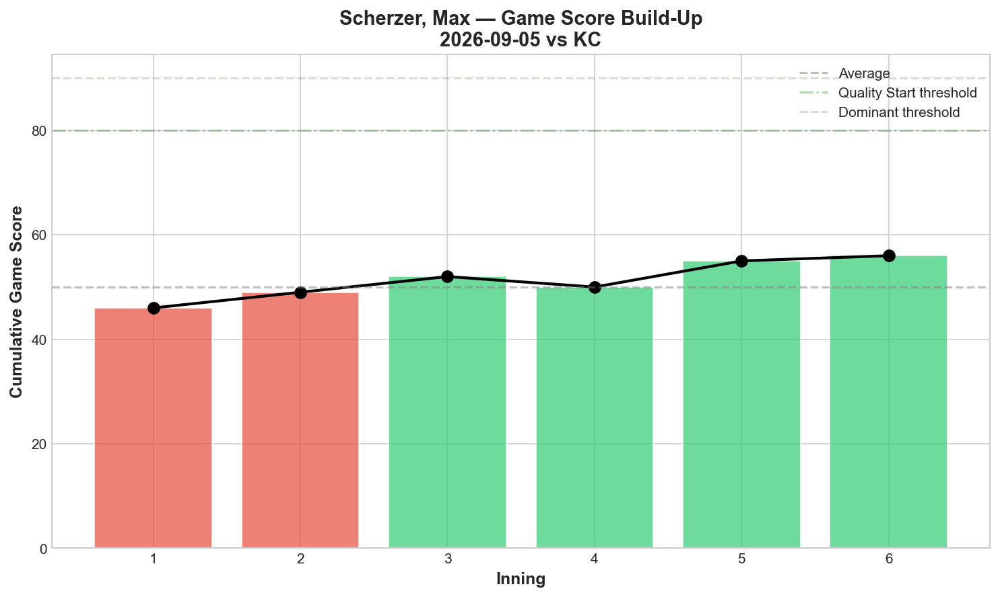
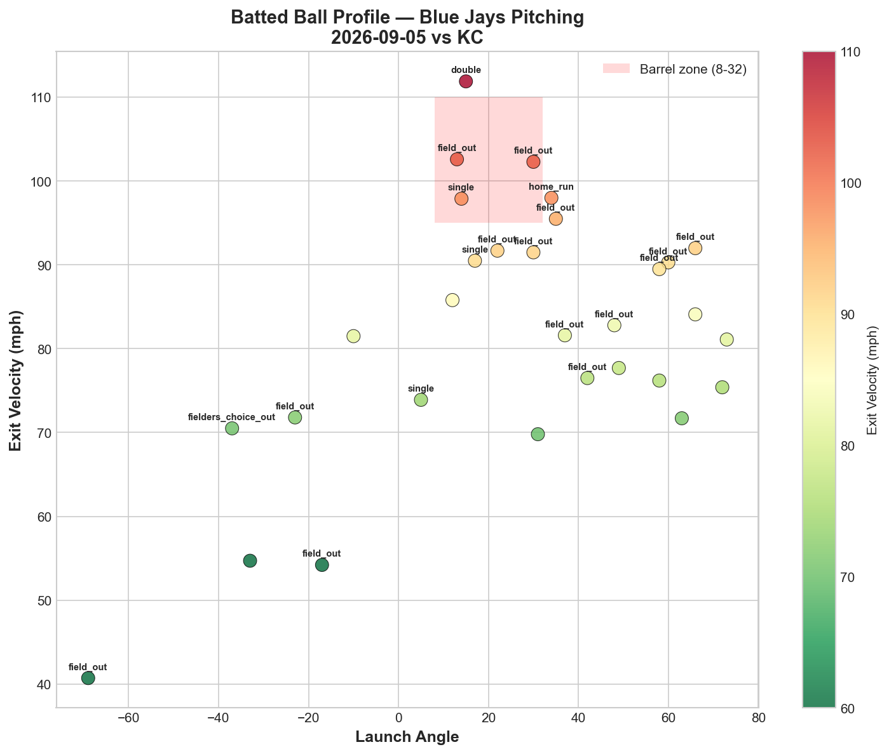
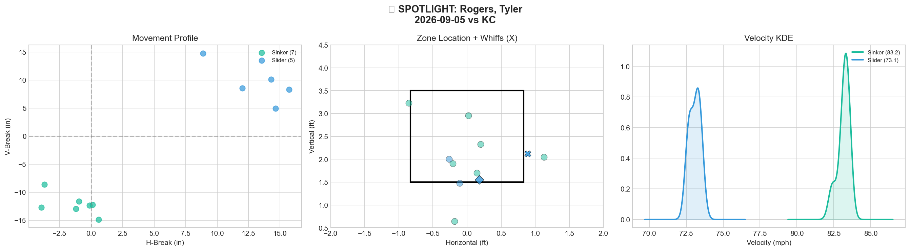
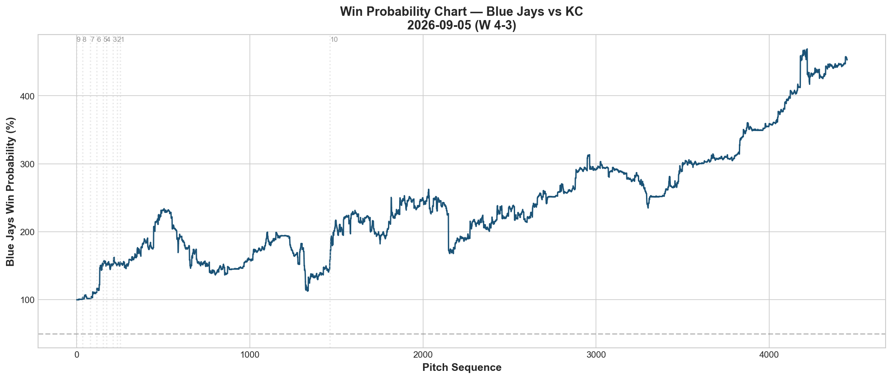
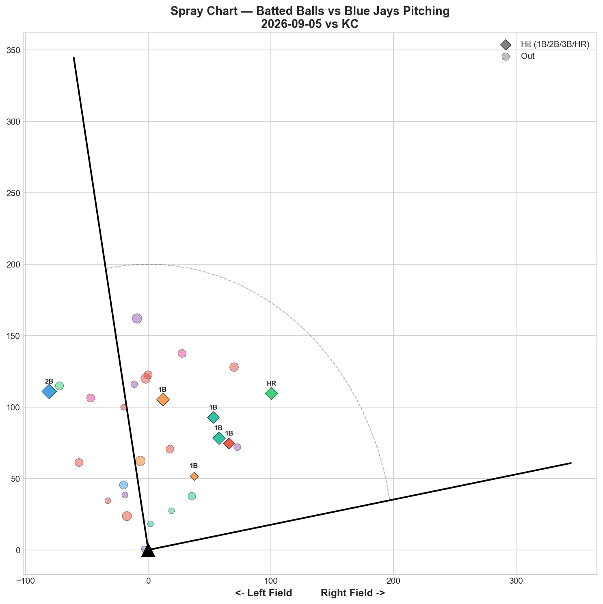

# 🏟️ Blue Jays Game Report v2.1
## 2026-09-05 | TOR @ KC | W 4-3

---

## 📋 Game Overview

| | |
|---|---|
| **Date** | 2026-09-05 |
| **Matchup** | Toronto Blue Jays @ Kansas City Royals |
| **Result** | **W 4-3 (10 innings)** |
| **Starter** | Max Scherzer (76 pitches) |
| **Spotlight Pitcher** | Tyler Rogers |
| **Season Record** | **71W-70L — first time above .500 this season** |

---

## 🔥 Key Storylines

### 1. First Time Above .500 All Season — A Season-Defining Milestone

**71-70.** After nearly the entire tracked season oscillating around or below .500 — reaching exactly .500 four times before finally clearing it tonight — the Blue Jays have crossed the break-even threshold for the first time. This comes on the back of a 10-inning grind against Kansas City, extending the current stretch to 6-1 across the last seven games.

### 2. Scherzer's Curveball Delivers Elite Value Again — Fastball Also Effective

Curveball posted **-1.559 RV (22.2% whiff, -0.1039 per pitch)** — his best single-pitch performance of this stretch — while the fastball also converted (-0.929 RV). This continues Scherzer's season-long split-effectiveness pattern: deception-based pitches (curveball) working consistently, while the changeup (+1.314 RV) and cutter (+0.760 RV) leaked significantly tonight, a reversal from his 8/30 masterpiece where everything worked simultaneously.

### 3. Tyler Rogers Spotlight — A Modest Line With a Sharp Slider

In the spotlight tonight, Rogers threw just 12 pitches but showcased a **50% whiff slider (Grade A)** alongside his signature low-velocity sinker (0% whiff, D grade). Assessed as a "Solid Reliever" with 16.7% overall whiff — a representative, if unspectacular, glimpse of his current form.

---

## ⚾ Starter Pitch Arsenal Analysis — Max Scherzer

### Pitch Arsenal Performance (76 pitches)

| Pitch | # | Usage | Velo | Whiff% | CSW% | Chase% | Grade |
|-------|---|-------|------|--------|------|--------|-------|
| 4-Seam | 37 | 48.7% | 92.5 | 12.5% | 27.0% | 7.1% | 🟡 C |
| Curveball | 15 | 19.7% | 73.7 | 22.2% | 26.7% | 60.0% | 🟢 B |
| Slider | 9 | 11.8% | 85.0 | 50.0% | 33.3% | 33.3% | 🟢 A |
| Changeup | 8 | 10.5% | 82.9 | 0.0% | 12.5% | 20.0% | 🔴 D |
| Cutter | 7 | 9.2% | 87.0 | 0.0% | 14.3% | 66.7% | 🔴 D |

### Scherzer's Season-Long Split Pattern — Tonight's Version

| Start | Deception Pitches (CU/CT) | Velocity Pitches (FF/SL) | Result |
|-------|---------------------------|---------------------------|--------|
| 8/30 vs SEA | Both negative | Both negative (ALL 5 negative) | W, GS 80 (season best) |
| 8/25 vs KC | CU negative, CT negative | FF neutral, SL positive | L |
| **9/5 vs KC** | **CU strongly negative** | **FF negative, SL neutral** | **W** |

Tonight sits between his two typical modes — the curveball carried the outing (-1.559 RV) while the changeup and cutter (also deception-type pitches) unusually reversed and leaked value. The fastball's -0.929 RV was a quiet positive contributor.

### Pitch Movement (inches)

| Pitch | H-Break | V-Break | Count |
|-------|---------|---------|-------|
| 4-Seam (FF) | -8.7 | 15.1 | 37 |
| Curveball (CU) | 12.4 | -7.1 | 15 |
| Slider (SL) | 4.2 | 2.1 | 9 |
| Changeup (CH) | -12.5 | 3.0 | 8 |
| Cutter (FC) | 3.8 | 6.7 | 7 |

### Pitch Tunneling Analysis

| Pair | Release Sim | Plate Sep | Tunnel | Velo Gap |
|------|-------------|-----------|--------|----------|
| **Slider/Changeup** | **0.5in** | **16.7in** | **🟢 31.6** | **2.1mph** |
| Changeup/Cutter | 1.0in | 16.7in | 🟢 16.9 | 4.2mph |
| 4-Seam/Curveball | 2.3in | 30.6in | 🟢 13.6 | 18.8mph |
| Slider/Cutter | 0.5in | 4.7in | 🟢 9.9 | 2.1mph |

Best tunnel Slider/Changeup at 31.6 — ironically the two pitches paired here had opposite fortunes tonight (slider neutral, changeup his worst pitch), showing tunneling doesn't guarantee matched outcomes even within a well-paired combination.

### Pitch Run Value by Type

| Pitch | Total RV | Per Pitch | Pitches | Assessment |
|-------|----------|-----------|---------|------------|
| Curveball | **-1.559** | **-0.1039** | 15 | ✅ Best pitch |
| 4-Seam | -0.929 | -0.0251 | 37 | ✅ Effective |
| Slider | +0.187 | +0.0208 | 9 | 🟡 Marginal |
| Cutter | +0.760 | +0.1086 | 7 | 🔴 Leaked |
| Changeup | +1.314 | +0.1642 | 8 | 🔴 Worst per-pitch |

**Net: -0.227 RV.** A modest overall outing — the curveball's elite performance narrowly offset the cutter and changeup's struggles.

### Pitch Selection by Count

| Situation | Primary | Secondary | Notes |
|-----------|---------|-----------|-------|
| First Pitch (0-0) | **4-Seam 75.0%** | Cutter/Curveball 12.5% each | Heavy fastball-first |
| Ahead | 4-Seam 33.3% | Changeup/Curveball 20.8% each | Balanced |
| Behind | Curveball 35.7% | 4-Seam 28.6% | Curveball trusted behind |
| Even | 4-Seam 53.8% | Curveball/Slider 15.4% each | Fastball-led |
| Full Count (3-2) | Slider 100% | — | Small sample, all slider |

**Strikeout Pitches (2 K's):** Curveball 1, Slider 1.

### vs LHB/RHB Split

| Stand | Pitches | Avg Velo | Swinging Strikes | Whiff/Pitch |
|-------|---------|----------|------------------|-------------|
| L | 44 | 86.6 | 1 | 2.3% |
| R | 32 | 86.1 | 5 | 15.6% |

A significant platoon split tonight — nearly seven times the whiff rate against RHH compared to LHH.

### Top Opposing Batters

| Batter | Pitches | Hits | K | BB | Avg EV |
|--------|---------|------|---|-----|--------|
| Bobby Witt Jr. | 14 | 1 | 1 | 0 | **95.0** |
| Nick Loftin | 10 | 0 | 1 | 0 | 80.6 |
| Josh Rojas | 9 | 0 | 0 | 0 | 78.4 |
| Salvador Perez | 8 | 1 | 0 | 0 | 85.2 |
| Michael Massey | 8 | 1 | 0 | 0 | 84.4 |

Witt's 95.0 mph average EV stands out as the hardest-hit data point among the top order, though the Royals' contact overall stayed moderate.

### Velocity Profile

- **4-Seam:** 93.0 → 92.1 mph (-1.0)
- **Curveball:** 73.1 → 74.1 mph (+1.0)
- **Slider:** 85.4 → 84.5 mph (-0.9)

Modest, unremarkable declines/gains across the board — no fatigue red flags at 76 pitches.

### Game Score / Batted Ball

**Game Score: 54 (AVERAGE).** 2K, 0H(!), 0HR, 2BB on 76 pitches — a personal no-hit bid despite the modest overall grade.

| Metric | Value |
|--------|-------|
| Total BIP | 30 |
| Avg Exit Velo | 82.1 mph |
| Avg Launch Angle | 25.4° |
| Hard Hit (95+ mph) | 6/30 (20%) |

---

## 🔍 Spotlight Pitcher — Tyler Rogers

| | |
|---|---|
| **Pitch Count** | 12 |
| **Line** | 0K / 0BB / 2H / 0HR |
| **Overall Whiff%** | 16.7% |
| **Role Assessment** | SOLID RELIEVER |

### Pitch Arsenal

| Pitch | # | Usage | Velo | Whiff% | CSW% | Grade |
|-------|---|-------|------|--------|------|-------|
| Sinker | 7 | 58.3% | 83.2 | 0.0% | 0.0% | 🔴 D |
| Slider | 5 | 41.7% | 73.1 | 50.0% | 40.0% | 🟢 A |

### Assessment

Rogers' profile remains consistent with his season-long pattern: a low-velocity sinker (83.2 mph) that generates outs through weak contact rather than whiffs, paired with a slower slider (73.1 mph) that flashes real swing-and-miss when it's working — tonight at 50% whiff. His overall 16.7% whiff rate and 2 hits allowed in 12 pitches reflect a standard, unremarkable relief outing for a pitcher whose value has always come from ground-ball generation and soft contact rather than strikeouts.

---

## 📊 Bullpen Detailed Analysis

| Pitcher | Pitches | Line | Key Pitch | Notes |
|---------|---------|------|-----------|-------|
| **Louis Varland** | 13 | 1K / 0BB / 0H / 0HR | K-Curve 33.3% whiff 🟢A | 100.0 mph fastball, clean outing |
| **Tyler Rogers** | 12 | 0K / 0BB / 2H / 0HR | Slider 50% whiff 🟢A | See spotlight |
| **Paul Sewald** | 7 | 0K / 0BB / 0H / 0HR | FF 50% whiff 🟢A | Small sample, clean |
| **Mason Fluharty** | 20 | 2K / 1BB / 0H / 0HR | Sweeper 50% whiff 🟢A | Solid, extended bridge |

### Bullpen Notes

- **Varland's fastball touched exactly 100.0 mph** — his hardest tracked velocity of the season — while his K-Curve (33.3% whiff, A) provided the swing-and-miss complement.
- **Fluharty's sweeper at 50% whiff** anchored a clean 20-pitch outing that helped bridge the extra innings.
- The bullpen combined for 0 earned runs across four relievers' 52 pitches, a strong complement to Scherzer's own quality peripherals (0H personally allowed).

---

## 📈 Win Probability Analysis

### Key WPA Moments

| Inning | Event | Impact |
|--------|-------|--------|
| 2 | Molina — home_run | 📈 Jays scored early |
| 5 | Kay — home_run | 📉 Royals answered |
| 7 | Beeter — home_run | 📈 Jays extended |
| 8 | Booser — double | 📈 Jays pushed further |
| 8 | Rogers — GIDP | 📉 Royals limited damage |
| 10 | Latz — home_run | 📉 Late tension in extras |

A see-saw affair that ultimately extended into the 10th before Toronto closed it out.

---

## 📊 Spray Chart & Batted Ball Summary

| Metric | Value |
|--------|-------|
| Total batted balls tracked | 28 |
| Hits | 7 (25%) |
| Pull | 6 (21%) |
| Center | 18 (64%) |
| Oppo | 4 (14%) |

---

## 🎯 Analytical Takeaways

1. **71-70 — First Time Above .500 All Season** — A milestone reached after nearly two months of tracked data showing the pitching staff's underlying quality (elite starts from Cease, Bieber, and occasionally Scherzer; deep, effective bullpen) consistently outpacing the counting-stat record. Tonight's extra-innings win extends the recent stretch to 6-1 over the last seven games.

2. **Scherzer's Curveball Remains His Most Reliable Weapon** — -1.559 RV tonight, continuing a pattern where his deception-based pitches (curveball especially) outperform his velocity-based ones on most nights — though tonight's changeup and cutter reversal (both leaking heavily) shows even his "typical" pattern has real night-to-night variance.

3. **Tyler Rogers' Spotlight Confirms His Established Profile** — Ground-ball sinker paired with an occasionally-elite slider (50% whiff tonight). Nothing new revealed, but a clean confirmation of his role as a steady, if unspectacular, bullpen piece.

4. **Bullpen Depth Continues to Deliver** — Varland's 100.0 mph fastball, Fluharty's sweeper, and a clean complementary effort from Sewald combined for 0 earned runs across 52 relief pitches, reinforcing the bullpen's status as the team's most consistent strength this season.

5. **Game Classification: Extra-Innings Milestone Win** — A back-and-forth 10-inning battle that delivered more than just two points in the standings — it marked the first time all season the Blue Jays have been able to call themselves a winning team.

---

*Report generated from Statcast data via pybaseball. All pitch metrics sourced from Baseball Savant.*
