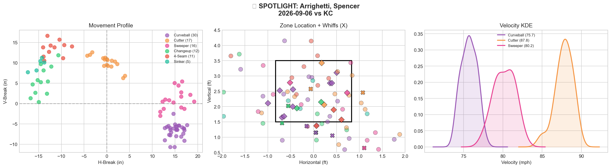
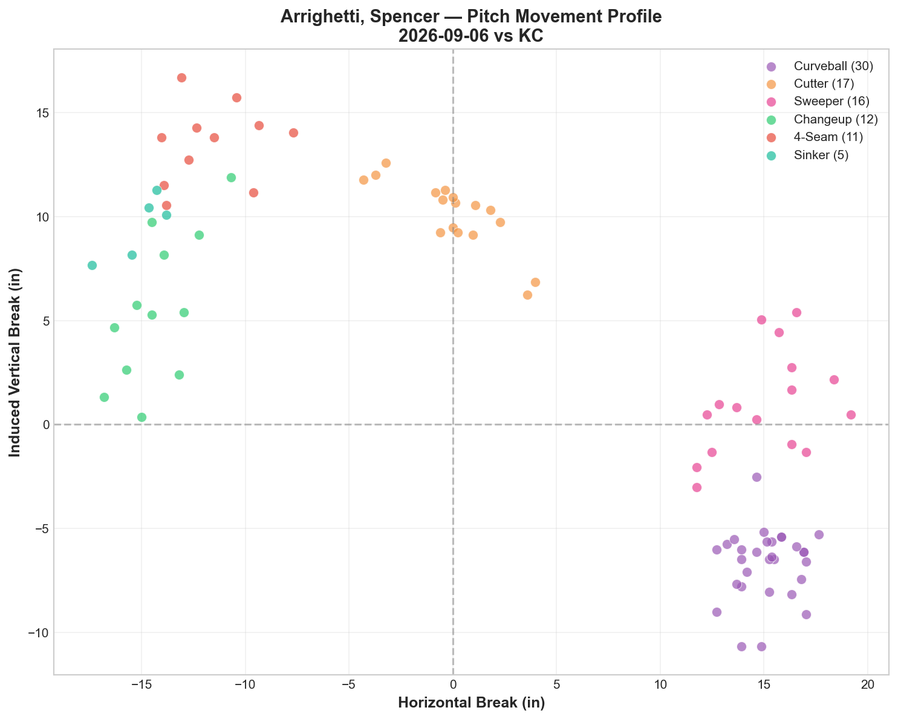
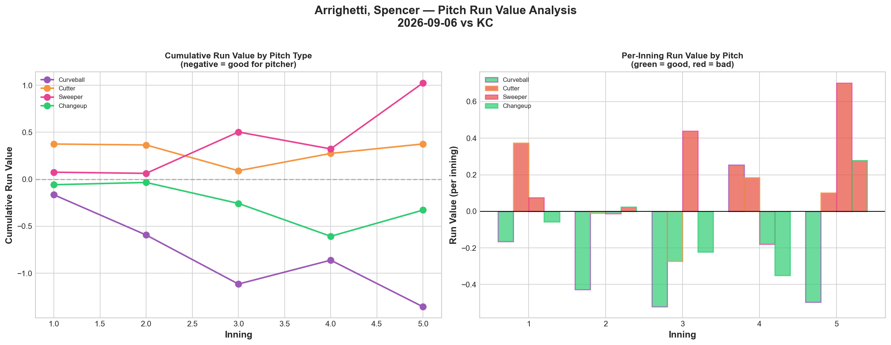
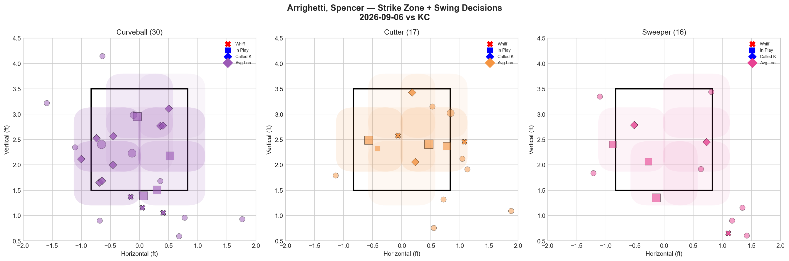
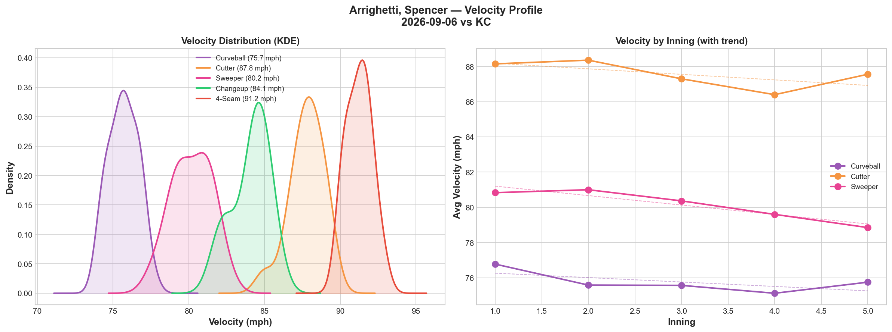
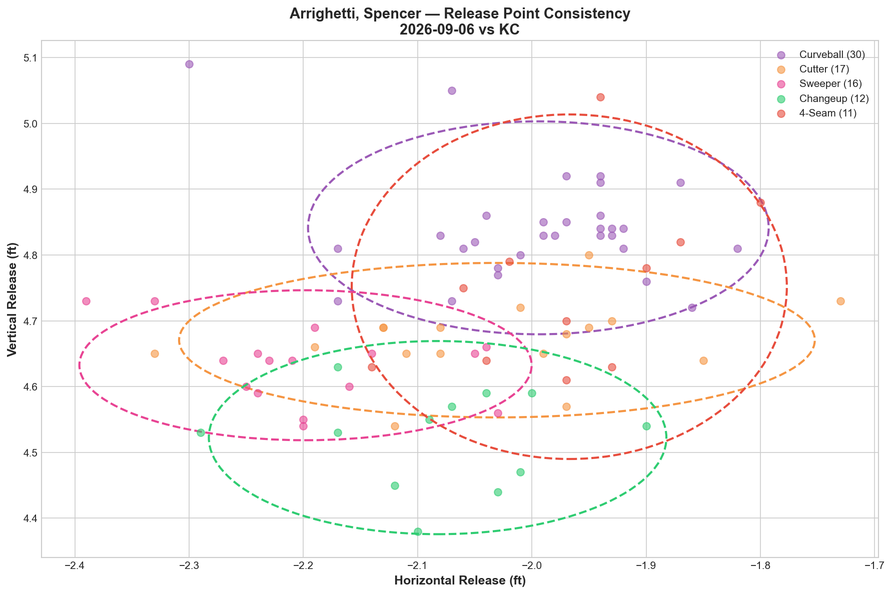
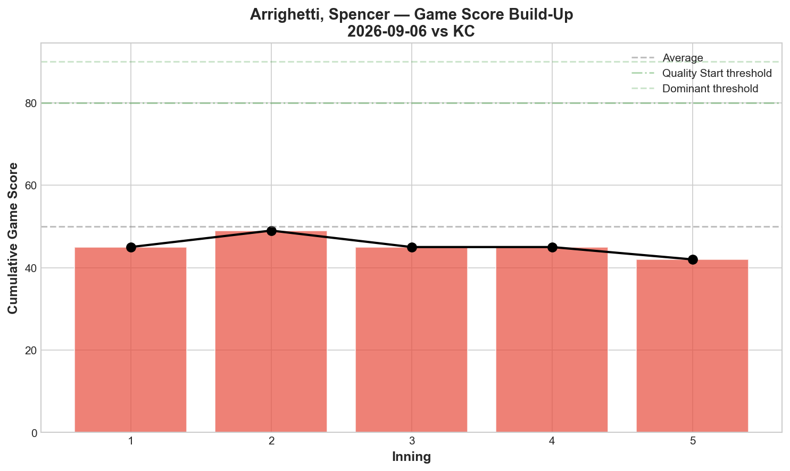
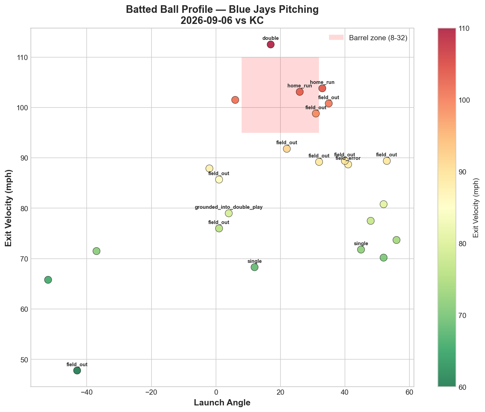
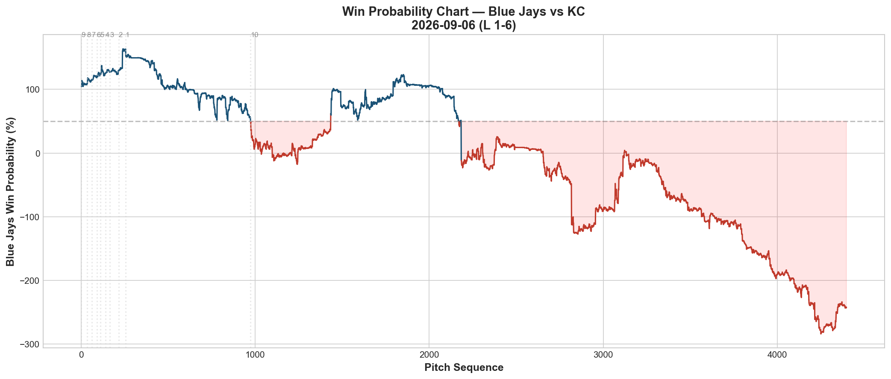
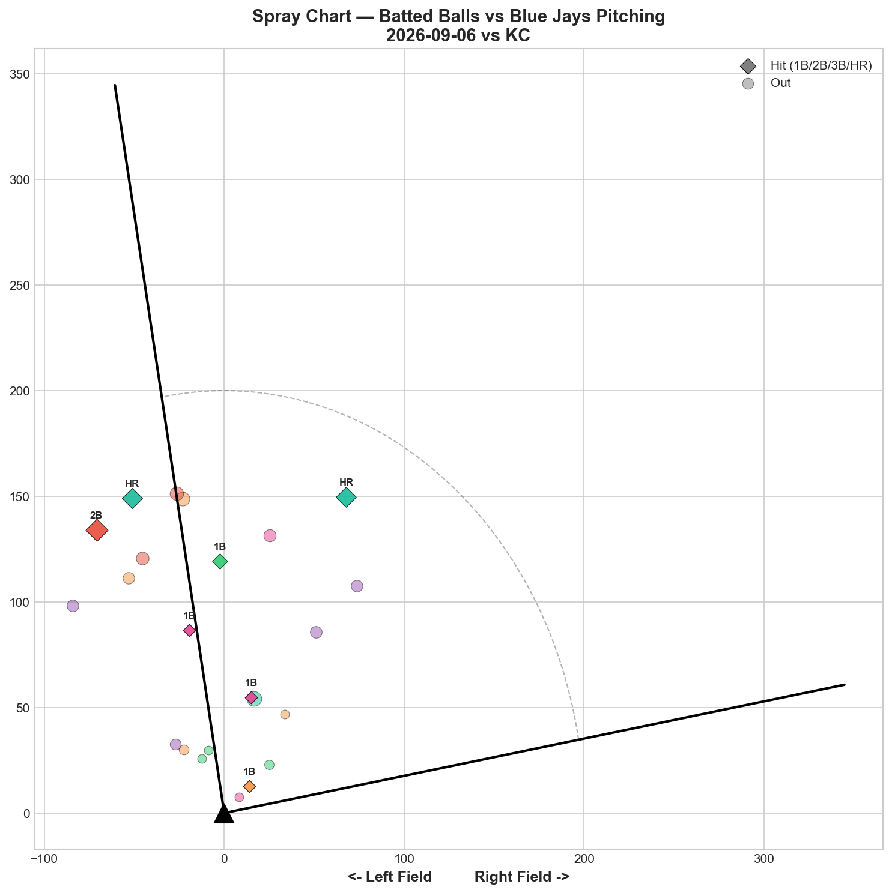

# 🏟️ Blue Jays Game Report v2.1
## 2026-09-06 | TOR @ KC | L 1-6

---

## 📋 Game Overview

| | |
|---|---|
| **Date** | 2026-09-06 |
| **Matchup** | Toronto Blue Jays @ Kansas City Royals |
| **Result** | **L 1-6** |
| **Starter** | Spencer Arrighetti (91 pitches) |
| **Spotlight Pitcher** | Spencer Arrighetti |
| **Season Record** | 71W-71L — back to exactly .500 |

---

## 🔥 Key Storylines

### 1. Back to .500 — The Win Above .500 Lasted One Game

**71-71.** After finally breaking above .500 for the first time all season on 9/5, the Jays immediately regressed. This continues the season-long pattern documented repeatedly: reaching or crossing .500, then dropping right back — this time after just a single game above the line.

### 2. Arrighetti's Curveball Is Elite — Everything Else Struggles, Especially the Sinker

The curveball posted **-1.357 RV (27.3% whiff)** — clearly his best pitch. But the **sinker delivered the worst per-pitch performance we've tracked from any Blue Jays pitcher this season: +2.607 total RV across just 5 pitches (+0.5214 per pitch).** The sweeper (+1.025) and 4-seam (+0.495) also leaked. Two home runs allowed, both likely tied to the non-curveball offerings.

### 3. Massive Platoon Split — 17.1% Whiff vs LHH, Just 4.0% vs RHH

Arrighetti was drastically more effective against left-handed hitters tonight (17.1% whiff/pitch) than right-handed hitters (4.0%) — over a 4x differential. Worth monitoring whether this becomes a repeatable platoon signature as he accumulates more starts.

---

## 🔍 Spotlight Pitcher — Spencer Arrighetti

### Pitch Arsenal Performance (91 pitches)

| Pitch | # | Usage | Velo | Whiff% | CSW% | Chase% | Grade |
|-------|---|-------|------|--------|------|--------|-------|
| Curveball | 30 | 33.0% | 75.7 | 27.3% | 40.0% | 26.7% | 🟢 B |
| Cutter | 17 | 18.7% | 87.8 | 25.0% | 23.5% | 22.2% | 🟢 B |
| Sweeper | 16 | 17.6% | 80.2 | 20.0% | 18.8% | 27.3% | 🟢 B |
| Changeup | 12 | 13.2% | 84.1 | **60.0%** | 41.7% | 37.5% | 🟢 A |
| 4-Seam | 11 | 12.1% | 91.2 | 0.0% | 27.3% | 25.0% | 🔴 D |
| Sinker | 5 | 5.5% | 91.8 | 0.0% | 0.0% | 0.0% | 🔴 D |

**Role Assessment: SOLID RELIEVER-caliber outing** (per the model's classification) despite functioning as the starter tonight — 23.7% overall whiff rate. Four pitches graded B or better, showing genuine arsenal depth across his third tracked start.

### The Sinker Disaster in Detail

| Metric | Value |
|--------|-------|
| Pitches thrown | 5 |
| Whiff% | 0.0% |
| Total RV | +2.607 |
| Per-pitch RV | **+0.5214** |

Five sinkers, zero swinging strikes, and over 2.6 runs of value surrendered — the single worst small-sample pitch performance tracked from any Blue Jays pitcher this season. With such a tiny sample (5 pitches), this could be an outlier rather than a trend, but it's worth watching whether Arrighetti continues featuring the sinker or moves away from it in upcoming outings.

### Three-Start Arrighetti Progression

| Start | Role | Pitches | Best Pitch | Worst Pitch | Result |
|-------|------|---------|------------|--------------|--------|
| 8/21 (debut) | Bulk | 61 | CU 40% whiff (A) | 4-Seam +1.256 RV | L |
| 8/27 | Starter | 79 | CU 53.8% whiff (A) | 4-Seam +1.256 RV | L |
| 9/1 | Relief | 62 | 4-Seam/CU both B | Cutter flat | L |
| **9/6** | **Starter** | **91** | **CU -1.357 RV** | **Sinker +2.607 RV** | **L** |

**The curveball has been his most consistent weapon across all four tracked appearances**, while the fastball-family pitches (4-seam, sinker, cutter) remain the recurring soft spot. Arrighetti is still winless personally across his tracked outings, though his individual pitch grades continue to show real upside.

### Pitch Movement (inches)

| Pitch | H-Break | V-Break | Count |
|-------|---------|---------|-------|
| Curveball (CU) | 15.1 | -6.7 | 30 |
| Cutter (FC) | 0.0 | 10.1 | 17 |
| Sweeper (ST) | 15.0 | 1.0 | 16 |
| Changeup (CH) | -14.3 | 5.6 | 12 |
| 4-Seam (FF) | -11.7 | 13.5 | 11 |
| Sinker (SI) | -15.1 | 9.5 | 5 |

### Pitch Tunneling Analysis

| Pair | Release Sim | Plate Sep | Tunnel | Velo Gap |
|------|-------------|-----------|--------|----------|
| **Curveball/4-Seam** | **1.1in** | **33.6in** | **🟢 29.9** | **15.6mph** |
| Curveball/Sinker | 1.4in | 34.3in | 🟢 23.8 | 16.1mph |
| 4-Seam/Sinker | 0.3in | 5.3in | 🟢 15.8 | 0.6mph |
| Sweeper/Changeup | 1.9in | 29.6in | 🟢 15.5 | 3.9mph |
| Cutter/Sinker | 1.0in | 15.2in | 🟢 15.4 | 4.0mph |

Best tunnel: Curveball/4-Seam (29.9) — his best pitch pairing well with his most-used secondary fastball, even though the 4-seam itself struggled by RV tonight.

### Pitch Run Value by Type

| Pitch | Total RV | Per Pitch | Pitches | Assessment |
|-------|----------|-----------|---------|------------|
| Curveball | **-1.357** | **-0.0452** | 30 | ✅ Best pitch |
| Changeup | -0.328 | -0.0273 | 12 | ✅ Effective, elite whiff |
| Cutter | +0.376 | +0.0221 | 17 | 🔴 Leaked |
| 4-Seam | +0.495 | +0.0450 | 11 | 🔴 Leaked |
| Sweeper | +1.025 | +0.0641 | 16 | 🔴 Significant damage |
| Sinker | +2.607 | +0.5214 | 5 | 🔴 Worst per-pitch of the season |

**Net: +3.218 RV.** A rough overall total, driven heavily by the small-sample sinker collapse and the sweeper's struggles.

### Pitch Selection by Count

| Situation | Primary | Secondary | Notes |
|-----------|---------|-----------|-------|
| First Pitch (0-0) | Curveball 33.3% | Sweeper 25.0% | Breaking-ball-first approach |
| Ahead | Curveball 30.0% | Sweeper 23.3% | Off-speed dominant |
| Behind | **Curveball 57.9%** | Cutter 21.1% | Heavy curveball reliance even behind |
| Even | Cutter 37.5% | Sweeper/FF 18.8% each | Cutter-led neutral |
| Full Count (3-2) | FF/SI 50% each | — | Fastball-only on 3-2 |

**Strikeout Pitches (3 K's):** Curveball 2, Cutter 1.

### vs LHB/RHB Split

| Stand | Pitches | Avg Velo | Swinging Strikes | Whiff/Pitch |
|-------|---------|----------|------------------|-------------|
| L | 41 | 82.9 | 7 | **17.1%** |
| R | 50 | 82.4 | 2 | **4.0%** |

A stark platoon differential worth monitoring across his next several starts.

### Top Opposing Batters

| Batter | Pitches | Hits | K | BB | Avg EV |
|--------|---------|------|---|-----|--------|
| Bobby Witt Jr. | 18 | 1 | 0 | 1 | 89.8 |
| Salvador Perez | 13 | 1 | 0 | 0 | 82.0 |
| Josh Rojas | 13 | 0 | 1 | 0 | 68.5 |
| John Rave | 11 | 1 | 1 | 0 | 81.6 |
| Nick Loftin | 11 | 2 | 0 | 0 | 79.6 |

Loftin's 2 hits led the Royals' order against him; no single hitter posted extreme exit velocity, consistent with the moderate 84.4 mph team average.

### Velocity Profile

- **Curveball:** 76.8 → 75.8 mph (-1.0)
- **Cutter:** 88.2 → 87.6 mph (-0.6)
- **Sweeper:** 80.8 → 78.8 mph (**-2.0**)

The sweeper's -2.0 mph decline at 91 pitches — his career-high pitch count — could reflect standard fatigue as he continues building up as a starter.

### Game Score / Batted Ball

**Game Score: 42 (BELOW AVERAGE).** 3K, 6H, 2HR, 4BB on 91 pitches — his career-high pitch count also produced his most damage allowed.

| Metric | Value |
|--------|-------|
| Total BIP | 24 |
| Avg Exit Velo | 84.4 mph |
| Avg Launch Angle | 19.7° |
| Hard Hit (95+ mph) | 6/24 (25%) |

---

## 📊 Bullpen Detailed Analysis

| Pitcher | Pitches | Line | Key Pitch | Notes |
|---------|---------|------|-----------|-------|
| **Joe Mantiply** | 17 | 2K / 1BB / 0H / 0HR | SI 33.3% (A) + CU 25% (B) | Clean, effective |
| **Ricky Tiedemann** | 32 | 2K / 3BB / 1H / 0HR | **ST 50% (A) + FF 50% (A)** | Two A-grade pitches, but 3 walks |
| **Braydon Fisher** | 10 | 1K / 1BB / 0H / 0HR | SL 50% whiff (A) | Sharp in a brief stint |

### Bullpen Notes

- **Tiedemann's** sweeper and fastball both graded A (50% whiff each), but 3 walks in 32 pitches show his command still needs tightening as he continues integrating into the relief mix.
- **Mantiply** delivered his second straight clean outing (0H allowed), with the sinker (33.3% whiff, A) building on his debut promise.
- **Fisher's** slider at 50% whiff continues his recent trend of sharp, if brief, relief appearances.

---

## 📈 Win Probability Analysis

### Key WPA Moments

| Inning | Event | Impact |
|--------|-------|--------|
| 2 | Bradish — home_run | 📉 Royals scored |
| 4 | Matz — double | 📉 Royals extended |
| 8 | Seymour — home_run | 📉 Royals pulled further ahead |
| 8 | Dion — home_run | 📉 Royals continued |
| 8 | McFarlane — home_run | 📉 Royals capped the scoring |
| 9 | Iglesias — field_out | 📈 Jays limited final damage |

An 8th-inning barrage of home runs decided the game after the score had stayed within reach through seven.

---

## 📊 Spray Chart & Batted Ball Summary

| Metric | Value |
|--------|-------|
| Total batted balls tracked | 23 |
| Hits | 7 (30%) |
| Pull | 3 (13%) |
| Center | 15 (65%) |
| Oppo | 5 (22%) |

---

## 🎯 Analytical Takeaways

1. **Arrighetti's Curveball Is a Confirmed Weapon Across Four Appearances** — -1.357 RV tonight, continuing a track record where his curveball has graded A or B in every tracked outing. This remains his clearest foundation as he continues stretching into a starter's workload.

2. **The Sinker Needs Reconsideration** — A tiny 5-pitch sample produced the worst per-pitch run value tracked from any Blue Jays pitcher all season (+0.5214). While the sample is too small to draw firm conclusions, the Blue Jays' pitching staff may want to examine whether the sinker belongs in Arrighetti's regular mix going forward.

3. **A Dramatic Platoon Split Emerged Tonight** — 17.1% whiff vs LHH, 4.0% vs RHH. Worth tracking across his next few starts to see if this becomes a repeatable pattern that could inform matchup-based usage.

4. **71-71 — Back to .500 After One Game Above** — The Jays' brief taste of a winning record lasted a single day, extending the season-long theme of hovering right around the break-even line.

5. **Bullpen Continues Solid, If Imperfect, Complementary Work** — Tiedemann and Mantiply both flashed real swing-and-miss stuff, though Tiedemann's 3 walks in 32 pitches show ongoing command refinement as he establishes himself in the relief corps.

6. **Game Classification: Career-High Workload, Career-High Damage** — Arrighetti's 91-pitch outing (his deepest tracked start) also produced his highest hit and home run totals, suggesting the Blue Jays may want to monitor his workload progression carefully as he continues building toward a full starter's role.

---

*Report generated from Statcast data via pybaseball. All pitch metrics sourced from Baseball Savant.*
