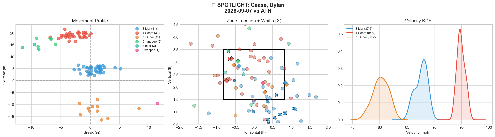
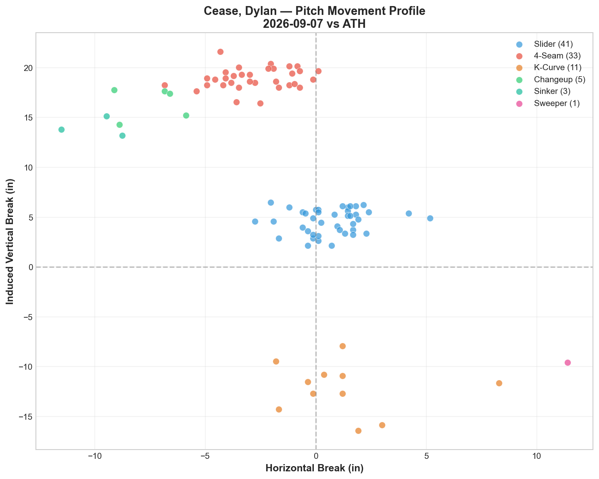
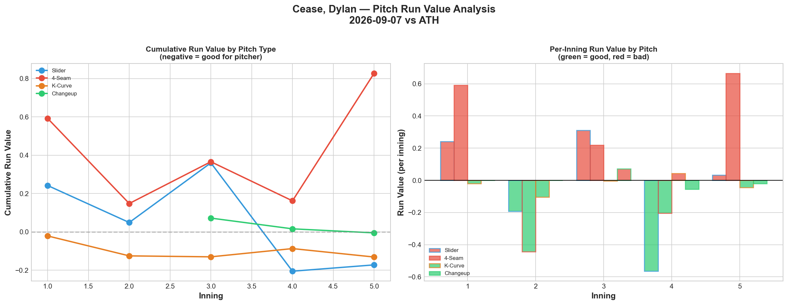
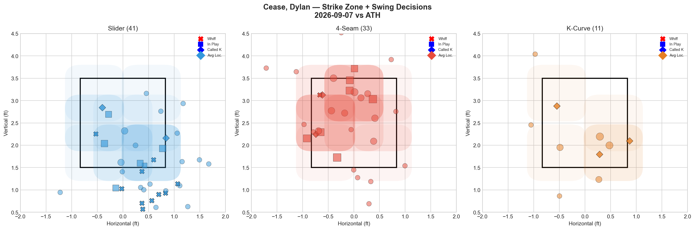
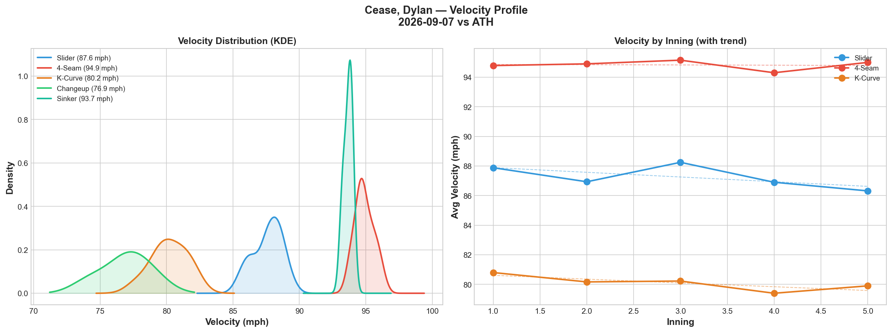
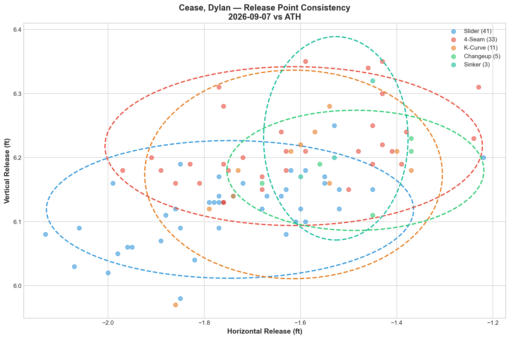
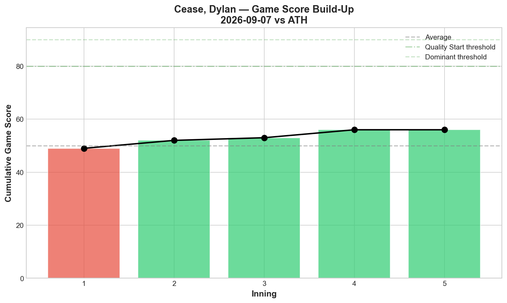
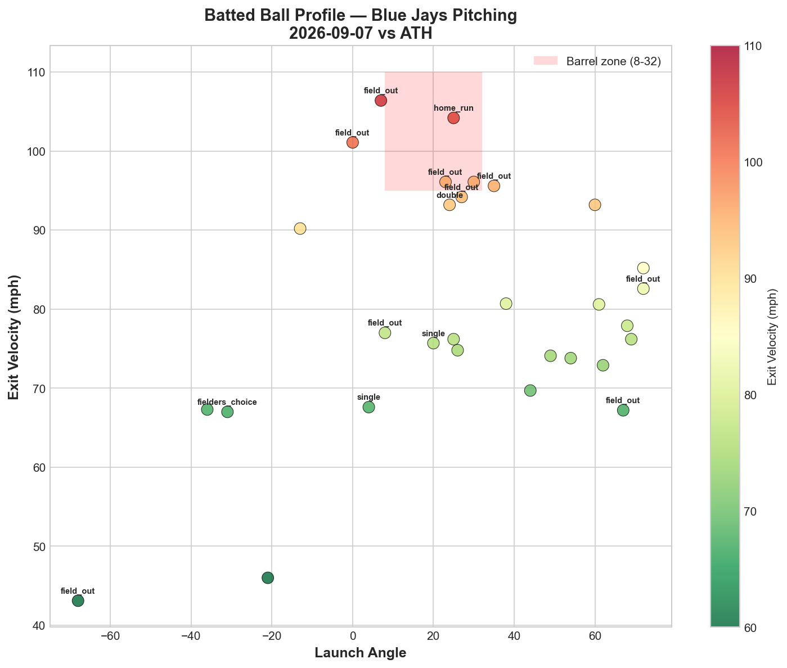
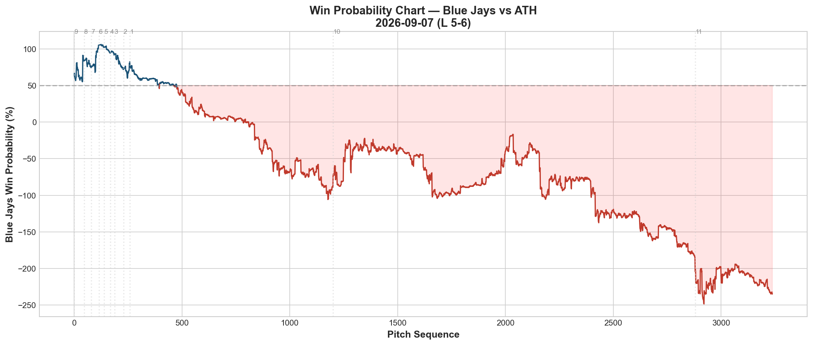
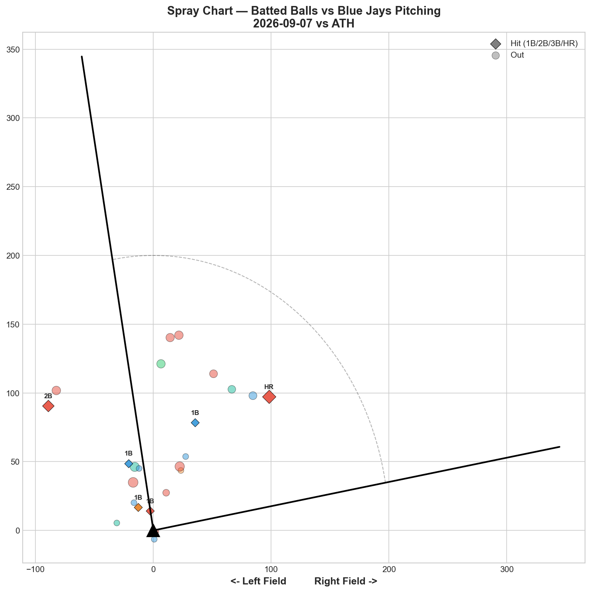

# 🏟️ Blue Jays Game Report v2.1
## 2026-09-07 | TOR @ ATH | L 5-6

---

## 📋 Game Overview

| | |
|---|---|
| **Date** | 2026-09-07 |
| **Matchup** | Toronto Blue Jays @ Athletics |
| **Result** | **L 5-6 (10 innings)** |
| **Starter** | Dylan Cease (94 pitches) |
| **Spotlight Pitcher** | Dylan Cease |
| **Season Record** | 71W-72L |

---

## 🔥 Key Storylines

### 1. Slider Elite Whiff, Nearly Neutral RV — 4-Seam the Actual Leak

Cease's slider posted **50.0% whiff (Grade A)** with 6 of his 6 total strikeouts, yet the pitch's run value was only **-0.172** — essentially neutral despite the elite whiff rate. The real damage came from the fastball, which posted **+0.827 RV** (worst on the staff tonight) despite modest usage. This is a now-familiar whiff/RV disconnect pattern, but tonight it appeared on his best pitch rather than a secondary offering.

### 2. All Six Strikeouts Came From a Single Pitch

Every one of Cease's 6 K's came via the slider — his most concentrated strikeout-pitch reliance tracked this season. The changeup, despite 100% whiff (5 pitches, tiny sample), didn't register any strikeouts, and the K-Curve (0% whiff) contributed nothing to the K total.

### 3. Extra-Innings Loss Despite a Quality Peripheral Line

GS 58, only 4H and 1HR allowed personally, yet the Jays fell in a 10-inning battle. The bullpen (Varland, Rogers, Sewald, Little) combined for a mixed final stretch — Little's dominant 3-A-grade-pitch outing (SL 50%, KC 100%, FF 100%) stood out, but it wasn't enough to close out the extra frames.

---

## 🔍 Spotlight Pitcher — Dylan Cease

### Pitch Arsenal Performance (94 pitches)

| Pitch | # | Usage | Velo | Whiff% | CSW% | Chase% | Grade |
|-------|---|-------|------|--------|------|--------|-------|
| Slider | 41 | 43.6% | 87.6 | **50.0%** | 29.3% | 35.7% | 🟢 A |
| 4-Seam | 33 | 35.1% | 94.9 | 5.3% | 9.1% | 28.6% | 🔴 D |
| K-Curve | 11 | 11.7% | 80.2 | 0.0% | 27.3% | 16.7% | 🔴 D |
| Changeup | 5 | 5.3% | 76.9 | **100.0%** | 40.0% | 0.0% | 🟢 A |
| Sinker | 3 | 3.2% | 93.7 | 0.0% | 0.0% | 0.0% | 🔴 D |
| Sweeper | 1 | 1.1% | 79.8 | 0.0% | 100.0% | 0.0% | 🔴 D |

**Role Assessment: SOLID RELIEVER-caliber outing** at 26.1% overall whiff. Two A-grade pitches (Slider, Changeup), but the slider's usage (43.6%) was by far the season's highest for Cease — a clear tactical shift toward his best swing-and-miss weapon.

### The Slider's Whiff/RV Split — A Deeper Look

| Metric | Value | Interpretation |
|--------|-------|------------------|
| Usage | 43.6% (season-high) | Heaviest reliance on the pitch all year |
| Whiff% | 50.0% | Elite — his best slider whiff rate this season |
| K's produced | 6 of 6 (100%) | Every strikeout came from this pitch |
| Total RV | -0.172 | Barely negative — nearly neutral |
| Per-pitch RV | -0.0042 | Essentially zero |

Despite the elite whiff rate and total strikeout dependence, the slider's run value was nearly flat. This suggests that while Cease got plenty of empty swings, the pitches that were put in play (or worked into deep counts) didn't consistently prevent runs — a more moderate version of the whiff/RV disconnect that's appeared across many Blue Jays starters this season.

### Cease's Season-Long Slider Usage Trend

| Start | SL Usage | SL Whiff% | SL RV |
|-------|----------|-----------|-------|
| 7/25 vs BOS | 34.2% | 48.0% | -2.639 |
| 8/6 vs CHC | 30.8% | 28.6% | -2.779 |
| 8/22 vs NYY | 32.4% | 47.6% | -1.212 |
| **9/7 vs ATH** | **43.6%** | **50.0%** | **-0.172** |

Tonight's slider usage (43.6%) is his highest tracked this season, yet the run value conversion was his weakest of these four comparison starts — reinforcing that heavier reliance on even an elite pitch doesn't automatically scale its effectiveness.

### Pitch Movement (inches)

| Pitch | H-Break | V-Break | Count |
|-------|---------|---------|-------|
| Slider (SL) | 0.7 | 4.6 | 41 |
| 4-Seam (FF) | -2.8 | 18.9 | 33 |
| K-Curve (KC) | 1.2 | -12.2 | 11 |
| Changeup (CH) | -7.5 | 16.5 | 5 |
| Sinker (SI) | -9.9 | 14.0 | 3 |

### Pitch Tunneling Analysis

| Pair | Release Sim | Plate Sep | Tunnel | Velo Gap |
|------|-------------|-----------|--------|----------|
| **4-Seam/K-Curve** | **0.5in** | **31.4in** | **🟢 59.1** | **14.7mph** |
| K-Curve/Sinker | 1.3in | 28.5in | 🟢 22.8 | 13.5mph |
| K-Curve/Changeup | 1.5in | 30.0in | 🟢 19.4 | 3.3mph |
| Slider/K-Curve | 1.7in | 16.8in | 🟢 9.8 | 7.4mph |

Best tunnel: 4-Seam/K-Curve (59.1) — consistent with his season-long identity pairing, though neither pitch converted particularly well tonight by RV.

### Pitch Run Value by Type

| Pitch | Total RV | Per Pitch | Pitches | Assessment |
|-------|----------|-----------|---------|------------|
| Sinker | -0.243 | -0.0810 | 3 | ✅ Best per-pitch (tiny sample) |
| Slider | -0.172 | -0.0042 | 41 | 🟡 Elite whiff, flat RV |
| K-Curve | -0.131 | -0.0119 | 11 | ✅ Modest |
| Sweeper | -0.041 | -0.0410 | 1 | ✅ (tiny sample) |
| Changeup | -0.005 | -0.0010 | 5 | 🟡 100% whiff, still flat |
| 4-Seam | +0.827 | +0.0251 | 33 | 🔴 Worst total damage |

**Net: +0.235 RV.** A roughly break-even outing overall, with the fastball as the clear liability tonight.

### Pitch Selection by Count

| Situation | Primary | Secondary | Notes |
|-----------|---------|-----------|-------|
| First Pitch (0-0) | K-Curve 36.4% | 4-Seam 31.8% | Breaking-ball-led first pitch |
| Ahead | Slider 44.4% | 4-Seam 37.0% | Slider trusted ahead |
| Behind | **Slider 57.9%** | 4-Seam 36.8% | Slider even when behind |
| Even | **Slider 57.9%** | 4-Seam 26.3% | Slider-dominant neutral |
| Full Count (3-2) | 4-Seam 57.1% | Slider 42.9% | Fastball-led on 3-2 |

**Strikeout Pitches (6 K's):** Slider 6 — 100% concentration on a single pitch, his most one-dimensional K profile tracked this season.

### vs LHB/RHB Split

| Stand | Pitches | Avg Velo | Swinging Strikes | Whiff/Pitch |
|-------|---------|----------|------------------|-------------|
| L | 47 | 87.7 | 8 | 17.0% |
| R | 47 | 90.0 | 4 | 8.5% |

More than double the whiff rate against left-handed hitters tonight, consistent with the slider's typical platoon advantage.

### Top Opposing Batters

| Batter | Pitches | Hits | K | BB | Avg EV |
|--------|---------|------|---|-----|--------|
| Lawrence Butler | 17 | 0 | 3 | 0 | 90.2 |
| Henry Bolt | 17 | 1 | 0 | 2 | 81.0 |
| Zack Gelof | 12 | 1 | 0 | 0 | 88.9 |
| Max Muncy | 11 | 0 | 2 | 0 | 80.0 |
| Jeff McNeil | 10 | 0 | 0 | 0 | 80.4 |

Butler's 3 strikeouts (0-for) represent the night's most dominant individual matchup, all via the slider based on the pitch's overall K share.

### Velocity Profile

- **Slider:** 87.9 → 86.3 mph (-1.6)
- **4-Seam:** 94.8 → 95.0 mph (+0.2)
- **K-Curve:** 80.8 → 79.9 mph (-0.9)

The fastball held essentially flat (+0.2 mph), continuing Cease's season-long pattern of maintaining or gaining velocity late into outings, while the slider showed a modest fade.

### Game Score / Batted Ball

**Game Score: 58 (QUALITY).** 6K, 4H, 1HR, 2BB on 94 pitches.

| Metric | Value |
|--------|-------|
| Total BIP | 30 |
| Avg Exit Velo | 80.2 mph |
| Avg Launch Angle | 26.7° |
| Hard Hit (95+ mph) | 6/30 (20%) |

---

## 📊 Bullpen Detailed Analysis

| Pitcher | Pitches | Line | Key Pitch | Notes |
|---------|---------|------|-----------|-------|
| **Louis Varland** | 24 | 0K / 2BB / 2H / 0HR | SL 50% whiff 🟢A | Rough command night, 2BB |
| **Tyler Rogers** | 13 | 1K / 0BB / 0H / 0HR | SI 16.7% 🟡C | Standard sinker-heavy outing |
| **Paul Sewald** | 11 | 1K / 0BB / 0H / 0HR | FF 20% whiff 🟢B | Clean, solid |
| **Brendon Little** | 12 | 2K / 0BB / 0H / 0HR | **SL 50% (A) + KC 100% (A) + FF 100% (A)** | Three A-grade pitches — dominant |

### Bullpen Notes

- **Little's outing was the individual highlight of the bullpen** — three different pitch types graded A, with the K-Curve and fastball both posting 100% whiff in a small sample. This continues his recent run as one of the most consistently effective relievers on the staff.
- **Varland** struggled with command (2 walks in 24 pitches) despite his slider grading A (50% whiff) — a rougher outing by his recent standards.
- The bullpen ultimately couldn't preserve the lead through extra innings, with the O'Brien GIDP and Harris HR in the 9th/10th proving costly.

---

## 📈 Win Probability Analysis

### Key WPA Moments

| Inning | Event | Impact |
|--------|-------|--------|
| 8 | Fuentes — home_run | 📉 Athletics scored |
| 9 | Harris — home_run | 📉 Athletics tied/took lead |
| 9 | Varland — single | 📈 Jays rallied |
| 9 | Cruz — double_play | 📉 Rally limited |
| 10 | O'Brien — GIDP | 📉 Jays missed chance |
| 10 | Kimbrel — single | 📉 Athletics walked it off |

A late-inning collapse in the 8th and 9th, followed by a missed rally opportunity in the 10th, decided the extra-innings loss.

---

## 📊 Spray Chart & Batted Ball Summary

| Metric | Value |
|--------|-------|
| Total batted balls tracked | 24 |
| Hits | 6 (25%) |
| Pull | 4 (17%) |
| Center | 18 (75%) |
| Oppo | 2 (8%) |

---

## 🎯 Analytical Takeaways

1. **The Slider's Whiff/RV Gap Widened at Peak Usage** — At a season-high 43.6% usage, the slider still generated elite whiffs (50%) and all 6 strikeouts, but its run-value conversion was the weakest of any heavy-slider start tracked this season (-0.172 vs. -1.2 to -2.8 in prior comparisons). Heavier reliance didn't scale the pitch's run-prevention value proportionally.

2. **The Fastball Was the Actual Problem Tonight** — +0.827 RV, the clear offender on a night where Cease's overall line still looked solid (GS 58). A reminder that Game Score and underlying pitch-level performance don't always tell identical stories.

3. **Little Delivered the Bullpen's Best Individual Outing** — Three A-grade pitches (SL, KC, FF) in 12 pitches, continuing his strong recent stretch as a relief weapon.

4. **71-72 — Back Below .500 Again** — After finally crossing .500 on 9/5, the Jays have now gone .500 → below .500 within three games, extending the season's defining pattern of hovering right around the break-even line.

5. **Game Classification: Quality Start, Extra-Innings Heartbreak** — A near-identical shape to several losses tracked earlier this season: solid starter peripherals (GS 58, 6K, limited hard contact) undone by a late-inning and extra-innings sequence that the bullpen couldn't fully close out.

---

*Report generated from Statcast data via pybaseball. All pitch metrics sourced from Baseball Savant.*
