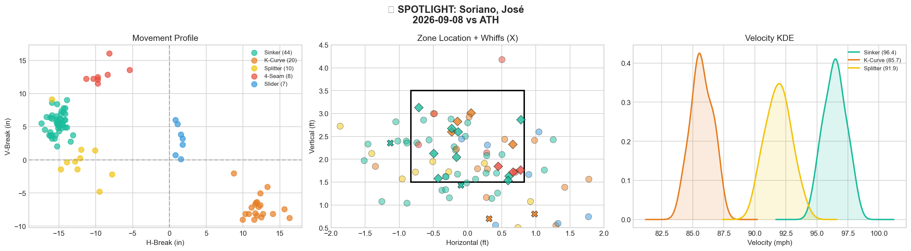
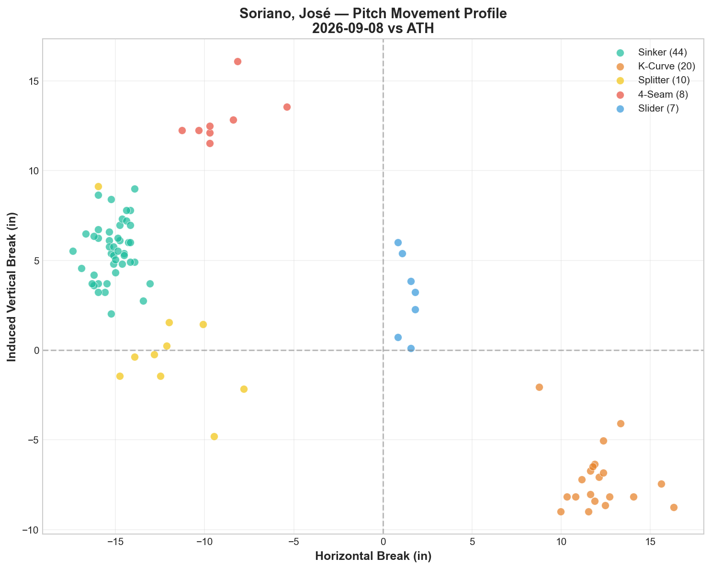
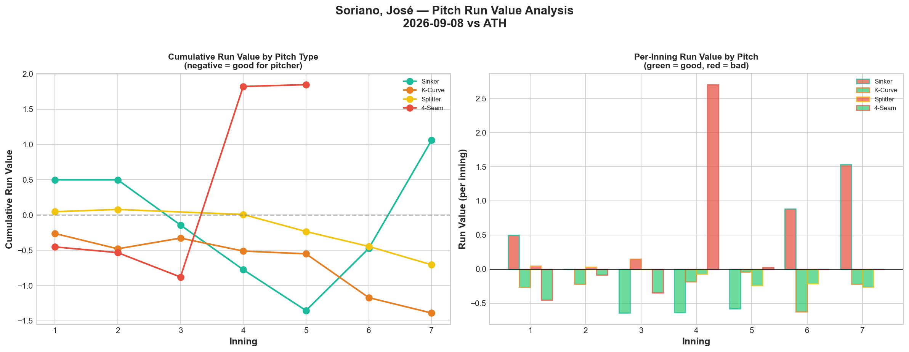
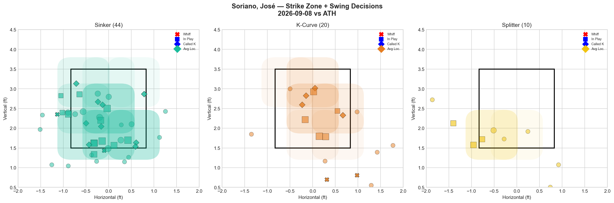
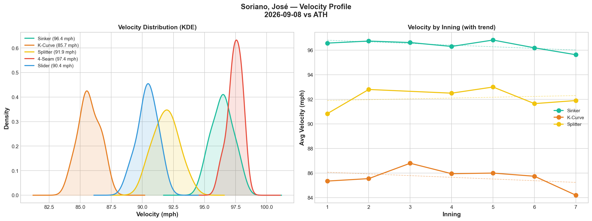
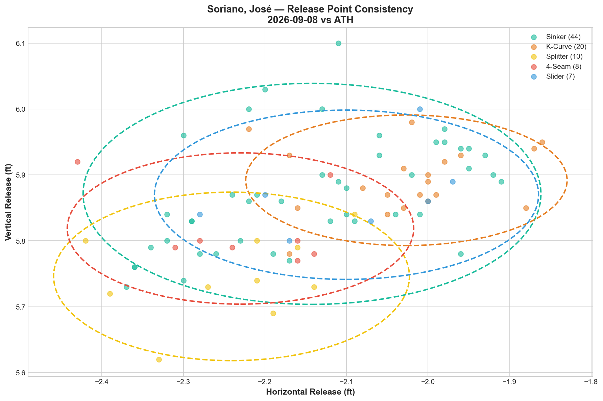
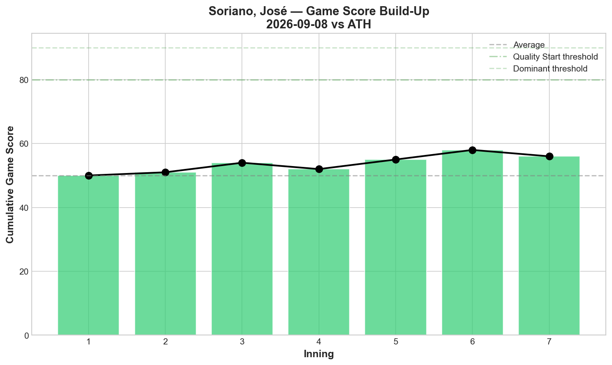
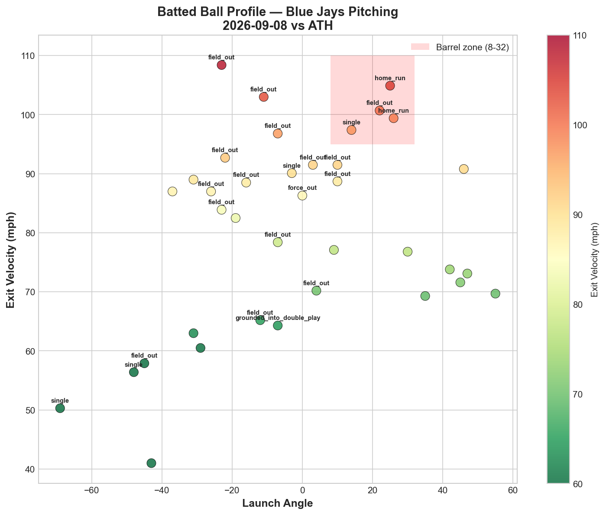
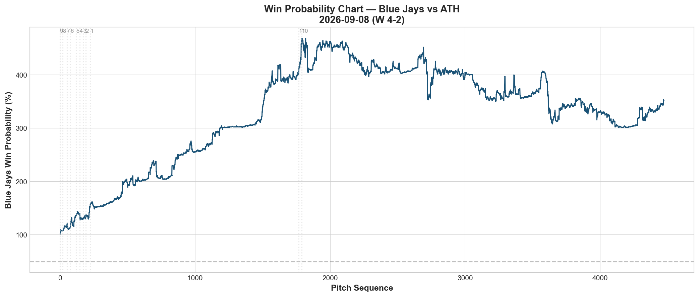
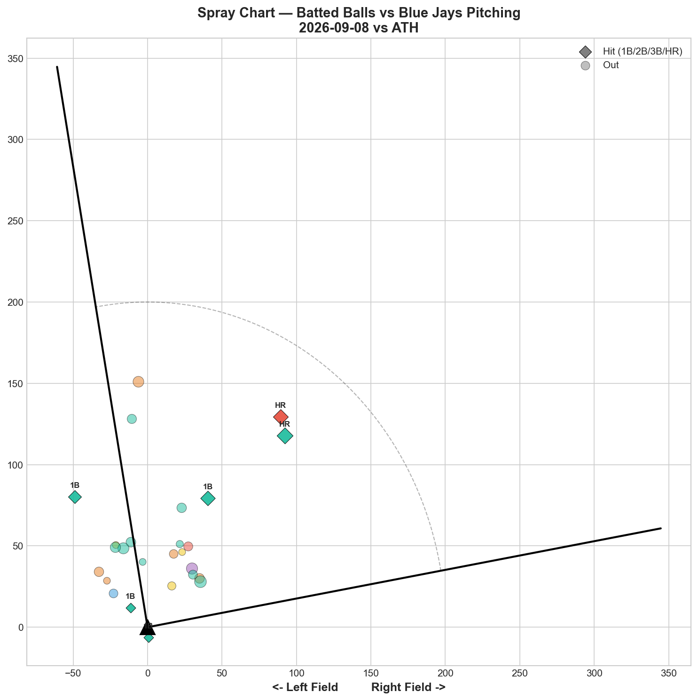

# 🏟️ Blue Jays Game Report v2.1
## 2026-09-08 | TOR @ ATH | W 4-2

---

## 📋 Game Overview

| | |
|---|---|
| **Date** | 2026-09-08 |
| **Matchup** | Toronto Blue Jays @ Athletics |
| **Result** | **W 4-2 (11 innings)** |
| **Starter** | José Soriano (89 pitches) |
| **Spotlight Pitcher** | José Soriano |
| **Season Record** | **72W-72L — back to .500** |

---

## 🔥 Key Storylines

### 1. Back to .500 — Third Time This Season the Jays Have Reached the Line

**72-72.** After dipping below .500 on 9/7, the Jays return to exactly break-even via an 11-inning grind. This marks the third time the team has reached .500 in September alone (9/5 crossed above, 9/6 back to even, 9/7 below, 9/8 back to even) — a tight oscillation that continues the season's defining theme.

### 2. K-Curve Was Elite, Sinker and 4-Seam Both Leaked Heavily Despite Heavy Sinker Usage

Soriano's K-Curve posted **-1.389 RV (25% whiff, Grade B)** — clearly his best pitch. But the **sinker (49.4% usage, his primary pitch) posted +1.059 RV**, and the **4-seam leaked +1.848 RV in just 8 pitches (+0.231 per pitch)** — the worst per-pitch total on his arsenal tonight. This continues a recurring pattern across Soriano's recent starts: the K-Curve carries the outing while the fastball-family pitches struggle.

### 3. Zero Swinging Strikes vs LHH in 48 Pitches

A striking platoon split tonight: **0.0% whiff/pitch against left-handed hitters** across 48 pitches, compared to 9.8% against RHH. Combined with the "Contact Manager" role classification (9.1% overall whiff), tonight was defined by soft/weak contact management rather than swing-and-miss — yet it still produced 6 hits and 2 home runs personally allowed.

---

## 🔍 Spotlight Pitcher — José Soriano

### Pitch Arsenal Performance (89 pitches)

| Pitch | # | Usage | Velo | Whiff% | CSW% | Chase% | Grade |
|-------|---|-------|------|--------|------|--------|-------|
| Sinker | 44 | 49.4% | 96.4 | 8.3% | 25.0% | 42.1% | 🔴 D |
| K-Curve | 20 | 22.5% | 85.7 | 25.0% | 30.0% | 30.0% | 🟢 B |
| Splitter | 10 | 11.2% | 91.9 | 0.0% | 0.0% | 33.3% | 🔴 D |
| 4-Seam | 8 | 9.0% | 97.4 | 0.0% | 37.5% | 0.0% | 🔴 D |
| Slider | 7 | 7.9% | 90.4 | 0.0% | 0.0% | 0.0% | 🔴 D |

**Role Assessment: CONTACT MANAGER** — only 9.1% overall whiff rate, his lowest classification tracked this season. Four of five pitch types graded D, with the K-Curve as the lone standout.

### The Fastball-Family Struggle Continues

| Pitch | Usage | Whiff% | RV | Per-Pitch RV |
|-------|-------|--------|-----|----------------|
| Sinker | 49.4% | 8.3% | +1.059 | +0.0241 |
| 4-Seam | 9.0% | 0.0% | +1.848 | **+0.2310** |
| **Combined FF-family** | **58.4%** | — | **+2.907** | — |

Nearly 60% of Soriano's pitches tonight came from his fastball family (sinker + 4-seam), and both leaked significant value. This mirrors his 9/3 and 8/23 starts, where the same pattern emerged — heavy sinker reliance with the pitch failing to convert, while the K-Curve (and occasionally the splitter) carried the actual run-prevention.

### Soriano's Recent K-Curve Consistency

| Start | K-Curve Whiff% | K-Curve RV | Grade |
|-------|-----------------|-------------|-------|
| 8/23 vs NYY | 16.7% | -0.902 | C |
| 8/29 vs SEA | 44.4% | -0.464 | A |
| 9/3 vs CLE | 37.5% | -0.232 | A |
| **9/8 vs ATH** | **25.0%** | **-1.389** | **B** |

Tonight's -1.389 RV is his best K-Curve total run-value performance across these four comparison starts, even though the whiff rate (25%) was middling relative to his other outings — another instance where whiff rate and run value don't move in lockstep.

### Pitch Movement (inches)

| Pitch | H-Break | V-Break | Count |
|-------|---------|---------|-------|
| Sinker (SI) | -15.1 | 5.6 | 44 |
| K-Curve (KC) | 12.1 | -7.2 | 20 |
| Splitter (FS) | -12.1 | 0.2 | 10 |
| 4-Seam (FF) | -9.1 | 12.9 | 8 |
| Slider (SL) | 1.4 | 3.1 | 7 |

### Pitch Tunneling Analysis

| Pair | Release Sim | Plate Sep | Tunnel | Velo Gap |
|------|-------------|-----------|--------|----------|
| **Sinker/Slider** | **0.5in** | **16.7in** | **🟢 32.8** | **6.0mph** |
| Sinker/K-Curve | 1.4in | 30.1in | 🟢 21.3 | 10.7mph |
| K-Curve/Slider | 0.9in | 14.9in | 🟢 16.2 | 4.7mph |
| Splitter/4-Seam | 0.9in | 13.1in | 🟢 14.8 | 5.5mph |

Best tunnel: Sinker/Slider (32.8) — his tightest release pairing tonight, though the slider itself graded D by whiff.

### Pitch Run Value by Type

| Pitch | Total RV | Per Pitch | Pitches | Assessment |
|-------|----------|-----------|---------|------------|
| K-Curve | **-1.389** | **-0.0694** | 20 | ✅ Best pitch |
| Splitter | -0.705 | -0.0705 | 10 | ✅ Effective, zero whiff |
| Slider | -0.007 | -0.0010 | 7 | 🟡 Essentially neutral |
| Sinker | +1.059 | +0.0241 | 44 | 🔴 Leaked at high volume |
| 4-Seam | +1.848 | +0.2310 | 8 | 🔴 Worst per-pitch |

**Net: +0.806 RV.** A modestly negative overall outing masked by the win — the K-Curve and splitter did the real work while the fastball-family pitches gave value back.

### Pitch Selection by Count

| Situation | Primary | Secondary | Notes |
|-----------|---------|-----------|-------|
| First Pitch (0-0) | **Sinker 70.4%** | K-Curve 14.8% | Heavy sinker-first approach |
| Ahead | K-Curve 31.0% | Sinker/Splitter 20.7% each | More balanced when ahead |
| Behind | **Sinker 64.7%** | K-Curve 23.5% | Sinker-heavy when behind |
| Even | Sinker 50.0% | K-Curve 21.4% | Sinker-dominant neutral |
| Full Count (3-2) | FF/SI 50% each | — | Small sample |

**Strikeout Pitches (3 K's):** 4-Seam 2, K-Curve 1.

### vs LHB/RHB Split

| Stand | Pitches | Avg Velo | Swinging Strikes | Whiff/Pitch |
|-------|---------|----------|------------------|-------------|
| L | 48 | 93.5 | 0 | **0.0%** |
| R | 41 | 92.7 | 4 | 9.8% |

Zero swinging strikes against left-handed hitters across nearly half his total pitches — a significant platoon weakness tonight.

### Top Opposing Batters

| Batter | Pitches | Hits | K | BB | Avg EV |
|--------|---------|------|---|-----|--------|
| Lawrence Butler | 14 | 0 | 1 | 0 | 75.5 |
| Alika Williams | 14 | 0 | 0 | 0 | 80.8 |
| Jeff McNeil | 11 | 1 | 0 | 0 | 87.4 |
| Zack Gelof | 10 | 0 | 1 | 1 | 85.3 |
| Henry Bolt | 10 | 2 | 1 | 0 | 64.6 |

Bolt's 2 hits led the Athletics' order against him; the rest of the top hitters were held to modest exit velocities overall.

### Velocity Profile

- **Sinker:** 96.6 → 95.6 mph (-0.9)
- **K-Curve:** 85.4 → 84.2 mph (-1.1)
- **Splitter:** 90.8 → 91.9 mph (+1.1)

Modest declines across the two fastball-family/breaking pitches, with the splitter actually gaining velocity late — no major fatigue signal at 89 pitches.

### Game Score / Batted Ball

**Game Score: 54 (AVERAGE).** 3K, 6H, 2HR, 1BB on 89 pitches.

| Metric | Value |
|--------|-------|
| Total BIP | 37 |
| Avg Exit Velo | 80.5 mph |
| Avg Launch Angle | -2.3° |
| Hard Hit (95+ mph) | 7/37 (19%) |

A notably negative average launch angle (-2.3°) suggests heavy ground-ball contact tonight — consistent with the "Contact Manager" classification and the sinker's dominant usage, even though the sinker itself posted a positive RV.

---

## 📊 Bullpen Detailed Analysis

| Pitcher | Pitches | Line | Key Pitch | Notes |
|---------|---------|------|-----------|-------|
| **Spencer Miles** | 22 | 3K / 0BB / 0H / 0HR | **CU 33.3% (A) + FF 50% whiff (A)** | Dominant, clean relief effort |

### Bullpen Notes

- With Soriano covering 89 pitches, only Miles was needed in relief — a testament to Soriano's pitch efficiency despite the mixed underlying run-value profile.
- **Miles' curveball and fastball both graded A** (33.3% and 50% whiff respectively), delivering 3K in a clean, 0-hit, 22-pitch appearance that helped extend the game into the 11th inning where the Jays ultimately prevailed.

---

## 📈 Win Probability Analysis

### Key WPA Moments

| Inning | Event | Impact |
|--------|-------|--------|
| 5 | Kremer — home_run | 📉 Athletics scored |
| 6 | Anderson — home_run | 📉 Athletics extended |
| 9 | Webb — home_run | 📈 Jays answered |
| 9 | Morillo — home_run | 📈 Jays continued rally |
| 10 | Cruz — single | 📉 Athletics threatened |
| 11 | Gose — triple | 📉 Late Athletics push before Jays closed it out |

A dramatic back-and-forth extending into the 11th inning, with home runs from both sides before Toronto secured the win.

---

## 📊 Spray Chart & Batted Ball Summary

| Metric | Value |
|--------|-------|
| Total batted balls tracked | 26 |
| Hits | 6 (23%) |
| Pull | 3 (12%) |
| Center | 22 (85%) |
| Oppo | 1 (4%) |

---

## 🎯 Analytical Takeaways

1. **The K-Curve Remains Soriano's Only Consistently Positive Pitch** — -1.389 RV tonight, his best total run-value performance from the pitch across four recent comparison starts. This continues an unmistakable pattern: when Soriano's K-Curve is working, it's the pitch keeping his outings afloat.

2. **The Sinker/4-Seam Combination Is a Recurring Liability** — Nearly 60% of his pitches came from the fastball family, and both leaked significant value (+2.907 combined RV). Given how consistently this pattern has appeared across his recent starts, the coaching staff may want to examine whether reduced sinker usage in favor of more K-Curve/splitter mix could improve his run prevention.

3. **Zero Whiffs vs LHH Signals a Platoon Vulnerability** — Worth monitoring whether opposing teams increasingly stack left-handed lineups against Soriano given this data point.

4. **72-72 — Third Time at .500 This Month Alone** — The Jays' September has been defined by rapid oscillation around the break-even line (above on 9/5, even on 9/6, below on 9/7, even again tonight), extending the season-long theme in its most compressed form yet.

5. **Game Classification: Efficient Contact-Manager Win** — Soriano's 89-pitch outing (his most efficient recent start by pitch count) reflects genuine contact management even with a positive overall RV — the "Contact Manager" role assessment fits a night defined by grounders and soft contact rather than swing-and-miss dominance, and the bullpen (Miles) and offense combined to convert it into an extra-innings win.

---

*Report generated from Statcast data via pybaseball. All pitch metrics sourced from Baseball Savant.*
