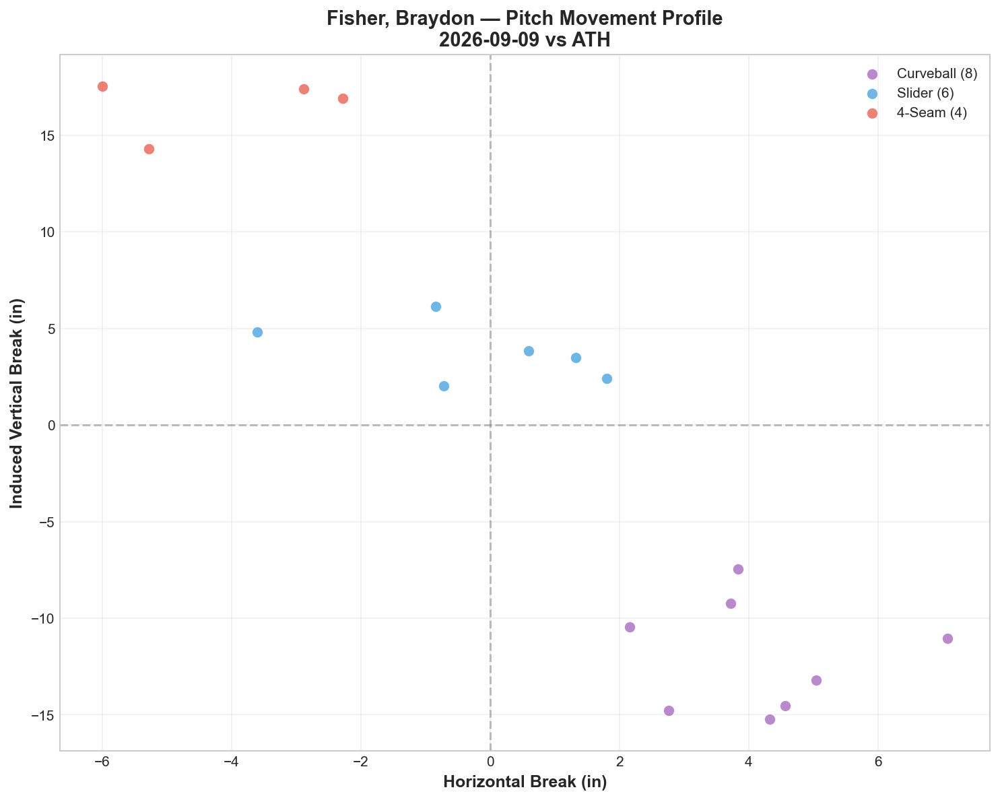
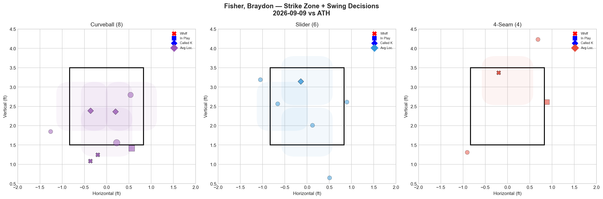
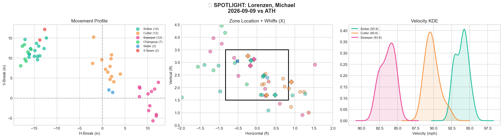
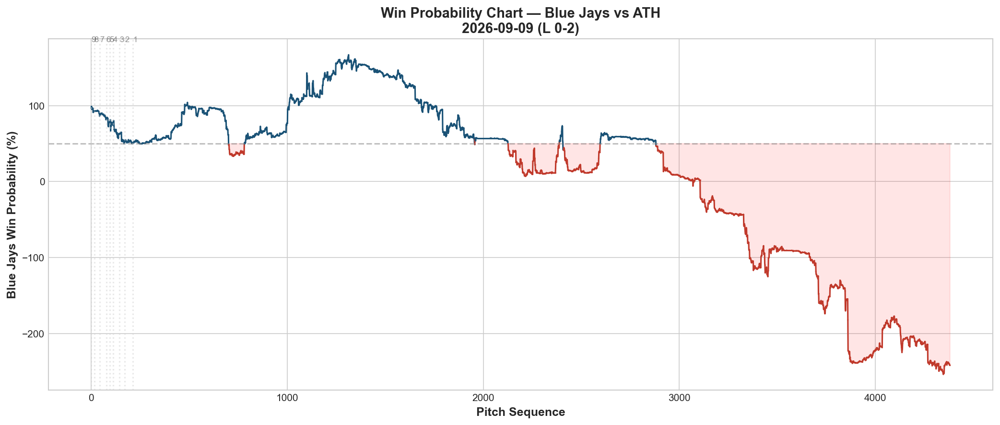
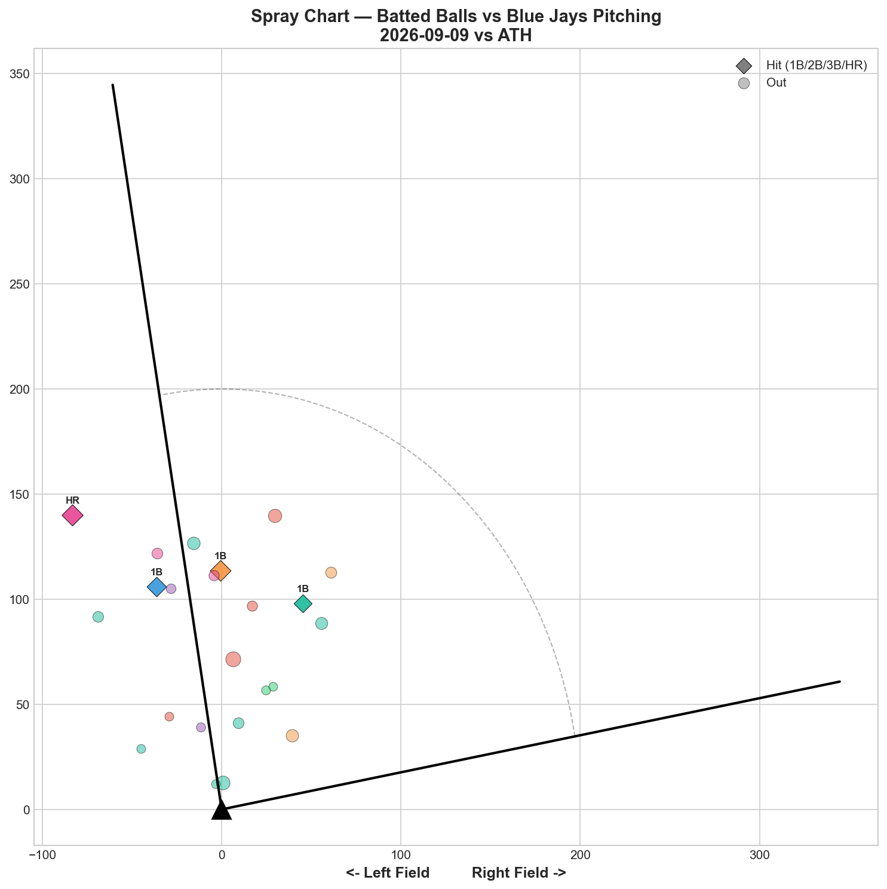

# 🏟️ Blue Jays Game Report v2.1
## 2026-09-09 | TOR @ ATH | L 0-2

---

## 📋 Game Overview

| | |
|---|---|
| **Date** | 2026-09-09 |
| **Matchup** | Toronto Blue Jays @ Athletics |
| **Result** | **L 0-2** |
| **Opener** | Braydon Fisher (18 pitches) |
| **Bulk** | Michael Lorenzen (49 pitches) |
| **Spotlight Pitcher** | Michael Lorenzen |
| **Season Record** | 72W-73L |

---

## 🔥 Key Storylines

### 1. Back Below .500 — Fifth September Line-Crossing

**72-73.** After bouncing to exactly .500 on 9/8, the Jays fall back below the line in a shutout loss. This is now the fifth time in five games (9/5 through 9/9) the team's position relative to .500 has flipped — the most compressed oscillation stretch of the entire tracked season.

### 2. Lorenzen's Bulk Outing — 5.0% Whiff, Contact-Manager Profile, But Costly Damage

In the spotlight tonight, Lorenzen threw 49 pitches across six pitch types, with **five of six grading D** and an overall whiff rate of just 5.0% — his lowest tracked whiff performance yet. Only the slider (50% whiff, 2 pitches) offered any swing-and-miss. He allowed 4H and a home run, with the "Contact Manager" classification undercut tonight by the fact that the contact allowed included real damage rather than purely weak outs.

### 3. Fisher's Curveball Shines in a Brief Opener Stint

Fisher's curveball posted **-0.585 RV (40% whiff)** across just 8 pitches — his most effective pitch of the night, with a strong Curveball/Slider tunnel score (22.4). The 4-seam was also modestly effective (-0.248 RV), while the slider was the lone leak (+0.054, still nearly neutral). A brief but efficient opener stint overall.

---

## ⚾ Opener Pitch Arsenal Analysis — Braydon Fisher

### Pitch Arsenal Performance (18 pitches)

| Pitch | # | Usage | Velo | Whiff% | CSW% | Chase% | Grade |
|-------|---|-------|------|--------|------|--------|-------|
| Curveball | 8 | 44.4% | 81.6 | **40.0%** | 50.0% | 75.0% | 🟢 A |
| Slider | 6 | 33.3% | 87.2 | 0.0% | 16.7% | 33.3% | 🔴 D |
| 4-Seam | 4 | 22.2% | 94.5 | **50.0%** | 25.0% | 33.3% | 🟢 A |

Two A-grade pitches (Curveball, 4-Seam) in a small but efficient 18-pitch sample. Notably, the curveball's 75.0% chase rate suggests hitters were frequently fooled entirely out of the zone.

### Pitch Tunneling Analysis

| Pair | Release Sim | Plate Sep | Tunnel | Velo Gap |
|------|-------------|-----------|--------|----------|
| **Curveball/Slider** | **0.7in** | **16.4in** | **🟢 22.4** | **5.6mph** |
| Curveball/4-Seam | 2.8in | 29.7in | 🟢 10.8 | 12.9mph |
| Slider/4-Seam | 3.2in | 13.3in | 🟢 4.2 | 7.3mph |

### Pitch Run Value by Type

| Pitch | Total RV | Per Pitch | Pitches | Assessment |
|-------|----------|-----------|---------|------------|
| Curveball | **-0.585** | **-0.0731** | 8 | ✅ Best pitch |
| 4-Seam | -0.248 | -0.0620 | 4 | ✅ Effective |
| Slider | +0.054 | +0.0090 | 6 | 🟡 Nearly neutral |

**Net: -0.779 RV.** A clean, efficient opener stint before handing off to Lorenzen.

### vs LHB/RHB Split

| Stand | Pitches | Avg Velo | Swinging Strikes | Whiff/Pitch |
|-------|---------|----------|------------------|-------------|
| L | 9 | 86.4 | 0 | 0.0% |
| R | 9 | 86.2 | 3 | **33.3%** |

A dramatic platoon split in a small sample — all the whiff production tonight came against right-handed hitters.

**Strikeout Pitches (1 K):** Curveball.

---

## 🔍 Spotlight Pitcher — Michael Lorenzen (Bulk Role)

| | |
|---|---|
| **Role** | Bulk (entered after Fisher) |
| **Pitch Count** | 49 |
| **Line** | 2K / 1BB / 4H / 1HR |
| **Overall Whiff%** | **5.0%** |
| **Role Assessment** | CONTACT MANAGER |

### Pitch Arsenal

| Pitch | # | Usage | Velo | Whiff% | CSW% | Grade |
|-------|---|-------|------|--------|------|-------|
| Sinker | 14 | 28.6% | 93.9 | 0.0% | 21.4% | 🔴 D |
| Cutter | 12 | 24.5% | 89.8 | 0.0% | 25.0% | 🔴 D |
| Sweeper | 12 | 24.5% | 83.6 | 0.0% | 16.7% | 🔴 D |
| Changeup | 7 | 14.3% | 84.8 | 0.0% | 0.0% | 🔴 D |
| Slider | 2 | 4.1% | 87.9 | **50.0%** | 50.0% | 🟢 A |
| 4-Seam | 2 | 4.1% | 93.8 | 0.0% | 0.0% | 🔴 D |

### Assessment — A Career-Low Whiff Performance

Five of Lorenzen's six pitch types generated **zero swinging strikes** across 47 combined pitches — only the 2-pitch slider sample offered any swing-and-miss. This is his lowest overall whiff rate (5.0%) tracked since debuting on 8/27, well below his prior outings:

| Appearance | Pitches | Overall Whiff% | Best Pitch |
|------------|---------|-----------------|------------|
| 8/27 (debut) | 42 | — | Changeup (B) |
| 9/1 | 20 | — | All D-grade |
| **9/9** | **49** | **5.0%** | **Slider (A, 2 pitches)** |

Across three tracked appearances, Lorenzen has yet to post a genuinely dominant swing-and-miss outing — his profile continues to lean toward contact management, though tonight's specific contact (4H, 1HR) produced real damage rather than the soft outs the role classification implies.

### Pitch Run Value Context

While full per-pitch RV wasn't broken out individually in tonight's data for Lorenzen, the aggregate line (2K, 1BB, 4H, 1HR across 49 pitches) reflects a below-average bulk outing — five pitch types graded D, with only the small-sample slider offering encouragement.

---

## 📊 Bullpen Detailed Analysis

| Pitcher | Pitches | Line | Key Pitch | Notes |
|---------|---------|------|-----------|-------|
| **Louis Varland** | 18 | 2K / 0BB / 0H / 0HR | **FF 33.3% (A) + KC 50% (A)** | Two A-grade pitches, clean |
| **Tyler Rogers** | 20 | 0K / 1BB / 0H / 0HR | All D-grade | Standard sinker-heavy outing |
| **Joe Mantiply** | 8 | 0K / 0BB / 0H / 0HR | CH 100% whiff 🟢A | Small sample, clean |
| **Paul Sewald** | 6 | 0K / 0BB / 0H / 0HR | ST 33.3% whiff 🟢A | Brief, effective |

### Bullpen Notes

- **Varland's** fastball hit 99.1 mph with 33.3% whiff (A), paired with the K-Curve at 50% whiff (A) — his second straight outing featuring two A-grade pitches.
- **Mantiply's** changeup at 100% whiff (2 pitches, small sample) continues a modest positive trend since his 9/1 debut.
- Despite four relievers combining for 0 earned runs across 52 pitches, the damage was already done by Lorenzen's bulk stint, and the offense couldn't generate any runs to work with.

---

## 📈 Win Probability Analysis

### Key WPA Moments

| Inning | Event | Impact |
|--------|-------|--------|
| 3 | Tidwell — home_run | 📉 Athletics scored |
| 3 | Bennett — home_run | 📈 (Jays response, still trailing) |
| 5 | Soroka — home_run | 📉 Athletics extended |
| 8 | Soriano — double | 📉 Athletics threatened |
| 8 | Soriano — double | 📉 Athletics continued |
| 8 | Weaver — double_play | 📈 Jays limited final damage |

A shutout loss where the Athletics' third-inning damage proved decisive, with the Jays' offense unable to answer at any point.

---

## 📊 Spray Chart & Batted Ball Summary

| Metric | Value |
|--------|-------|
| Total batted balls tracked | 23 |
| Hits | 4 (17%) |
| Pull | 3 (13%) |
| Center | 17 (74%) |
| Oppo | 3 (13%) |

---

## 🎯 Analytical Takeaways

1. **Lorenzen's 5.0% Whiff Rate Is His Lowest Tracked Performance** — Five of six pitch types produced zero swinging strikes. Across three appearances since his 8/27 debut, he has yet to show a consistently dominant swing-and-miss weapon, reinforcing his likely long-term role as a contact-oriented bulk arm rather than a strikeout-heavy option.

2. **Fisher's Curveball Continues to Be a Reliable Opener Weapon** — -0.585 RV, 40% whiff, 75% chase rate tonight. Combined with the 4-seam's effectiveness, his brief opener stints continue producing clean, efficient results.

3. **A Dramatic Platoon Split for Fisher** — 33.3% whiff vs RHH, 0.0% vs LHH in a small sample. Worth tracking whether this becomes a repeatable signature as more data accumulates.

4. **72-73 — Fifth .500-Line Crossing in Five Games** — The most compressed stretch of oscillation around the break-even mark all season (above on 9/5, even 9/6, below 9/7, even 9/8, below again tonight).

5. **Game Classification: Bulk Outing Damage, Offense Shutout** — With Fisher's opener stint clean and the late bullpen (Varland, Mantiply, Sewald) also clean, the loss traces primarily to Lorenzen's bulk-inning damage (4H, 1HR) combined with a Jays offense that was shut out entirely.

---

*Report generated from Statcast data via pybaseball. All pitch metrics sourced from Baseball Savant.*
