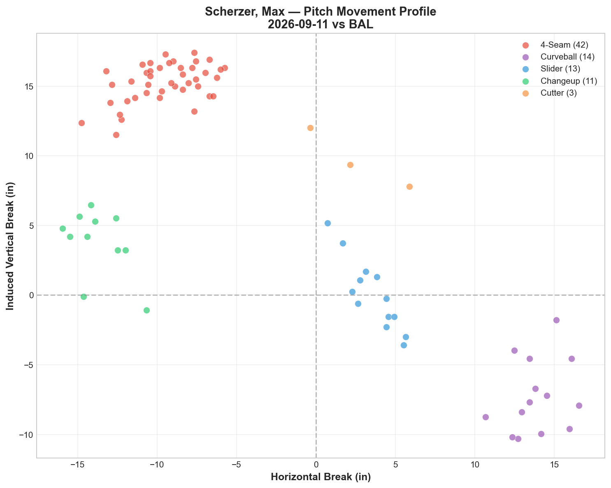
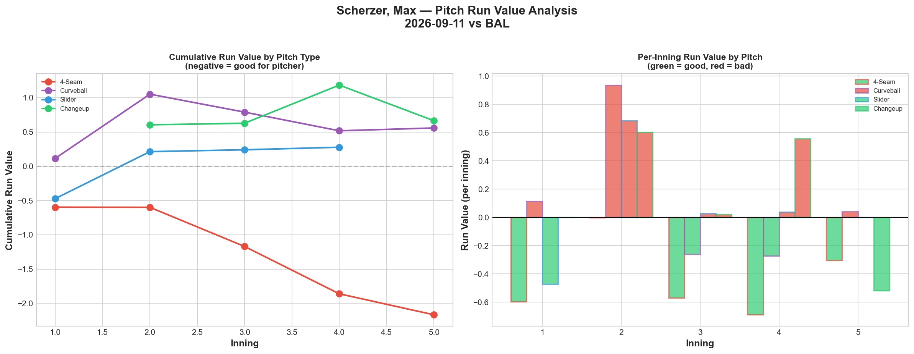
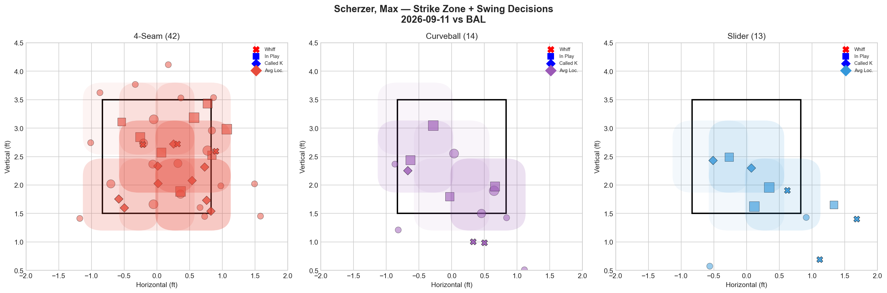
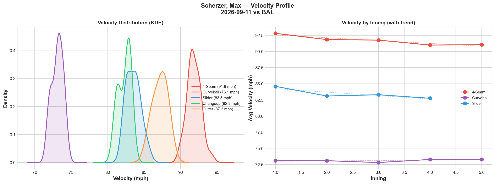
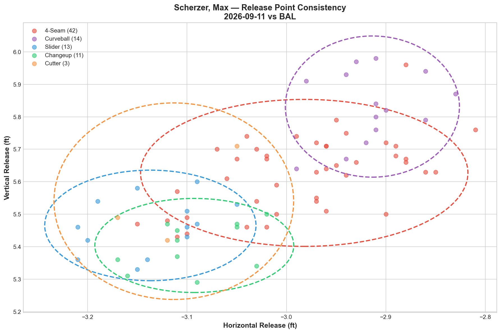
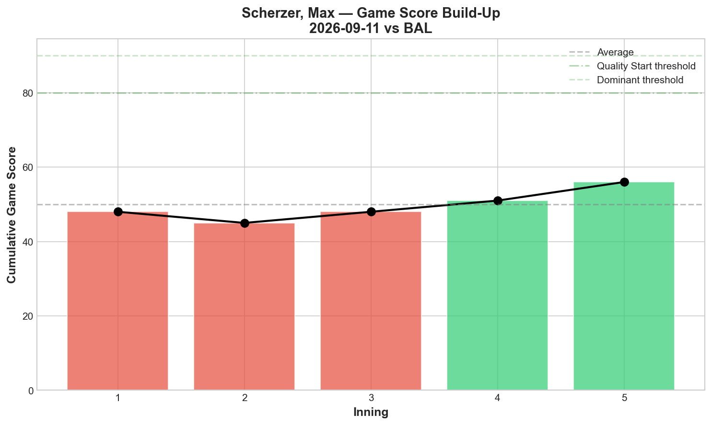
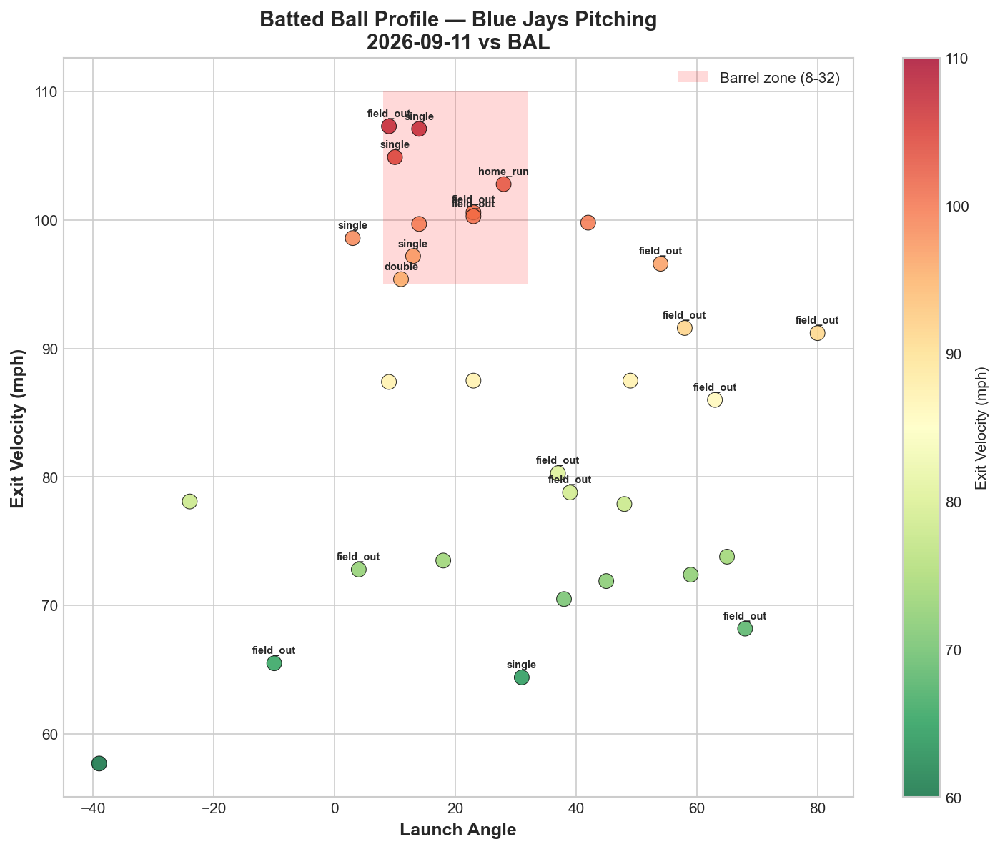
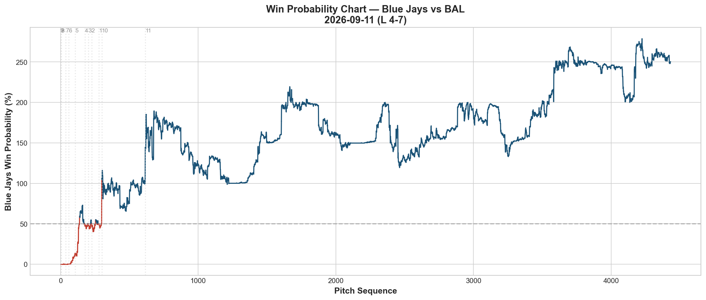
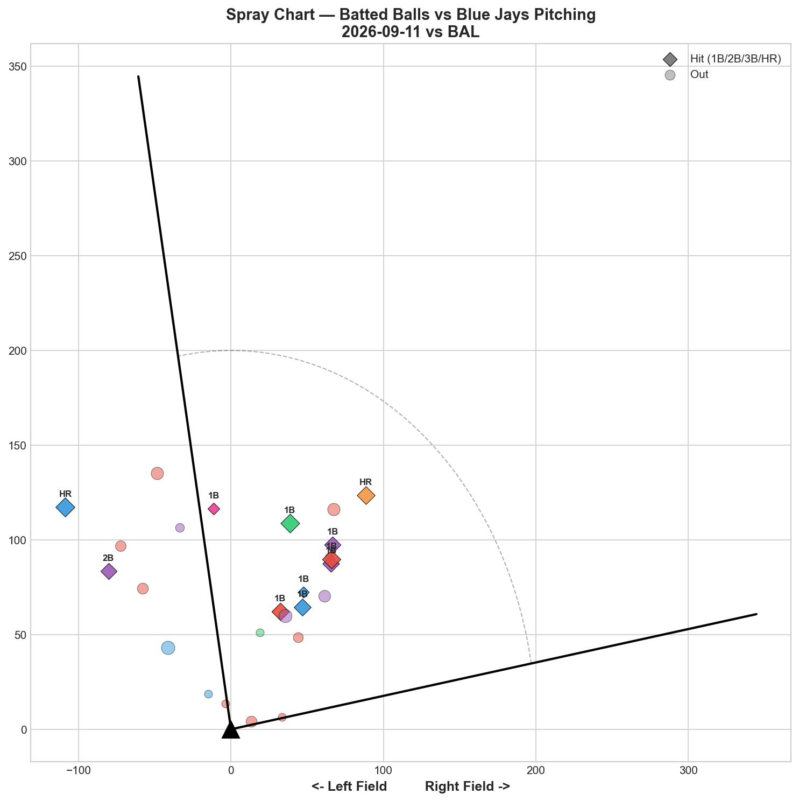

# 🏟️ Blue Jays Game Report v2.1
## 2026-09-11 | TOR vs BAL | L 4-7

---

## 📋 Game Overview

| | |
|---|---|
| **Date** | 2026-09-11 |
| **Matchup** | Baltimore Orioles @ Toronto Blue Jays |
| **Result** | **L 4-7 (11 innings)** |
| **Starter** | Max Scherzer (83 pitches) |
| **Spotlight Pitcher** | None |
| **Season Record** | 72W-74L |

---

## 🔥 Key Storylines

### 1. Fastball Elite Again, Everything Else Leaks — The Clearest Reversal of His Aging-Arm Pattern

Scherzer's fastball posted **-2.166 RV (-0.0516 per pitch)** — his best pitch by a wide margin — while all four secondary pitches (Curveball, Slider, Changeup, Cutter) posted positive run value. This is a striking departure from his typical season-long profile, where the fastball usually leaks and the breaking/off-speed pitches carry the outing. Combined with his 8/30 masterpiece (all five pitches negative) and 9/5 mixed result, Scherzer's pitch-level performance continues to show real start-to-start volatility rather than a fixed pattern.

### 2. Cutter's Tiny Sample Produced the Worst Per-Pitch Total of the Season

Just 3 cutters thrown, **+1.236 total RV (+0.412 per pitch)** — the highest per-pitch damage tracked from any pitch, any pitcher, this season. With such a small sample size, this is likely noise rather than signal, but it's a notable outlier worth flagging.

### 3. 38% Hard-Hit Rate Despite the Strong Fastball — An 11-Inning Slugfest

Baltimore made consistent hard contact (12 of 32 batted balls at 95+ mph, 85.9 mph average EV) even as Scherzer's individual fastball performance graded well. The bullpen (Little, Sewald, Fisher, Tiedemann) largely pitched well individually, but the game stretched to 11 innings before Baltimore pulled away late.

---

## ⚾ Starter Pitch Arsenal Analysis — Max Scherzer

### Pitch Arsenal Performance (83 pitches)

| Pitch | # | Usage | Velo | Whiff% | CSW% | Chase% | Grade |
|-------|---|-------|------|--------|------|--------|-------|
| 4-Seam | 42 | 50.6% | 91.9 | 14.3% | 28.6% | 31.2% | 🟡 C |
| Curveball | 14 | 16.9% | 73.1 | 22.2% | 21.4% | 33.3% | 🟢 B |
| Slider | 13 | 15.7% | 83.5 | 37.5% | 38.5% | 57.1% | 🟢 A |
| Changeup | 11 | 13.3% | 82.3 | 33.3% | 27.3% | 14.3% | 🟢 A |
| Cutter | 3 | 3.6% | 87.2 | 0.0% | 0.0% | 0.0% | 🔴 D |

Four of five pitch types graded A or B by whiff rate, yet only the fastball (Grade C by whiff) actually prevented runs — another instance of the whiff/RV disconnect that has appeared across nearly every Blue Jays starter this season.

### Scherzer's Season-Long Pitch-Level Volatility

| Start | Best Pitch (RV) | Worst Pitch (RV) | Overall Pattern |
|-------|-------------------|---------------------|-------------------|
| 8/25 vs KC | Curveball -0.531 | Changeup +0.207 | Typical: breaking > fastball |
| 8/30 vs SEA | ALL 5 negative | — | Season-best: everything works |
| 9/5 vs KC | Curveball -1.559 | Changeup +1.314 | Typical: breaking > fastball |
| **9/11 vs BAL** | **4-Seam -2.166** | **Cutter +1.236** | **Reversed: fastball > breaking** |

Tonight represents the clearest reversal of his typical split yet — the pitch family that usually struggles (fastball) was his best weapon, while the pitches that usually carry him (curveball, slider, changeup) all leaked value simultaneously.

### Pitch Movement (inches)

| Pitch | H-Break | V-Break | Count |
|-------|---------|---------|-------|
| 4-Seam (FF) | -9.5 | 15.3 | 42 |
| Curveball (CU) | 13.9 | -7.3 | 14 |
| Slider (SL) | 3.6 | 0.0 | 13 |
| Changeup (CH) | -13.7 | 3.8 | 11 |
| Cutter (FC) | 2.6 | 9.7 | 3 |

### Pitch Tunneling Analysis

| Pair | Release Sim | Plate Sep | Tunnel | Velo Gap |
|------|-------------|-----------|--------|----------|
| **Slider/Changeup** | **0.9in** | **17.7in** | **🟢 19.5** | **1.2mph** |
| 4-Seam/Curveball | 2.6in | 32.5in | 🟢 12.6 | 18.7mph |
| Changeup/Cutter | 1.7in | 17.4in | 🟢 10.5 | 4.9mph |
| Slider/Cutter | 0.9in | 9.7in | 🟢 10.4 | 3.7mph |

Best tunnel: Slider/Changeup (19.5) — both pitches individually leaked value tonight despite the reasonable tunnel score, another case of deception not guaranteeing conversion.

### Pitch Run Value by Type

| Pitch | Total RV | Per Pitch | Pitches | Assessment |
|-------|----------|-----------|---------|------------|
| 4-Seam | **-2.166** | **-0.0516** | 42 | ✅ Clear best pitch |
| Curveball | +0.558 | +0.0399 | 14 | 🔴 Leaked |
| Slider | +0.277 | +0.0213 | 13 | 🔴 Leaked |
| Changeup | +0.664 | +0.0604 | 11 | 🔴 Leaked |
| Cutter | +1.236 | +0.4120 | 3 | 🔴 Worst per-pitch (tiny sample) |

**Net: +0.569 RV.** Despite the fastball's strong individual showing, the aggregate total ended up slightly positive (unfavorable) due to the secondary pitches' struggles.

### Pitch Selection by Count

| Situation | Primary | Secondary | Notes |
|-----------|---------|-----------|-------|
| First Pitch (0-0) | **4-Seam 65.2%** | Curveball/Slider 13.0% each | Heavy fastball-first |
| Ahead | 4-Seam 38.7% | Slider 25.8% | Fastball-led |
| Behind | **4-Seam 64.3%** | Changeup/Cutter 14.3% each | Fastball-heavy when behind |
| Even | 4-Seam 40.0% | Changeup 30.0% | Balanced |
| Full Count (3-2) | 4-Seam 40.0% | CH/CU/SL 20% each | Diverse |

**Strikeout Pitches (3 K's):** Changeup 1, Curveball 1, 4-Seam 1 — balanced across three pitch types.

### vs LHB/RHB Split

| Stand | Pitches | Avg Velo | Swinging Strikes | Whiff/Pitch |
|-------|---------|----------|------------------|-------------|
| L | 52 | 85.3 | 3 | 5.8% |
| R | 31 | 87.0 | 6 | 19.4% |

More than triple the whiff rate against right-handed hitters tonight.

### Top Opposing Batters

| Batter | Pitches | Hits | K | BB | Avg EV |
|--------|---------|------|---|-----|--------|
| Pete Alonso | 18 | 0 | 0 | 0 | 80.0 |
| Gunnar Henderson | 14 | 1 | 1 | 0 | 91.2 |
| Colton Cowser | 10 | 1 | 0 | 1 | 85.5 |
| Dylan Beavers | 10 | 2 | 0 | 0 | 86.4 |
| Jackson Holliday | 10 | 0 | 0 | 0 | 77.1 |

Alonso and Holliday were both held hitless, though the Orioles' order overall made consistent, moderate-to-hard contact.

### Velocity Profile

- **4-Seam:** 92.8 → 91.0 mph (-1.8)
- **Curveball:** 73.1 → 73.3 mph (+0.2)
- **Slider:** 84.6 → 82.8 mph (-1.8)

Both fastball and slider faded 1.8 mph across 83 pitches — a moderate but not alarming decline for a start of this length.

### Game Score / Batted Ball

**Game Score: 52 (AVERAGE).** 3K, 1H, 0HR, 1BB on 83 pitches — a personal quality line despite the eventual loss.

| Metric | Value |
|--------|-------|
| Total BIP | 32 |
| Avg Exit Velo | 85.9 mph |
| Avg Launch Angle | 28.3° |
| Hard Hit (95+ mph) | **12/32 (38%)** |

A 38% hard-hit rate is elevated — notably, this occurred on a night where the fastball graded well by RV, suggesting the hard contact was more concentrated on the leaking secondary pitches.

---

## 📊 Bullpen Detailed Analysis

| Pitcher | Pitches | Line | Key Pitch | Notes |
|---------|---------|------|-----------|-------|
| **Brendon Little** | 14 | 3K / 0BB / 0H / 0HR | **K-Curve 75% (A) + SL 100% (A)** | Dominant, clean outing |
| **Paul Sewald** | 14 | 1K / 0BB / 1H / 0HR | Sweeper 66.7% whiff 🟢A | Strong complement |
| **Braydon Fisher** | 24 | 2K / 0BB / 2H / 1HR | CU 33.3% (A) + SL 66.7% (A) | Two A-grades, but gave up HR |
| **Ricky Tiedemann** | 25 | 3K / 1BB / 1H / 0HR | **FF 25% (B) + ST 50% (A) + CH 50% (A)** | Three graded pitches |

### Bullpen Notes

- **Little's 14-pitch outing was flawless** — K-Curve at 75% whiff and slider at 100% whiff (both A-grade), 3K, 0H. His strongest individual showing this stretch.
- **Tiedemann continued his positive recent trend**, with three different pitch types grading B or better across 25 pitches.
- **Fisher's** curveball and slider both graded A, but the home run allowed proved costly in the extra-innings loss.
- Despite four relievers combining for largely strong peripheral numbers, Baltimore's 11th-inning damage (Raley double, Roycroft single) sealed the defeat.

---

## 📈 Win Probability Analysis

### Key WPA Moments

| Inning | Event | Impact |
|--------|-------|--------|
| 2 | Sale — double | 📉 Orioles threatened |
| 7 | Minter — home_run | 📉 Orioles scored |
| 9 | Bowlan — single | 📈 Jays rally attempt |
| 10 | Bazardo — home_run | 📈 Jays pushed the game further |
| 10 | Roycroft — single | 📉 Orioles answered |
| 11 | Raley — double | 📉 Orioles took control late |

An 11-inning marathon ultimately decided by Baltimore's late-inning execution.

---

## 📊 Spray Chart & Batted Ball Summary

| Metric | Value |
|--------|-------|
| Total batted balls tracked | 26 |
| Hits | 11 (42%) |
| Pull | 10 (38%) |
| Center | 10 (38%) |
| Oppo | 6 (23%) |

A notably pull-heavy spray chart (38%) tonight, suggesting Baltimore was frequently ahead in the count or sitting on specific pitch locations.

---

## 🎯 Analytical Takeaways

1. **Scherzer's Fastball/Breaking-Ball Split Reversed Completely Tonight** — -2.166 RV on the fastball, positive RV on all four secondary pitches. This is the clearest inversion of his season-long typical pattern (breaking balls carrying, fastball leaking) tracked to date, reinforcing that his outing-to-outing volatility remains genuinely unpredictable rather than following a fixed formula.

2. **The Cutter's Tiny-Sample Outlier Is Worth Flagging, Not Overreacting To** — +0.412 per-pitch RV on just 3 pitches is the highest per-pitch damage recorded from any pitch this season, but the sample size makes this more noise than signal.

3. **Bullpen Delivered Strong Individual Performances in a Losing Effort** — Little's flawless 14 pitches, Tiedemann's three graded pitches, and Sewald's sweeper all represented quality work that ultimately wasn't enough across 11 innings.

4. **72-74 — Continuing the September Oscillation, Now Trending Below .500** — After the tight back-and-forth around .500 earlier in the month (9/5-9/9), the Jays have now dropped two games under the break-even line.

5. **Game Classification: Extra-Innings Attrition Loss** — A genuinely competitive game that stretched to 11 innings, with strong individual bullpen performances (Little, Tiedemann) and a well-performing Scherzer fastball ultimately undone by secondary-pitch struggles and Baltimore's late execution.

---

*Report generated from Statcast data via pybaseball. All pitch metrics sourced from Baseball Savant.*
