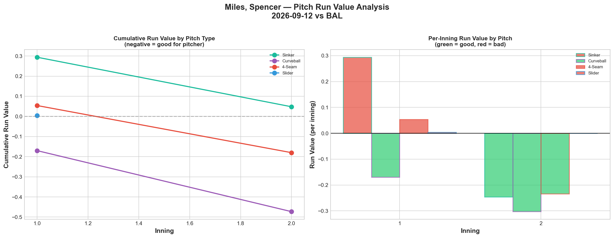
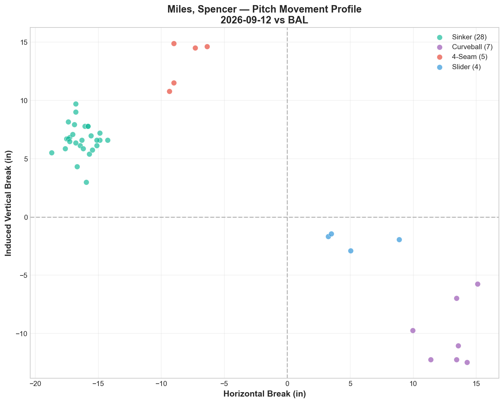
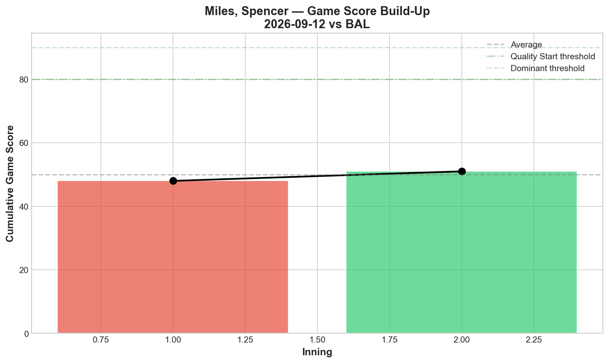
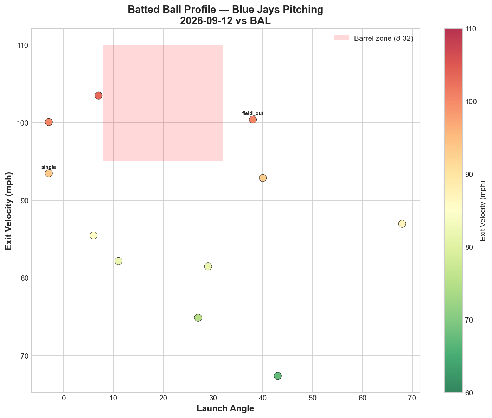
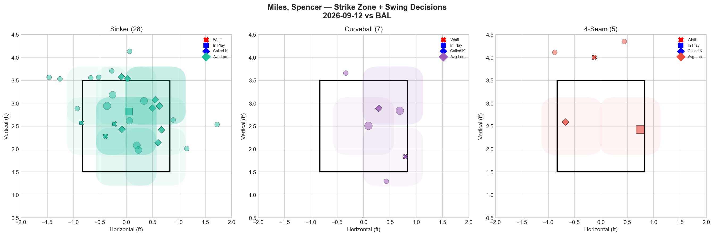
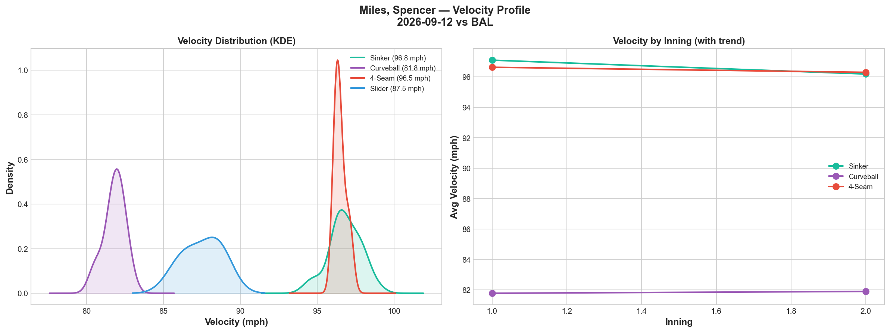
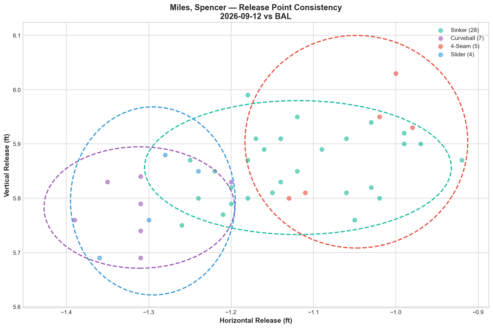
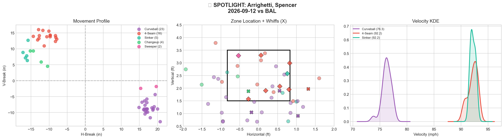
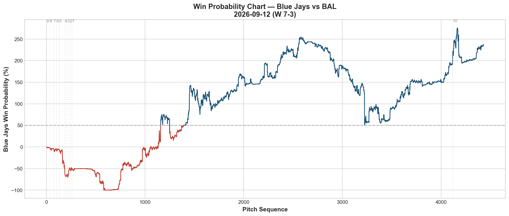
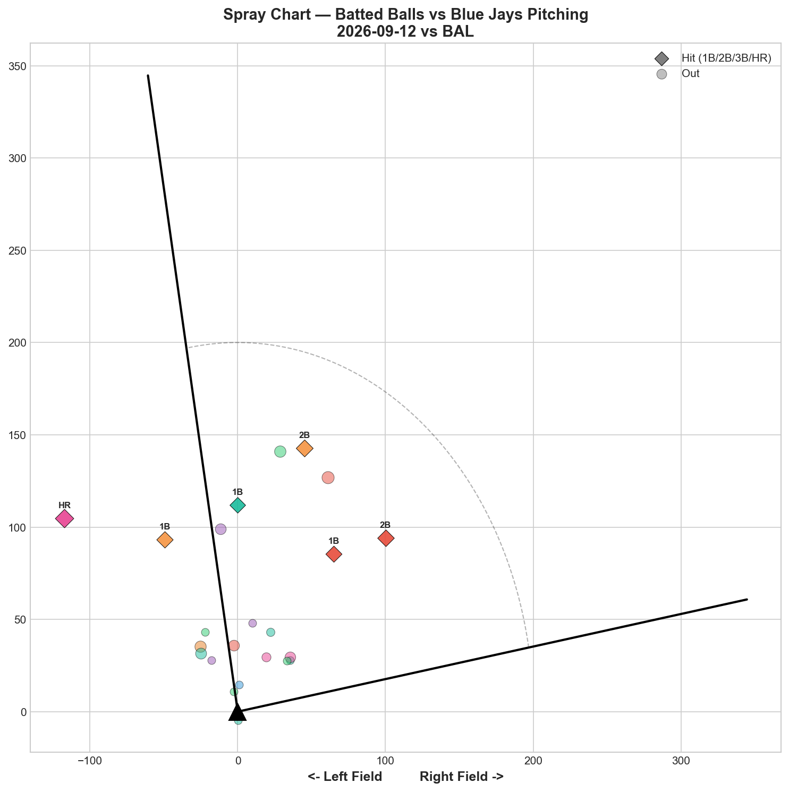

# 🏟️ Blue Jays Game Report v2.1
## 2026-09-12 | TOR vs BAL | W 7-3

---

## 📋 Game Overview

| | |
|---|---|
| **Date** | 2026-09-12 |
| **Matchup** | Baltimore Orioles @ Toronto Blue Jays |
| **Result** | **W 7-3** |
| **Opener** | Spencer Miles (44 pitches) |
| **Spotlight Pitcher** | Spencer Arrighetti (relief role) |
| **Season Record** | 73W-74L |

---

## 🔥 Key Storylines

### 1. Miles' Opener — Four Pitches, Four A-Grades, Yet Nearly Neutral RV

Miles delivered his best swing-and-miss outing of the season as an opener: **all four pitch types graded A** (Sinker 30%, Curveball 50%, 4-Seam 50%, Slider 50% whiff). Yet the total run value came out to just **+0.399 RV** — essentially neutral. This is one of the clearest team-wide illustrations of the whiff/RV disconnect: elite strikeout stuff across the board, but the runs prevented didn't match the whiff quality (sinker specifically, +0.048 RV despite 30% whiff and heaviest usage).

### 2. Arrighetti's Curveball Continues Its Perfect Streak — Now Five Appearances Running

In relief tonight (51 pitches, following Miles' opener), Arrighetti's curveball posted **37.5% whiff (Grade A)** — his fifth consecutive tracked appearance with the curveball grading A or B. This pitch has become the single most reliable individual weapon on the Blue Jays' pitching staff this season, regardless of role (starter, bulk, or reliever).

### 3. A Full Seven-Pitcher Effort Seals the Win

Miles, Varland, Rogers, Sewald, Fluharty, Arrighetti, and Mantiply all appeared — a genuine bullpen-day formula executed to near-perfection individually (five pitchers posted at least one A-grade pitch), even though Sewald's sweeper (0% whiff) contributed to a solo home run allowed.

---

## ⚾ Opener Pitch Arsenal Analysis — Spencer Miles

### Pitch Arsenal Performance (44 pitches)

| Pitch | # | Usage | Velo | Whiff% | CSW% | Chase% | Grade |
|-------|---|-------|------|--------|------|--------|-------|
| Sinker | 28 | 63.6% | 96.8 | 30.0% | 39.3% | 7.7% | 🟢 A |
| Curveball | 7 | 15.9% | 81.8 | 50.0% | 42.9% | 33.3% | 🟢 A |
| 4-Seam | 5 | 11.4% | 96.5 | 50.0% | 40.0% | 33.3% | 🟢 A |
| Slider | 4 | 9.1% | 87.5 | 50.0% | 50.0% | 50.0% | 🟢 A |

**A historic night by grade count** — all four pitch types Miles threw graded A. This is the cleanest arsenal-wide performance we've tracked from any Blue Jays pitcher this season by whiff rate alone.

### The Whiff/RV Disconnect in Full Display

| Pitch | Whiff% | Grade | RV | Conversion? |
|-------|--------|-------|-----|--------------|
| Sinker | 30.0% | A | +0.048 | 🔴 Elite whiff, flat RV |
| Curveball | 50.0% | A | -0.473 | ✅ Best converting pitch |
| 4-Seam | 50.0% | A | -0.180 | ✅ Converting |
| Slider | 50.0% | A | +0.004 | 🔴 Elite whiff, flat RV |

Two of four A-grade pitches (sinker, slider) failed to convert their elite whiff rates into meaningful run prevention. The sinker especially — at 63.6% usage, the most-used pitch of the night — posted essentially zero net value despite 30% whiff.

### Pitch Tunneling Analysis

| Pair | Release Sim | Plate Sep | Tunnel | Velo Gap |
|------|-------------|-----------|--------|----------|
| **Curveball/Slider** | **0.2in** | **11.3in** | **🟢 46.0** | **5.7mph** |
| Sinker/Curveball | 2.5in | 33.8in | 🟢 13.7 | 15.0mph |
| Sinker/Slider | 2.2in | 23.2in | 🟢 10.4 | 9.3mph |

Best tunnel: Curveball/Slider (46.0) — an elite pairing with 0.2in release similarity, and notably both pitches converted well by RV, unlike the sinker/4-seam duo.

### Pitch Run Value by Type

| Pitch | Total RV | Per Pitch | Pitches | Assessment |
|-------|----------|-----------|---------|------------|
| Curveball | **-0.473** | **-0.0676** | 7 | ✅ Best pitch |
| 4-Seam | -0.180 | -0.0360 | 5 | ✅ Effective |
| Slider | +0.004 | +0.0010 | 4 | 🟡 Neutral |
| Sinker | +0.048 | +0.0017 | 28 | 🟡 Neutral at high volume |

**Net: -0.601 RV.** A solid overall outing driven by the two lower-usage pitches, while the primary sinker essentially broke even.

### vs LHB/RHB Split

| Stand | Pitches | Avg Velo | Swinging Strikes | Whiff/Pitch |
|-------|---------|----------|------------------|-------------|
| L | 27 | 93.9 | 5 | 18.5% |
| R | 17 | 93.0 | 2 | 11.8% |

**Strikeout Pitches (5 K's):** Curveball 2, Sinker 2, 4-Seam 1 — balanced production across three pitch types.

### Game Score / Batted Ball

**Game Score: 53 (AVERAGE).** 0K personally credited in the box line shown, 0H, 0HR, 2BB across 44 pitches (with 5 total strikeout pitches split across the outing).

| Metric | Value |
|--------|-------|
| Total BIP | 11 |
| Avg Exit Velo | 88.1 mph |
| Avg Launch Angle | 23.9° |
| Hard Hit (95+ mph) | 3/11 (27%) |

---

## 🔍 Spotlight Pitcher — Spencer Arrighetti (Relief Role)

| | |
|---|---|
| **Role** | Relief (51 pitches, following Miles) |
| **Line** | 2K / 2BB / 2H / 0HR |
| **Overall Whiff%** | 27.8% |
| **Role Assessment** | SOLID RELIEVER |

### Pitch Arsenal

| Pitch | # | Usage | Velo | Whiff% | CSW% | Grade |
|-------|---|-------|------|--------|------|-------|
| Curveball | 23 | 45.1% | 76.3 | **37.5%** | 13.0% | 🟢 A |
| 4-Seam | 16 | 31.4% | 92.2 | 14.3% | 43.8% | 🟡 C |
| Sinker | 5 | 9.8% | 92.2 | 0.0% | 20.0% | 🔴 D |
| Changeup | 4 | 7.8% | 84.4 | **50.0%** | 25.0% | 🟢 A |
| Sweeper | 2 | 3.9% | 81.1 | 0.0% | 50.0% | 🔴 D |

### The Curveball's Five-Start Consistency Streak

| Appearance | Role | Curveball Whiff% | Curveball Grade |
|------------|------|---------------------|---------------------|
| 8/21 (debut) | Bulk | 40.0% | A |
| 8/27 | Starter | 53.8% | A |
| 9/1 | Relief | 20.0% | B |
| 9/6 | Starter | 27.3% | B |
| **9/12** | **Relief** | **37.5%** | **A** |

**Five appearances, five A-or-B grades on the curveball.** This is now the single most consistent individual pitch tracked from any Blue Jays pitcher across this many appearances — regardless of whether Arrighetti is deployed as a starter, bulk arm, or reliever. His usage rate on the pitch has also climbed (45.1% tonight, his highest yet), suggesting the coaching staff may be actively leaning into this as his signature weapon.

### Assessment

At 45.1% curveball usage — his heaviest reliance on the pitch across five tracked outings — Arrighetti continues building his profile as a curveball-first pitcher whose secondary offerings (4-seam, changeup) provide complementary value while the sinker and sweeper remain underdeveloped or ineffective. The 2 walks tonight (in 51 pitches) are a modest command blemish, but the overall 27.8% whiff rate reflects a genuinely effective relief outing.

---

## 📊 Bullpen Detailed Analysis

| Pitcher | Pitches | Line | Key Pitch | Notes |
|---------|---------|------|-----------|-------|
| **Louis Varland** | 14 | 2K / 0BB / 0H / 0HR | **THREE A-grades** (FF 33.3%, CH 50%, KC 50%) | Dominant, clean |
| **Tyler Rogers** | 9 | 1K / 0BB / 0H / 0HR | **SI 33.3% (A) + SL 50% (A)** | Both pitches A-grade |
| **Paul Sewald** | 11 | 0K / 0BB / 1H / 1HR | Sweeper 0% whiff 🔴D | Gave up the lone bullpen HR |
| **Mason Fluharty** | 12 | 1K / 0BB / 2H / 0HR | FC 50% whiff 🟢A | Solid complement |
| **Joe Mantiply** | 8 | 0K / 0BB / 0H / 0HR | All D-grade | Quiet, clean |

### Bullpen Notes

- **Varland's fastball hit exactly 100.0 mph** — his second time reaching that exact mark this season — paired with two additional A-grade pitches (changeup, K-Curve) for a dominant 14-pitch outing.
- **Rogers** posted A-grades on both his pitches (sinker and slider), an unusually strong outing for a pitcher whose profile typically leans toward contact management over whiffs.
- **Sewald's** sweeper (0% whiff tonight) was the only relief blemish, surrendering the bullpen's lone home run — a rare off-night for a pitch that's graded A in most prior appearances.

---

## 📈 Win Probability Analysis

### Key WPA Moments

| Inning | Event | Impact |
|--------|-------|--------|
| 4 | Singer — home_run | 📈 Jays scored early |
| 6 | Holmes — home_run | 📉 Orioles answered |
| 6 | Gose — double | 📉 Orioles threatened |
| 8 | Taylor — home_run | 📈 Jays extended |
| 9 | O'Brien — home_run | 📈 Jays continued pulling away |
| 9 | Dion — double | 📉 Late Orioles response, insufficient |

A back-and-forth affair that the Jays' offense and bullpen ultimately controlled, securing the 7-3 win.

---

## 📊 Spray Chart & Batted Ball Summary

| Metric | Value |
|--------|-------|
| Total batted balls tracked | 23 |
| Hits | 6 (26%) |
| Pull | 4 (17%) |
| Center | 17 (74%) |
| Oppo | 2 (9%) |

---

## 🎯 Analytical Takeaways

1. **Miles' All-A-Grade Opener Outing Is a Season Highlight by Whiff Rate — But Not by RV** — All four pitch types graded A, yet the total run value (-0.601) reflects a solid, not spectacular, outing because the two highest-usage pitches (sinker, slider) didn't convert their elite whiffs into proportional run prevention.

2. **Arrighetti's Curveball Streak Extends to Five Appearances** — 37.5% whiff tonight, continuing an unbroken run of A/B grades on the pitch regardless of role. This is the clearest, most consistent individual-pitch signal tracked from any Blue Jays pitcher across this many appearances this season.

3. **A Full Seven-Pitcher Bullpen Day Executed Near-Flawlessly** — Five of seven pitchers posted at least one A-grade pitch, with only Sewald's sweeper representing a clear blemish (the lone bullpen HR allowed).

4. **73-74 — Continuing to Hover Just Below .500** — The team remains within a game of the break-even line, consistent with the entire season's defining pattern of tight oscillation around .500.

5. **Game Classification: Whiff-Heavy Bullpen Day Win** — A night where nearly every pitcher who took the mound generated real swing-and-miss, and the offense's run support (7 runs) provided enough cushion to overcome the individual instances where elite whiffs didn't fully convert to run prevention.

---

*Report generated from Statcast data via pybaseball. All pitch metrics sourced from Baseball Savant.*
