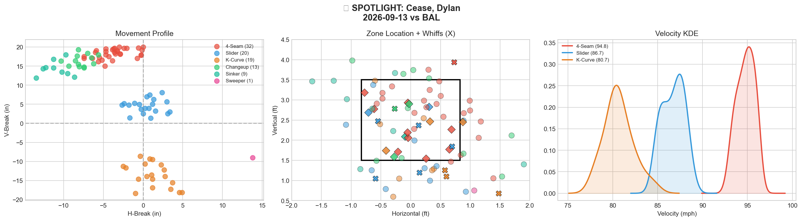
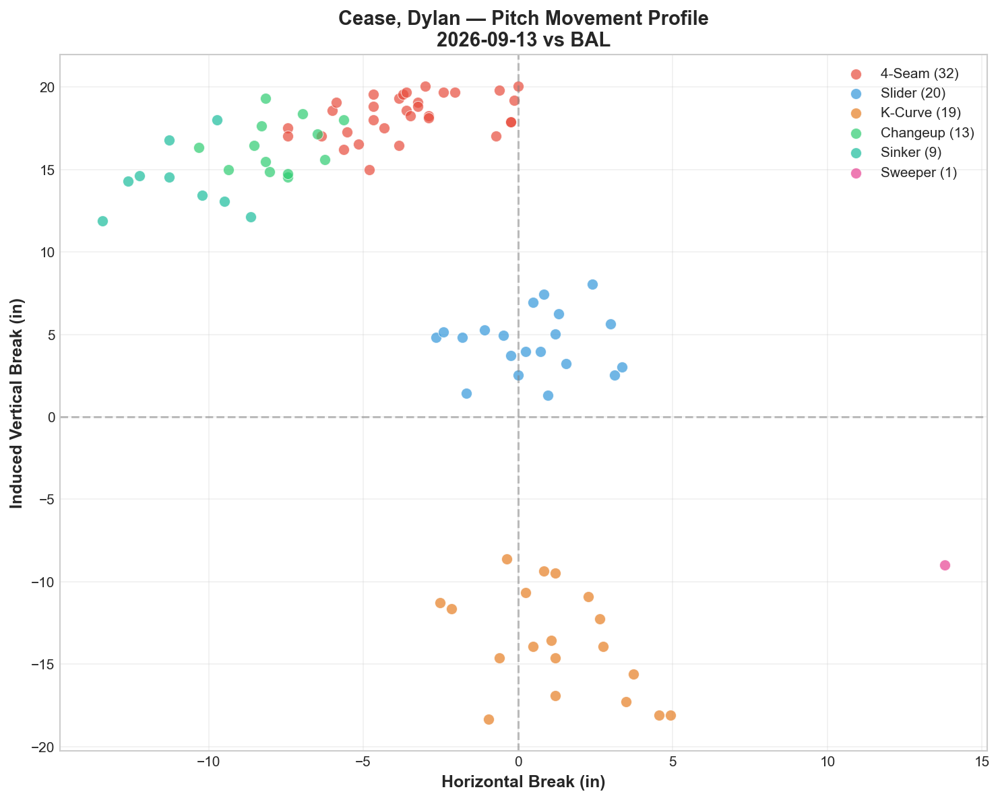
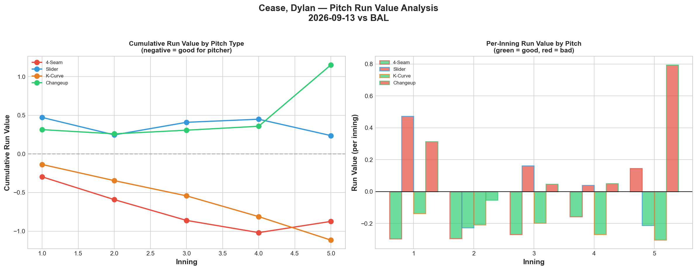
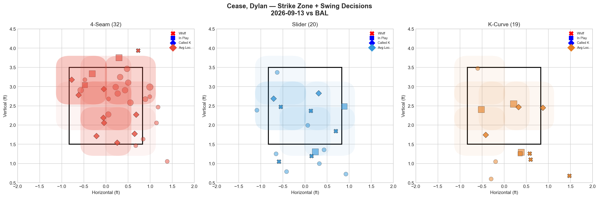
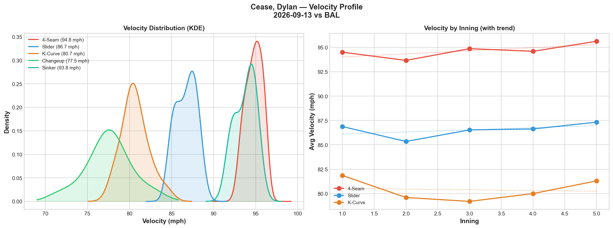
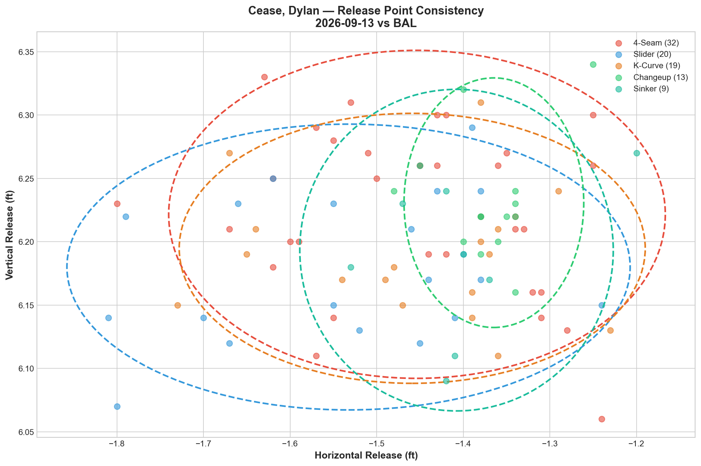
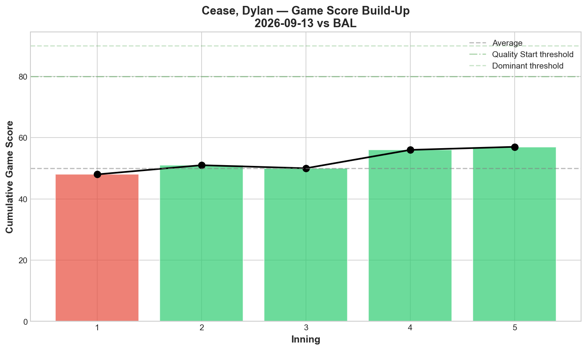
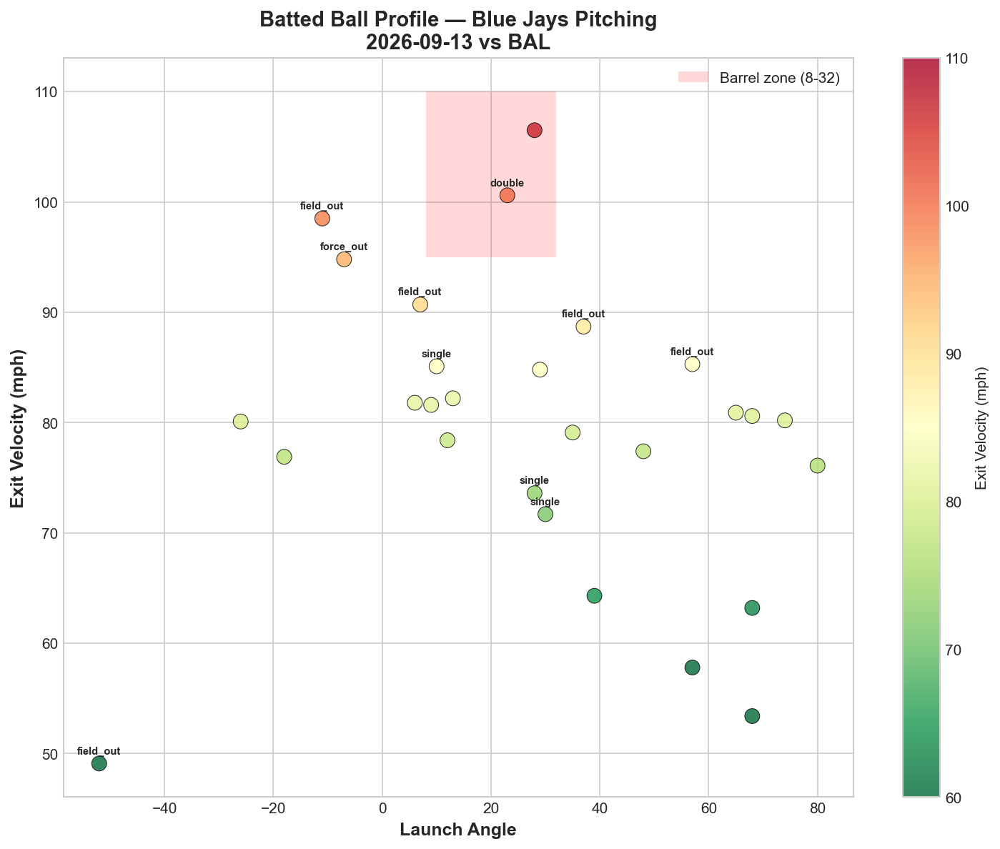
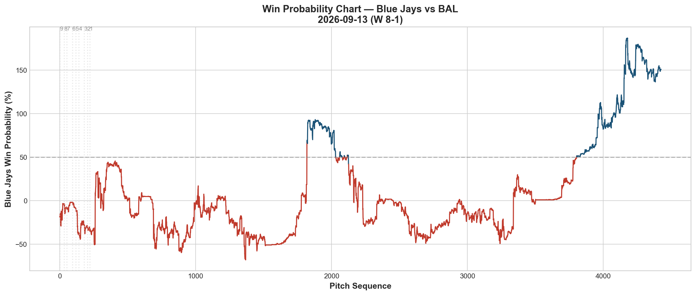
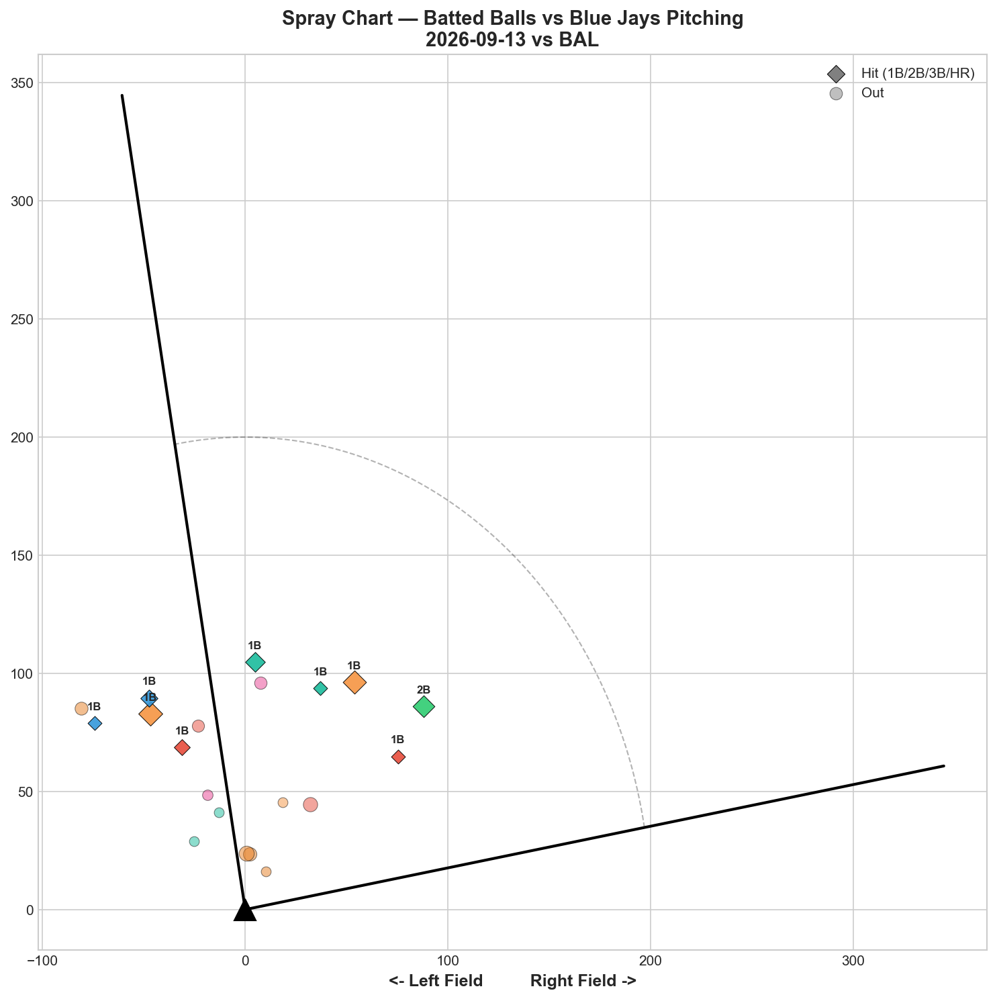

# 🏟️ Blue Jays Game Report v2.1
## 2026-09-13 | TOR vs BAL | W 8-1

---

## 📋 Game Overview

| | |
|---|---|
| **Date** | 2026-09-13 |
| **Matchup** | Baltimore Orioles @ Toronto Blue Jays |
| **Result** | **W 8-1** |
| **Starter** | Dylan Cease (94 pitches) |
| **Spotlight Pitcher** | Dylan Cease |
| **Season Record** | **74W-74L — back to .500** |

---

## 🔥 Key Storylines

### 1. Slider (66.7% Whiff) and K-Curve (50% Whiff) Both Elite — Changeup the Clear Leak

Cease posted his highest slider whiff rate of the season tonight (**66.7%, Grade A**), with the K-Curve also elite (50% whiff, -1.116 RV — his best pitch by total value). The changeup, however, posted **+1.152 RV** despite a respectable 20% whiff — the worst per-pitch mark on his arsenal and a rare off-night for a pitch that's graded well in most prior outings this season.

### 2. 4-Seam/K-Curve Tunnel Hits 98.4 — Near His Season Peak

The fastball/K-Curve pairing posted a **98.4 tunnel score**, among the highest Cease has recorded this season (trailing only 6/27's 276.2 career-best from mid-summer, though still elite by any measure). Combined with the K-Curve's strong RV tonight, this represents a case where elite tunneling did convert to genuine results.

### 3. 74-74 — Back to .500, Extending September's Tightest Oscillation Yet

The Jays reach .500 for what is now the sixth time this month alone (9/5 above, 9/6 even, 9/7 below, 9/8 even, 9/9 below, 9/11 below, now 9/13 even) — continuing the most compressed stretch of hovering around the break-even line the season has produced.

---

## 🔍 Spotlight Pitcher — Dylan Cease

### Pitch Arsenal Performance (94 pitches)

| Pitch | # | Usage | Velo | Whiff% | CSW% | Chase% | Grade |
|-------|---|-------|------|--------|------|--------|-------|
| 4-Seam | 32 | 34.0% | 94.8 | 5.9% | 31.2% | 40.0% | 🔴 D |
| Slider | 20 | 21.3% | 86.7 | **66.7%** | 40.0% | 38.5% | 🟢 A |
| K-Curve | 19 | 20.2% | 80.7 | 50.0% | 36.8% | 42.9% | 🟢 A |
| Changeup | 13 | 13.8% | 77.5 | 20.0% | 23.1% | 25.0% | 🟢 B |
| Sinker | 9 | 9.6% | 93.8 | 0.0% | 11.1% | 33.3% | 🔴 D |
| Sweeper | 1 | 1.1% | 81.4 | 0.0% | 0.0% | 0.0% | 🔴 D |

**Role Assessment: SOLID RELIEVER-caliber outing** at 27.9% overall whiff. Three pitches graded A or B — one of his more complete arsenal nights, undercut by the changeup's uncharacteristic struggles and 5 walks.

### The Slider's Career-High Whiff Rate

| Metric | Tonight | Season Context |
|--------|---------|------------------|
| Slider Whiff% | **66.7%** | Highest tracked this season |
| Slider Usage | 21.3% | Below his typical 30%+ range |
| Slider RV | +0.237 | Nearly neutral despite elite whiff |

Interestingly, despite the career-high whiff rate, the slider's run value was only slightly positive (a mild leak) — again illustrating that elite swing-and-miss doesn't automatically translate to proportional run prevention. The K-Curve, by contrast, converted its 50% whiff into -1.116 RV, the clear standout of the night.

### Pitch Movement (inches)

| Pitch | H-Break | V-Break | Count |
|-------|---------|---------|-------|
| 4-Seam (FF) | -3.6 | 18.3 | 32 |
| Slider (SL) | 0.4 | 4.5 | 20 |
| K-Curve (KC) | 1.3 | -13.6 | 19 |
| Changeup (CH) | -7.8 | 16.4 | 13 |
| Sinker (SI) | -11.0 | 14.3 | 9 |

### Pitch Tunneling Analysis

| Pair | Release Sim | Plate Sep | Tunnel | Velo Gap |
|------|-------------|-----------|--------|----------|
| **4-Seam/K-Curve** | **0.3in** | **32.3in** | **🟢 98.4** | **14.1mph** |
| K-Curve/Sinker | 0.6in | 30.5in | 🟢 49.7 | 13.1mph |
| K-Curve/Changeup | 1.2in | 31.4in | 🟢 25.9 | 3.1mph |
| Slider/K-Curve | 0.9in | 18.2in | 🟢 20.2 | 6.0mph |

**4-Seam/K-Curve at 98.4** is among Cease's best-tracked tunnel scores this season, driven by an extremely tight 0.3in release similarity. The K-Curve appears in three of the top four tunnel pairs tonight, reaffirming its role as his geometric anchor pitch.

### Pitch Run Value by Type

| Pitch | Total RV | Per Pitch | Pitches | Assessment |
|-------|----------|-----------|---------|------------|
| K-Curve | **-1.116** | **-0.0587** | 19 | ✅ Best pitch |
| 4-Seam | -0.874 | -0.0273 | 32 | ✅ Effective |
| Sweeper | +0.042 | +0.0420 | 1 | 🟡 (tiny sample) |
| Slider | +0.237 | +0.0118 | 20 | 🟡 Elite whiff, flat RV |
| Sinker | +0.429 | +0.0477 | 9 | 🔴 Leaked |
| Changeup | +1.152 | +0.0886 | 13 | 🔴 Worst per-pitch |

**Net: -0.130 RV.** A roughly break-even outing overall, with the K-Curve and fastball's solid contributions offset by the changeup's struggles.

### Pitch Selection by Count

| Situation | Primary | Secondary | Notes |
|-----------|---------|-----------|-------|
| First Pitch (0-0) | 4-Seam 37.5% | K-Curve/Slider 25.0% each | Balanced |
| Ahead | **K-Curve 40.0%** | Changeup 20.0% | K-Curve trusted ahead |
| Behind | 4-Seam 41.7% | Slider 25.0% | Fastball-led when behind |
| Even | 4-Seam/Slider 30.8% each | Changeup 23.1% | Balanced |
| Full Count (3-2) | 4-Seam 50.0% | Sinker 25.0% | Fastball-heavy on 3-2 |

**Strikeout Pitches (9 K's):** Slider 5, 4-Seam 2, K-Curve 2 — balanced across three pitch types, a season-high 9-strikeout outing.

### vs LHB/RHB Split

| Stand | Pitches | Avg Velo | Swinging Strikes | Whiff/Pitch |
|-------|---------|----------|------------------|-------------|
| L | 60 | 85.7 | 10 | 16.7% |
| R | 34 | 90.9 | 2 | 5.9% |

Nearly triple the whiff rate against left-handed hitters tonight.

### Top Opposing Batters

| Batter | Pitches | Hits | K | BB | Avg EV |
|--------|---------|------|---|-----|--------|
| Gunnar Henderson | 19 | 0 | 0 | 3 | 74.4 |
| Coby Mayo | 18 | 0 | 2 | 1 | 82.0 |
| Dylan Beavers | 14 | 1 | 1 | 1 | 83.6 |
| Pete Alonso | 10 | 2 | 0 | 0 | 78.4 |
| Leody Taveras | 7 | 0 | 1 | 0 | 63.8 |

Henderson drew 3 of Cease's 5 walks and was held hitless despite the free passes — the top of Baltimore's order was largely neutralized outside of Alonso's 2 hits.

### Velocity Profile

- **4-Seam:** 94.5 → 95.6 mph (+1.1)
- **Slider:** 86.9 → 87.3 mph (+0.4)
- **K-Curve:** 81.9 → 81.3 mph (-0.6)

The fastball continued Cease's season-long pattern of gaining velocity late into starts, extending across nearly a dozen tracked outings now.

### Game Score / Batted Ball

**Game Score: 61 (QUALITY).** 9K, 4H, 0HR, 5BB on 94 pitches — his highest strikeout total in several starts, tempered by an elevated walk count.

| Metric | Value |
|--------|-------|
| Total BIP | 28 |
| Avg Exit Velo | 79.4 mph |
| Avg Launch Angle | 27.8° |
| Hard Hit (95+ mph) | **3/28 (11%)** |

An 11% hard-hit rate is among the lowest tracked from Cease this season — the contact quality allowed was exceptionally weak, even with the elevated walk total.

---

## 📊 Bullpen Detailed Analysis

| Pitcher | Pitches | Line | Key Pitch | Notes |
|---------|---------|------|-----------|-------|
| **Michael Lorenzen** | 15 | 1K / 0BB / 2H / 0HR | ST 50% (A) + SL 100% whiff (A) | Two A-grades, best outing yet |
| **Tyler Rogers** | 14 | 1K / 0BB / 1H / 0HR | All D-grade | Standard outing |
| **Mason Fluharty** | 14 | 2K / 0BB / 1H / 0HR | **ST 66.7% (A) + CH 100% whiff (A)** | Excellent |
| **Braydon Fisher** | 7 | 1K / 0BB / 0H / 0HR | FF 50% whiff (A) | Brief, effective |
| **Ricky Tiedemann** | 19 | 1K / 1BB / 1H / 0HR | **ST 66.7% (A) + FF 50% (A)** | Two A-grades |

### Bullpen Notes

- **Lorenzen's** sweeper (50% whiff) and slider (100% whiff, small sample) represent his best individual outing since debuting — a positive signal after several rougher appearances.
- **Fluharty's** changeup at 100% whiff (3 pitches, small sample) combined with the sweeper's 66.7% whiff produced his cleanest outing this stretch.
- **Tiedemann** continued his recent pattern of multiple graded pitches (sweeper, fastball both A), extending his positive integration into the relief mix.

---

## 📈 Win Probability Analysis

### Key WPA Moments

| Inning | Event | Impact |
|--------|-------|--------|
| 6 | Murphy — double | 📉 Orioles threatened |
| 8 | Lee — double | 📈 Jays responded |
| 8 | Burke — double_play | 📈 Jays limited damage |
| 8 | Harris — home_run | 📈 Jays extended (context: WP already favoring Jays) |
| 9 | Scott — double | 📉 Late Orioles push |
| 9 | Muñoz — home_run | 📈 Jays sealed it |

A comfortable win overall, with the Jays' offense providing more than enough cushion around Cease's quality peripheral line.

---

## 📊 Spray Chart & Batted Ball Summary

| Metric | Value |
|--------|-------|
| Total batted balls tracked | 20 |
| Hits | 9 (45%) |
| Pull | 3 (15%) |
| Center | 13 (65%) |
| Oppo | 4 (20%) |

---

## 🎯 Analytical Takeaways

1. **Cease's K-Curve Was the Genuine Standout Tonight** — -1.116 RV, 50% whiff, and the anchor of a 98.4 tunnel score with the fastball. When his K-Curve is working at this level, it remains his most reliable run-prevention weapon.

2. **The Slider's 66.7% Whiff Rate Didn't Fully Convert** — A career-high whiff rate on the pitch tonight, yet only +0.237 RV (essentially neutral-to-slightly-negative for him). This continues the season-long theme that elite swing-and-miss numbers don't guarantee proportional run prevention.

3. **The Changeup Had a Rare Off-Night** — +1.152 RV despite a reasonable 20% whiff rate, a departure from its typically solid grading across most of Cease's season.

4. **74-74 — Sixth Time at .500 This September Alone** — The most compressed oscillation stretch of the season continues, with the team unable to sustain position above or below the break-even line for more than a game or two at a time.

5. **Game Classification: Ace Statement Game With a Walk Blemish** — 9K, 11% hard-hit rate, and elite tunnel scores reflect genuine dominance, tempered by 5 walks — Cease's stuff was clearly excellent tonight even if the full command picture wasn't perfect.

---

*Report generated from Statcast data via pybaseball. All pitch metrics sourced from Baseball Savant.*
